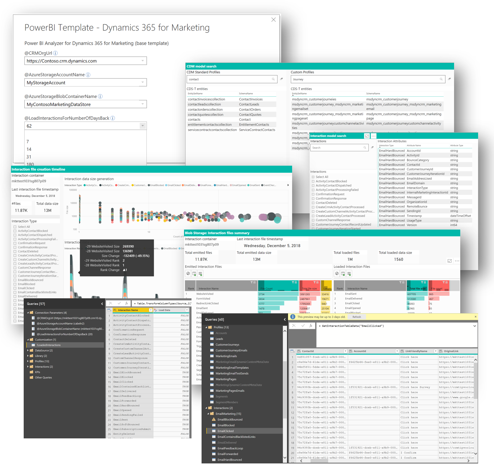

# Marketing analytic reporting framework

>[!TIP]
>**Designed for the data analysts who is fluent in Power BI report building, the marketing analytic reporting framework is an important foundation.**

Perhaps the most important foundation for our marketing reporting capabilities is the marketing analytic reporting framework of M-Code, queries, functions, data connectors and parameter processing that is the core of every marketing analytics report example.

|Download report template  |Download sample report  |
|---------|---------|
||

Find more downloads [here](MarketingAnalyticReporting-Gallery.md)

## Building custom Marketing Analytics with Power BI

The file repository provides a set of Power BI files (pbx) and respective template files (pbit) that can be used to build your own marketing analytic reports. The focus of the Power BI code framework is to provide ready built and easy to use data sources that connect to data from Dynamic 365 for Marketing including date filters and on liner query building in M-code to access specific profile and interaction tables.

## Out of the box connection dialog

>[!TIP]
>**Connect to your data with ease!**

The framework provides ready build report parameters which present the data entry dialog to the data analyst who opens a marketing report template file in order to configure and publish marketing analytics in his organization.

## The meta-model browser

>[!TIP]
>**Browse the meta-model for profile and interactions types**

Each report comes with a set of hidden report pages. Those can help you to browse the available types of profiles in your organization in CDS and all the interaction types that are referenced in the marketing model. You can select interaction types and study the attributes that you will be able to use for analytics reporting.

## Your marketing interaction data stream

>[!TIP]
>**Study the available interaction data and data generation over time**

Another valuable tool helps to validate the interaction data inflow in your marketing instance as it is reflected in the data arriving in your Azure storage. You can see quickly whether the data are arriving as expected and study which types of interaction data in what volume are being captured over time. This helps to select the use cases for marketing analytics, but also to troubleshoot the marketing analytic configuration and the processes in your marketing application in general.

## Working with queries in Power BI

**Use pre-build query code to load, filter and analyze your data!**
The framework comes with a rich set of pre-built queries, functions, parameters and tables that make it really easy to access the data from your marketing instance. The typical steps for a custom marketing report include to select interaction types that may be loaded and add queries for the profile and interaction data that should be loaded. Those tasks are well supported and require often just one line of query code per interaction and few desired formatting instructions.

**Configure which interaction data should be considered by the report**
Over time a marketing organization will collect large amounts of data, especially interactions that reflect how your audience interacts with your marketing experience, but also a set of signals emitted by the marketing automation engine.

A good practice is to limit the data to load to only the data that are really necessary for the purpose of the specific marketing analytic report. While the marketer will set the recency for the interactions to consider when he configured the analytics report, it is the duty of the data analyst who creates a marketing analytics report to specify which interactions types should be considered for loading. Limiting the amount of interactions types will greatly improve the refresh performance, because the Power BI code will filter interaction data as early as possible.

>[!TIP]
>**Add queries for profiles and interactions**

To load data for select profiles and interactions and then add the relations that connect the data is an easy task with the help of template code.
The best way to learn how this can be achieved is to look at the sample queries for profiles and interaction in the query editor. In order to load the data for a specific profile all you have to do is to add a new query and fill in one line of code with the respective profile/entity name - in below example "msdyncrm_marketingpage". 

>[!TIP]
>**let\
&ensp;&ensp;Source = GetCDST_CustomProfileTable("msdyncrm_marketingpage")\
  in\
&ensp;&ensp;Source**

Often you would add more operations to include only selected attributes and perform some formatting if needed.
In a similar way you can add queries to load interactions into your analytics report - also with one line of M-code.

<!--Common pages-->
## Common report pages

The *Common-Pages* in the marketing analytic reporting framework.
>[!TIP]
>Out of the box reports help you to quickly get going with the marketing data in your organization.

Each template and of course sample report contains the following common pages which help you to explain your report to your audience and a number of hidden data management pages that you will need when you want to customize your report or develop your own reports.

- The **Help page** is an empty page where you can enter the documentation you want your audience to know when accessing the report. Each report page contains a help button at the top and will navigate to your help page in the report.</li>

- The **"[Interaction data flow]" page** is hidden by default and provides insights into the data interaction data volume that is generated by your marketing organization over time.

- The **"[Interaction files]" leaderboard** shows you the largest data generated by all the interaction types and data emitted by your marketing organization compared to the subs set of data you actually consume in your analytic report.

- Two further pages, the **"[CDS-T entities]"** and the **"[Interaction types]"** provide a detailed lookup for any profile type and the full interaction data model available at your disposal for analytics reporting. You find also information which interactions are enable for data loading in your report configuration.
Please note that not all interaction types are supported by the data data publishing mechanic. Find more details here *(TBD)*.

***Happy marketing analytic reporting with Dynamics 365 Marketing!***
