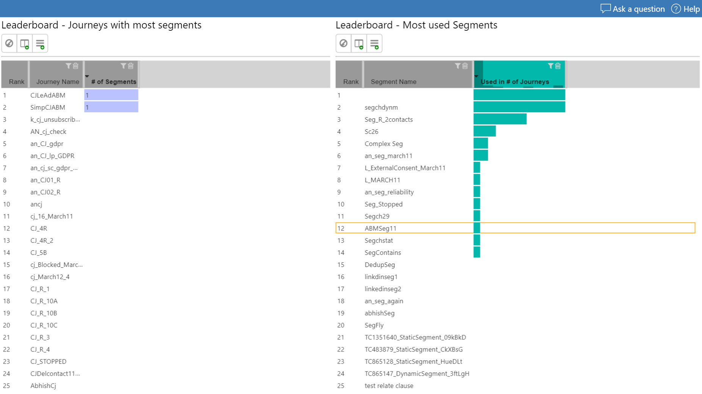

# Segmentation usage report

>[!TIP]
>**With the Marketing segmentation usage report you analyze how segments are used across your marketing activities.**

The marketing segment usage report shows you which segments are used in which marketing activities and helps you to identify orphaned segments.

|Download report template  |Download sample report  |
|---------|---------|
|||

Find more downloads [here](MarketingAnalyticReporting-Gallery.md)

## Leaderboard and segmentation usage report

A simple leader board reports helps you identify the most used segments and also your marketing automation that use the most segments.

## Orphaned segmentation  report

And with orphaned segment report you should identify segments that are not used anywhere. We recommend to regularly clean up your not used segments in order not to clutter your marketing system with unused segments and keep the segmentation engine busy unnecessarily so the calculation resources are used more efficiently for your essential marketing automation operations.

***Happy marketing analytic reporting with Dynamics 365 Marketing!***
