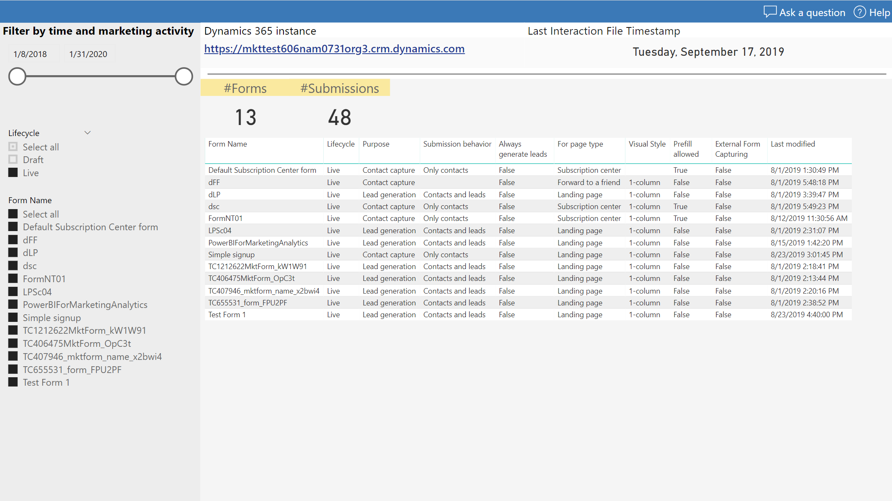
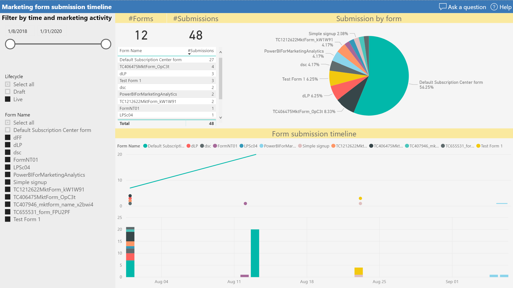
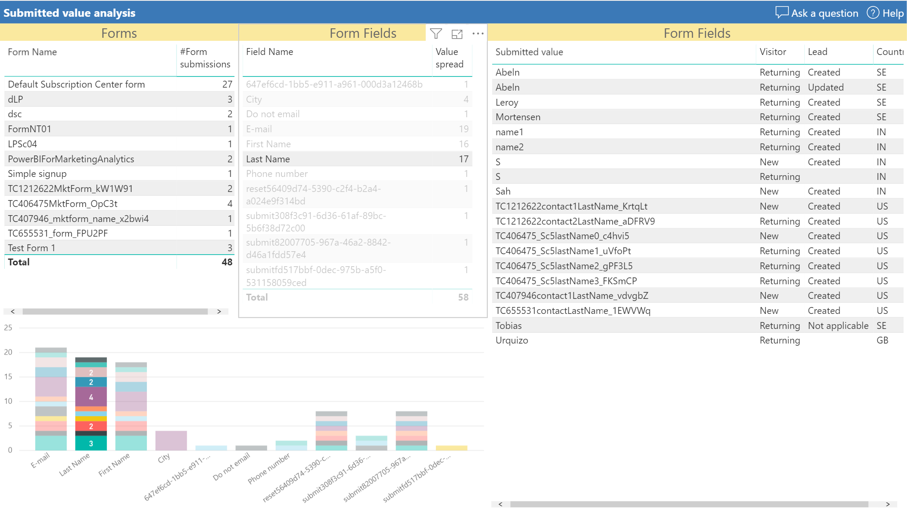
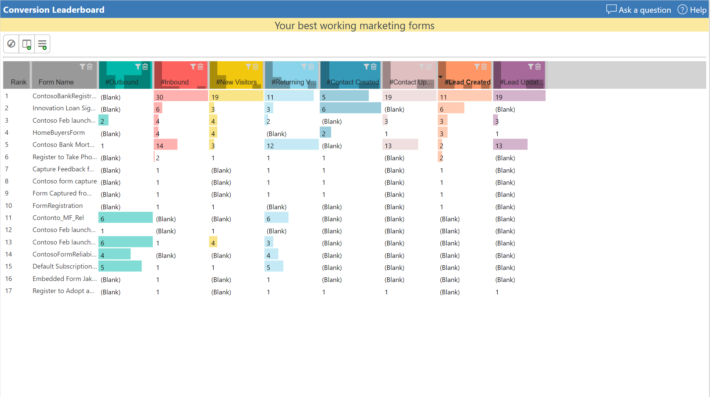

# Marketing form submission report

Use this marketing analytics report to get insights into the submission stream of your marketing forms. You'll be able to see all the details of your marketing form submissions in one report, and then slice and dice over the timeline, related marketing messaging, and automation.

Use the following links to download a template for running the report on your own organization and a sample report filled with sample data.

|Download report template  |Download sample report  |
|---------|---------|
||

> [!NOTE]
> You can find the full list of marketing analytics downloads in the [marketing analytics reporting gallery](analytics-gallery-start.md#gallery).

In addition to the [common report pages](analytics-gallery-framework.md#common-report-pages), this analytics report includes the following pages:

- [Home page](#home-page)
- [A timeline of form submissions](#submission-timeline)
- [Details of form submissions](#submission-details)
- [Submission values](#submission-values)
- [Conversion leaderboard](#leaderboard)

## Marketing-form submission report home page

> [!TIP]
> The report home page gives a quick overview on your marketing forms and the submission volume.

Each report includes a filter pane on the left that lets you quickly select the relevant marketing activities to focus on. You can also chose the relevant time frame for your exploration.

## Marketing-form submission timeline

Use this report page to see a timeline of form-submission history across all your marketing forms.

## Marketing-form submission details

You can also find a more detailed view of all form submissions.

## Marketing-form submission value report

See what values have been submitted against which fields for all marketing forms.

## Conversion leaderboard

This leaderboard displays various types of conversions from your marketing forms. It shows which forms:

- Attracted the most submissions from new and returning visitors.
- Created the most new contacts or updated the most existing contacts.
- Created the most new leads or updated the most existing leads.

***Happy analytics reporting with Dynamics 365 Marketing!***

[!INCLUDE[footer-include](../../includes/footer-banner.md)]