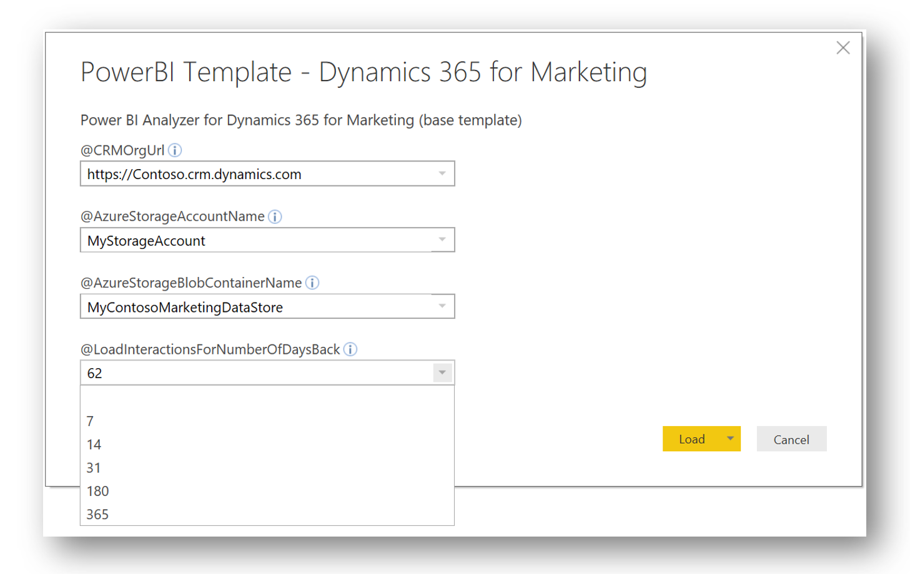
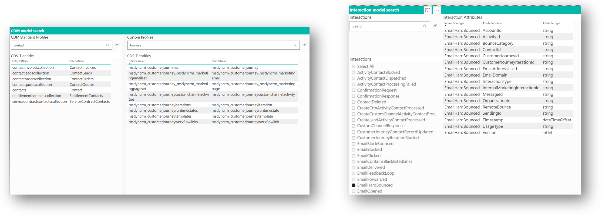
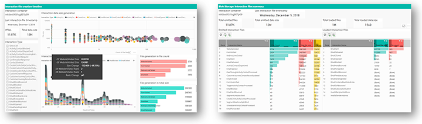
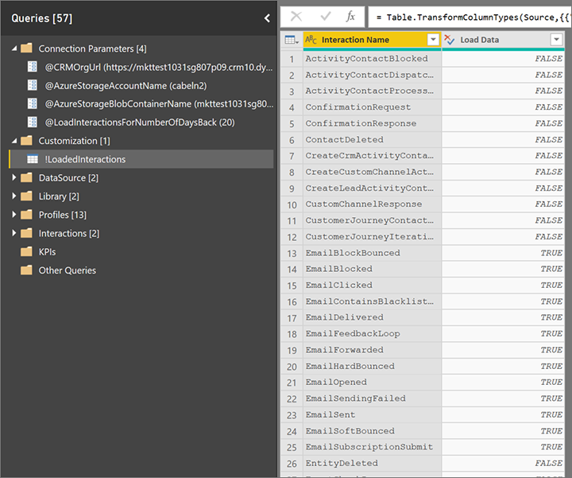
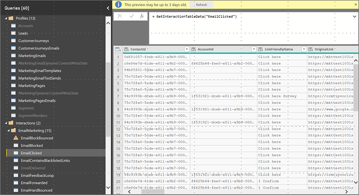
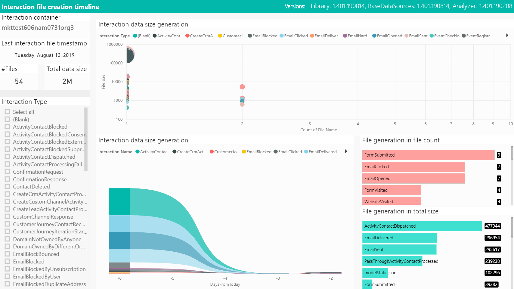
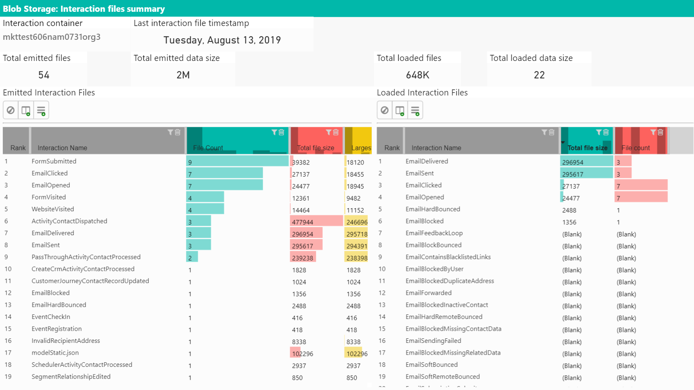

# The marketing analytics reporting framework (generic template)

[!INCLUDE[cc-data-platform-banner](../../includes/cc-data-platform-banner.md)]

Designed for the data analyst who's fluent in Power BI report building, the marketing analytics reporting framework provides an important foundation that includes the M-Code, queries, functions, data connectors, and parameter processing that are at the core of every marketing analytics report.

Use the following links to download a template for running the report on your own organization and a sample report filled with sample data.

|Download report template  |Download sample report  |
|---------|---------|
|[](https://github.com/microsoft/Dynamics-365-for-Marketing---Power-BI-Reporting/raw/master/PowerBI-Templates/PowerBI%20Template%20-%20Dynamics%20365%20for%20Marketing.pbit)|[](https://github.com/microsoft/Dynamics-365-for-Marketing---Power-BI-Reporting/raw/master/pbx%20files/PowerBI%20Template%20-%20Dynamics%20365%20for%20Marketing.pbix)|

> [!NOTE]
> You can find the full list of marketing analytics downloads in the [marketing analytics reporting gallery](analytics-gallery-start.md#gallery).

## Building custom marketing analytics with Power BI

The file repository provides a set of Power BI files (.pbx) and their respective template files (.pbit) that you can use to build your own marketing analytics reports. The focus of the Power BI code framework is to provide ready-built and easy-to-use data sources that connect to data from Dynamic 365 Marketing, including date filters and one-liner query building in M-code to access specific profile and interaction tables.

## Out-of-the-box connection dialog box

You can connect to your data with ease. When you open a template file, the framework presents a [connection dialog box](analytics-gallery-start.md#connect-dialog) for configuring and publishing marketing analytics.



## The meta-model browser

You can use the meta-model browser to discover profile and interaction types. Each report comes with a set of hidden report pages that can help you browse through the available types of profiles in your organization in Microsoft Dataverse, and all the interaction types that are referenced in the marketing model. You can select interaction types and study the attributes that you'll be able to use for analytics reporting.



## Your marketing interaction data stream

You can study the available interaction data and data generation over time. This valuable tool helps to validate the interaction data inflow in your marketing instance as it's reflected in the data arriving in your Azure storage. You can quickly see whether data is arriving as expected and study which type of interaction data, in what volume, is being captured over time. This not only helps you select use cases for marketing analytics, but in general it helps you troubleshoot your marketing analytics configuration and the processes in your marketing application.



## Working with queries in Power BI

When working with queries in Power BI, keep the following recommendations in mind:

- **Use pre-built query code to load, filter, and analyze your data.**  
    The framework comes with a rich set of pre-built queries, functions, parameters, and tables that make it easy to access data from your Marketing instance. You'll typically select the interaction types to load and then add queries for the profile and interaction data that you're looking for. Those tasks are well-supported; often, they'll require just one line of query code per interaction, plus a few useful formatting instructions.

- **Configure the interaction data you want to include in the report.**  
    Over time, a marketing organization collects large amounts of data, especially interactions, but also a set of signals emitted by the marketing automation engine.

    A good practice is to only load the data that's required for your specific report. Although marketers will configure their reports with a maximum age limit for the interactions to consider, it's the duty of the data analyst who creates a marketing analytics report to specify which interaction types should be considered for loading. Limiting the amount of interaction types greatly improves the refresh performance, because the Power BI code will filter interaction data as early as possible.



With the help of template code, it's easy to load data for selected profiles and interactions, and then add the relations that connect the data.

The best way to learn how to achieve this is to look at the sample queries for profiles and interaction in the query editor. To load the data for a specific profile, add a new query and fill in one line of code with the respective profile/entity name, as shown for the `msdyncrm_marketingpage` entity in the following example: 

```console
let 
  Source = GetCDST_CustomProfileTable("msdyncrm_marketingpage")
in
  Source
```
Typically, you'd add more operations to include only selected attributes and perform some formatting, if needed.

Similarly, you can add queries to load interactions into your analytics report&mdash;also with one line of M-code, as in the following illustration. 




<a name="common-report-pages"></a>

## Common report pages

Each template and sample report contains the following common pages:

- The **Help** page is an empty page where you can document anything that you want your audience to know about when they access the report. Each report page provides a help button at the top that opens this page.

- The **Interaction data flow** page is hidden by default. It provides insights into the volume of interaction data that your marketing organization generates over time.

    

- The **Interaction files leaderboard** shows you the largest volume of data generated by all the interaction types and data emitted by your marketing organization, compared to the subset of data you actually consume in your analytics report.

    

- Two additional pages, **CDS-T entities** and **Interaction types**, provide detailed lookup for any profile type and the full interaction data model available for analytics reporting. You'll also find information about which interactions are enabled for loading in your report configuration. Note that not all interaction types are supported by the data-publishing mechanism.

***Happy analytics reporting with Dynamics 365 Marketing!***


[!INCLUDE[footer-include](../../includes/footer-banner.md)]