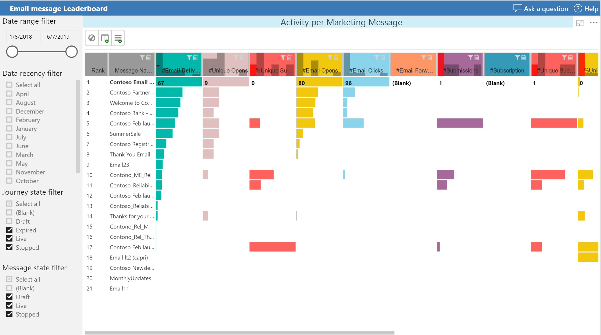
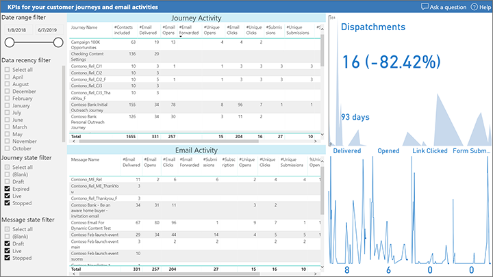

# Leaderboard report for customer journeys and email marketing

The leaderboard report for customer journeys and email marketing identifies your most effective journeys and messages. Use the following links to download a template for running the report on your own organization and a sample report filled with sample data.

|Download report template  |Download sample report  |
|---------|---------|
||

> [!NOTE]
> You can find the full list of marketing analytics downloads in the [marketing analytics reporting gallery](analytics-gallery-start.md#gallery).

In addition to the [common report pages](analytics-gallery-framework.md#common-report-pages) and a report home page, this analytics report includes the following pages:

- [A detailed leaderboard of email marketing activities](#email-leaderboard)
- [A detailed leaderboard of customer journeys](#journey-leaderboard)
- [A leaderboard of KPIs, with timelines](#leaderboard-kpis)

## Leaderboard of email marketing activities

The detailed email marketing leaderboard lets you compare and rank your marketing messages based on the following KPIs:

- Total emails delivered
- Total email opens, unique opens, and open rate
- Total link clicks, unique clicks, and click rate
- Total form submissions, unique submissions, and submission rate
- Total subscriptions, unique subscriptions, and submission rate

Use the data range, message status, and journey status columns to filter the messages. The interactions can also be filtered by age.

Users can configure the leaderboard chart control, rearrange columns, and sort the list by any selected KPI as needed.

## Leaderboard of customer journeys

KPIs related to email marketing are aggregated across all marketing messages that are part of a journey. The report compares and ranks your journeys based on the following KPIs:

- Number of contacts processed by the journey
- Total emails delivered
- Total email opens, unique opens, and open rate
- Total link clicks, unique clicks, and click rate
- Total form submissions, unique submissions, and submission rate
- Total subscriptions, unique subscriptions, and subscription rate

Use the data range and status slicers to filter the journeys. The interactions can also be filtered by age.

Users can configure the leaderboard chart control, rearrange columns, and sort the list by any selected KPI as needed.

## Leaderboard of KPIs with timelines

This report lists all the KPIs, marketing messages, and journeys selected by the sliders. In addition, you can look at the individual interaction timelines that lie behind the KPIs. Try filtering the various journeys and messages, or slicing and dicing to compare your marketing activities by various criteria.

***Happy analytics reporting with Dynamics 365 Marketing!***

[!INCLUDE[footer-include](../../includes/footer-banner.md)]