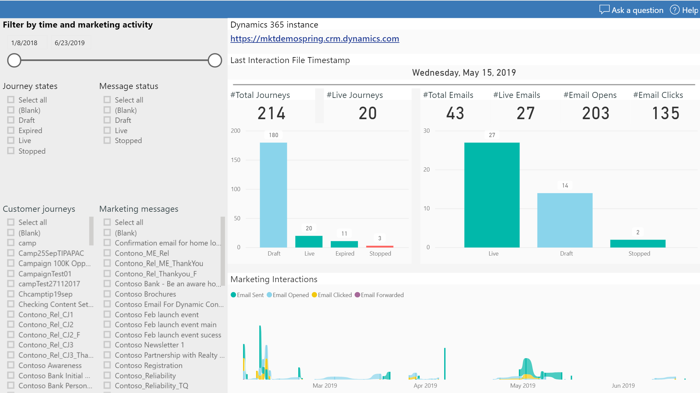
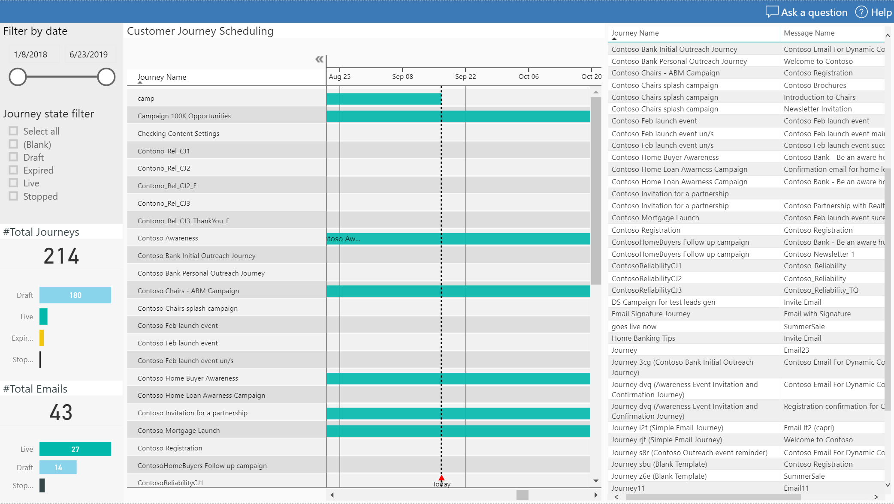
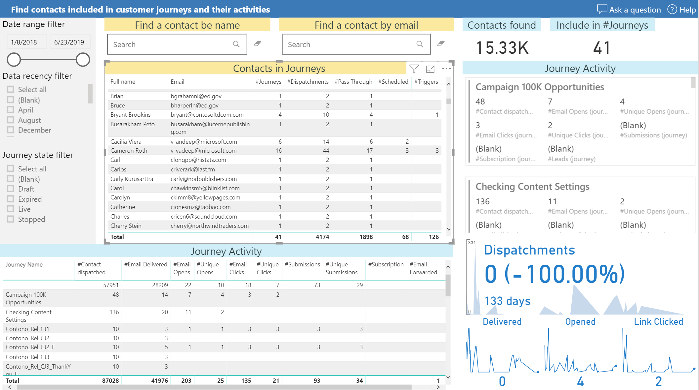
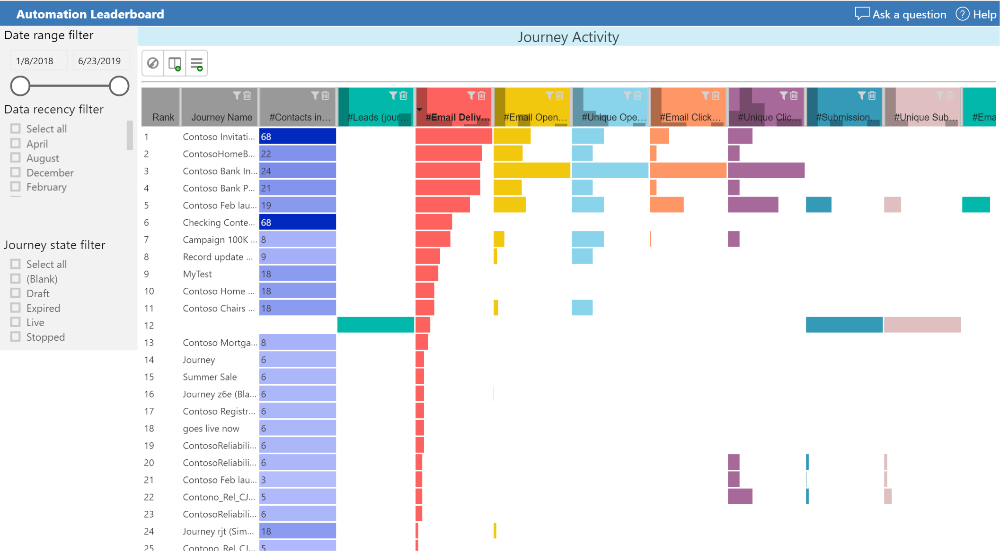
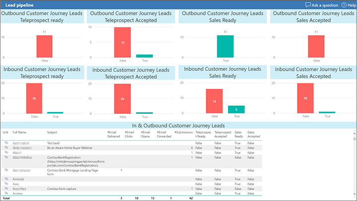
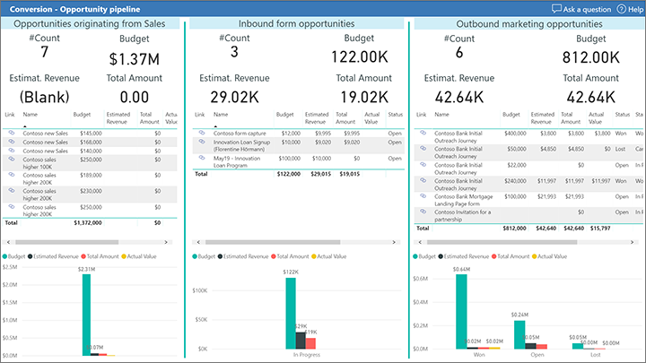

# Marketing program effectiveness analysis for Dynamics 365 Marketing

Use this report to analyze the end-to-end effectiveness of your marketing programs, including automation, journeys, channels, lead generation, conversion, and revenue generation. Use the following links to download a template for running the report on your own organization and a sample report filled with sample data.

|Download report template  |Download sample report  |
|---------|---------|
|||

> [!NOTE]
> You can find the full list of marketing analytics downloads in the [marketing analytics reporting gallery](analytics-gallery-start.md#gallery).

This report walks you through and end-to-end analytical exploration that starts from your marketing plan and continues all the way to return on investment (ROI) and attribution to sales versus marketing. Start your exploration on the [home page](#home-page), which provides a high-level overview of your marketing activities. Then go to the [marketing plan](#plan-overview) to see a Gantt chart that shows when your customer journeys are running and which messaging is being used. At the next station, you can find out [who exactly is included in your audience](#journey-reach), and what feedback and interactions have been detected. Go to the [leaderboard](#leaderboard) to compare which of your automated marketing activities performs best.

Next stop is [lead generation](#lead-generation), where you can find out which leads were created by inbound versus outbound marketing activities, see the stage the leads are in, and view related customer interactions. Explore the [full lead pipeline](#lead-pipeline) to find all leads, whether they're inbound/outbound or sales-generated; these leads are grouped by their current stage, as they leave marketing, go through tele-prospecting, and finally become sales-accepted. At the end of the exploration, the [return on investment report](#roi) helps you see where the opportunities with highest budget, highest estimated revenue, and actual total amount have been generated&mdash;by inbound marketing, outbound marketing, or direct sales activities.

In addition to the [common report pages](analytics-gallery-framework.md#common-report-pages), this analytics report includes the following pages:

- [Home page](#home-page)
- [Marketing automation plan overview](#plan-overview)
- [Journey reach](#journey-reach)
- [A leaderboard of your most effective marketing automation activities](#leaderboard)
- [Lead-generation performance analytics](#lead-generation)
- [Lead pipeline report for inbound and outbound lead generation](#lead-pipeline)
- [An ROI report](#roi)

## Marketing automation report home page

> [!TIP]
> The report home page gives you a quick overview of your core marketing automation objects, customer journeys, and email marketing messages.

Each report includes a filter pane on the left that lets you select the relevant marketing activities to focus on. You can also chose the relevant time frame for your exploration. You can define report-wide data filtering here, select the data range you'd like to report on, and limit the view to selected customer journeys.

## Marketing automation plan overview

The marketing plan report shows all your customer journeys in a Gantt chart together with related marketing messages. You can use the sliders to apply filters that sync across other reports. This helps you to set the scope for your explorations.

## Journey reach

The journey reach report dives into who was addressed by, and who responded to, your marketing activities. In this report you'll see all the audience members that have been included in and processed by your customer journeys. A *dispatchment* indicates that a contact has been pushed&mdash;typically from a segment&mdash;into the customer journey.

You can search dispatched contacts by name or email address. Then dive into details either per contact or aggregated at the customer journey level.

## Leaderboard&mdash;your most successful email marketing automation activities

The leaderboard shows which of your marketing automation plans performed best. Your best-performing customer journeys, along with the respective audience interactions, are ranked by various criteria, including unique opens, clicks, conversions (leads captured), subscriptions, and more. Select the criteria and then compare customer journeys or emails across selected&mdash;or all&mdash;customer journeys in which they appear.

## Lead generation flow originating from inbound/outbound marketing

The lead generation report helps you find out which leads were created from inbound versus outbound marketing activities. Outbound leads will have the originating customer journey field set, and will also have stages assigned and related customer interactions attached to the respective contact.

## Lead pipeline&mdash;see leads originating from inbound/outbound marketing and from sales

In the lead pipeline report, all leads originating from Dynamics 365 Marketing are grouped by their sales stage. The leads are split according to whether they came from inbound or outbound marketing activities. The leads originating from marketing move through the teleprospecting-ready and teleprospecting-accepted stages and then on to the sales-accepted and sales-ready stages. Sales-ready leads are typically the most promising and will probably be picked up by salespeople for extra attention.

## ROI report&mdash;judge effectiveness according to your return on marketing investments

Use the ROI report to compare revenue generation originating from inbound/outbound marketing and sales. This report splits your opportunities into three groups to help you attribute revenue to your marketing activities or direct sales. Each group shows the number of opportunities, the total budget for the opportunities in this group, the estimated revenue, and the actual total amount.

The group association is done through the originating leads based on whether those originated from customer journeys, marketing pages, or sales campaigns.

The first block contains the opportunities that originated from sales campaigns. The second block aggregates all opportunities that originated from inbound marketing&mdash;these have been created based on an inbound visit to a marketing page that can't be attributed to an outbound customer journey. The third are all the opportunities that have been attributed to a customer journey.

This report assumes all customer journeys to be outbound. However, you can extend your journey model to include an inbound versus outbound classification, and associate respective opportunities accordingly, if this is relevant for your marketing automation configuration.

***Happy analytics reporting with Dynamics 365 Marketing!***

[!INCLUDE[footer-include](../../includes/footer-banner.md)]