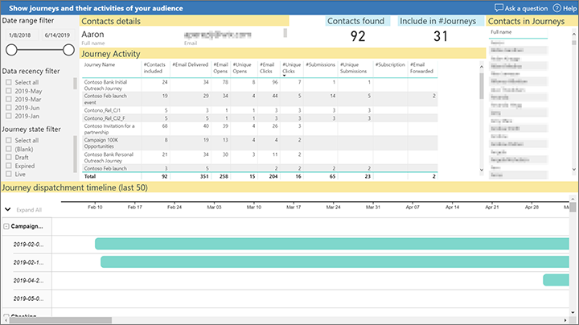
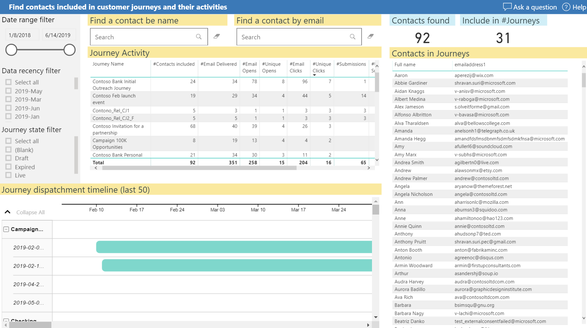

# Marketing reach analysis for Dynamics 365 Marketing

Use this report to identify contacts and how you're reaching out to them. See all audiences that have been reached in selected journeys, together with their related interactions.

Use the following links to download a template for running the report on your own organization and a sample report filled with sample data.

|Download report template  |Download sample report  |
|---------|---------|
||

> [!NOTE]
> You can find the full list of marketing analytics downloads in the [marketing analytics reporting gallery](analytics-gallery-start.md#gallery).

***Happy analytics reporting with Dynamics 365 Marketing!***

[!INCLUDE[footer-include](../../includes/footer-banner.md)]