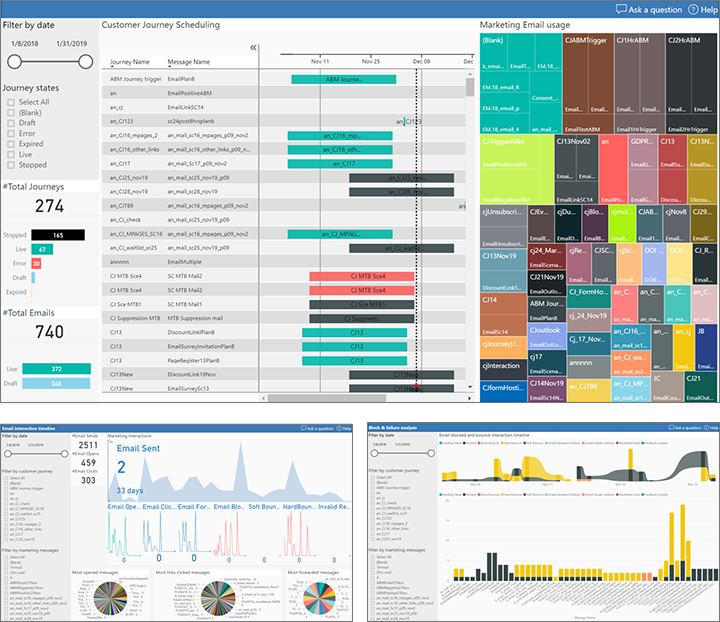
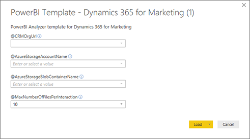

# Download and use marketing analytics templates and sample reports for Power BI

This topic provides a gallery with links to downloads and details for each template and sample report that is currently available. It also explains how to connect a downloaded template to your Dynamics 365 Marketing instance. These resources that will help you produce custom analytical reports with Power BI for your Dynamics 365 Marketing organization. 

## Gallery: Download Power BI reports and templates

> [!TIP]
> Download your marketing analytical reports and templates directly from our gallery&mdash;ready to use with Dynamics 365 Marketing!

We provide a growing set of marketing reports for easy download, and you can find all the information you need to select the reports that fit your needs. Each template and report provides many views, charts, and analytics that marketers should find useful. Use the standard features of the Power BI Desktop to explore the data sources and analytical displays, and to customize them as required.

|Name  |Description  |Template  |Report  |
|---------|---------|---------|---------|
|[Generic template (framework & tools)](analytics-gallery-framework.md)|This report provides generic parameters, data sources, and query code that allows you to query for any marketing data from CDS and the interaction store.|||
|[Basic leader board report (journeys & email marketing)](analytics-gallery-leaders.md)|Identify your most effective journeys and marketing messages.|||
|[Email Marketing Report](analytics-gallery-email.md)|Deep dive into your email marketing plans, activities and interactions.|||
|[Segmentation Report](analytics-gallery-segments.md)|Analyze how segments are used in your marketing activities.|||
|[Marketing program effectiveness](analytics-gallery-program.md)|Analyze the end-to-end effectiveness of your marketing programs, including automation, journeys, channels, lead generation, conversion, and revenue generation.|||
|[Marketing reach analysis](analytics-gallery-reach.md)|Identify contacts and how you are reaching out to them. See all audiences reached in selected journeys together with their related interactions.|||
|[Marketing form submission report](analytics-gallery-forms.md)|Get an overview of the submission stream across all your marketing forms.|||

The source code for all of these reports is [available publicly on GitHub](https://github.com/Microsoft/Dynamics-365-for-Marketing---Power-BI-Reporting).

## Connect a Power BI template to your Dynamics 365 Marketing instance

Once your Azure Blob storage is [set up and connected to Dynamics 365 Marketing](../custom-analytics.md), you're ready to start working in Power BI to connect to your data sources and design your analytics.

1. If you haven't already, then [download the templates you need from the gallery](#gallery).

1. Select a template and open it in Power BI Desktop. If you don't already have Power BI Desktop, you can download it for free from [https://powerbi.microsoft.com/desktop/](https://powerbi.microsoft.com/desktop/).

1. The first time you open a Power BI template you'll be asked to specify connection strings and credentials to connect to both Azure Blob storage and to Dynamics 365 Marketing.

    

    - To connect to the Dynamics 365 database, use the same user credentials that you use to sign into Marketing.
    - You can [find connection details for your Azure Blob storage](../custom-analytics.md#connect-blob) by using the Storage Explorer app.
    - Specify how many days of interaction data that you want to load (counting back from today).

1. Select **Load** to load the template or analyzer into Power BI.

    > [!NOTE]
    > If you see loading errors the first time you open a template or analyzer, then open the query editor, select a query that is highlighted with a warning icon and then select **Retry** on the notification message bar. Repeat for each query that shows a warning. After all queries have loaded, select **Close & Apply** and the refresh should work from now on.

## A video guide to data available for marketing analytics

Watch [the following video](https://www.youtube.com/watch?v=pBrB1BohUrE)
for a quick overview of all the data that is available for your marketing analytical reports.  

<iframe width="560" height="315" src="https://www.youtube.com/embed/pBrB1BohUrE" frameborder="0" allow="accelerometer; autoplay; encrypted-media; gyroscope; picture-in-picture" allowfullscreen></iframe>

More information: [Data sources for custom analytics](../custom-analytics.md#data-sources)