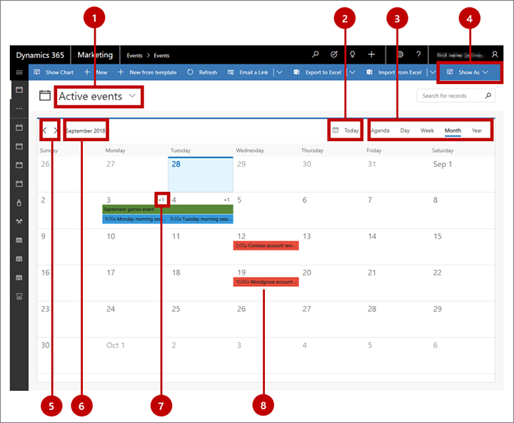
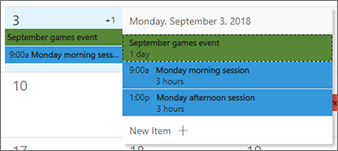

# Work with marketing calendars

The marketing calendar provides a calendar-style view where you can see and create time-based items like journeys, events, sessions, and appointments. It resembles Microsoft Outlook in both appearance and use.

The calendar is provided as a control that admins and customizers can add to, and optimize for, any form or entity in the system.

## Types and locations of marketing calendars

There are two basic types of marketing calendars:

- **Entity-level calendars**: Entity-level calendars appear when you first open an entity from the main navigator, such as events, customer journeys, or the main marketing calendar. They appear where you'd normally see a list view, and when present, you can switch between the calendar view and list view. Here you'll see relevant records plotted on the calendar according to their scheduled dates, and you can open any listed record from here. This type of calendar can show several types of entities and provides a system view selector for filtering the records shown.
- **Form-level calendars**: Form-level calendars appear while you are viewing a specific record, such as a specific event. They are integrated into the form view. These might appear in their own tab on the form, or as a section on a tab with other sections of settings also available. This type of calendar can only show and create records of one type of entity and they don't provide a system-view selector. They are often configured to show information that is related to the specific record where they appear.

Other than the differences noted here, both types of calendars look the same and work in similar ways.

<!--### The main marketing calendar

The main marketing calendar is available at **Marketing** > **My work** > **Marketing calendar**. It's an entity-level calendar, so it can show and create many types of time-based entities, including appointment, events, and customer journeys.-->

### The room reservation calendar

The room reservation calendar is a form-level calendar provided for event records. To use it, go to **Events** > **Event** > **Event**, open an event record and then go to its **Room reservations** tab. The calendar shows all room reservations assigned to the currently displayed event and its sessions. Unreserved rooms aren't shown, nor are events or sessions without assigned rooms. The calendar is read-only, so you can't create any sessions or reservations here.

### The speaker engagement calendar

The speaker engagement calendar is a form-level calendar provided for speaker records. To use it, go to **Events** > **Participants** > **Speakers**, open a speaker record and then go to its **Speaker engagements** tab. The calendar shows all speaking engagements that are associated with the currently displayed speaker.

### Custom calendars

System customizers can add custom calendars to nearly any entity or form, so your system may include more or other calendars than those described in the previous sections. If you are an admin or system customizer, then see [Create and customize marketing calendars](customize-marketing-calendars.md) for details about how to add, customize, and remove custom calendars.

## Use the calendar

### View and browse the calendar

The following illustration highlights the major display and navigation features of the marketing calendar. It shows an entity-level calendar that displays many types of entities. Form-level calendars are nearly the same, and the legend for the figure points out the differences.

Legend:

1. **System view selector**: Use this drop-down list to choose a system view, which establishes a preconfigured filter that controls which records you can see in the calendar (or list). The name of the current view is shown here. This option is only provided for entity-level calendars; for form-level calendars, the system view is preconfigured and fixed.
1. **Today button**: Select this button to jump to the current date while keeping the current calendar view and system view. In multiday views, the current day is highlighted. (If the current day is already shown and selected, then you won't see any change.)
1. **View selector**: Select a button here to display a single day, full week, or full year. You can also choose an agenda view, which provides a compact list of calendar items.
1. **Show as**: Select this button to open a drop-down list where you can switch between the calendar presentation or the standard list presentation. This option is only provided for entity-level calendars; for form-level calendars, the calendar is always shown.
1. **Increment buttons**: Select the left or right buttons here to increment the displayed date range by one unit (day, week, or year, as selected in the view selector).
1. **Displayed date range**: Names the current displayed date range. Select this value to open calendar controls that let you jump quickly to another date, week, or year.
1. **Overrun display** (month view only): For days where there are more items scheduled than can be shown in the current view, this value indicates how many unseen items are scheduled (such as **+1** ). To view all items scheduled for days with an overrun display, either double-click on the white space between the date number and the _+n_ display, or use the arrow keys of your keyboard to select a day and then press Enter. Choose any item in the pop-up window to view details about it or edit it, or choose **New item** to add a new calendar item to this date.  

    

1. **Scheduled item:** Scheduled items appear as labeled colored bars, where the color indicates the type of item it is. By default, events are green, sessions are blue, and appointments are red. Select any scheduled item to view a read-only summary of it in a pop-up dialog, which also includes an **Edit** button that lets you open the full record for editing. Some item types might go straight to the editing page (depending on how your calendar is set up).

### Create items in month view

To create a new calendar item while working in month view:

1. Select a day in the calendar using your mouse or cursor arrows.
1. Either click again on the selected date or range or press Enter on your keyboard. A pop-up window shows you all items scheduled for the selected day (if any) and includes items hidden in the standard view due to space constraints.  

    

1. Choose **New item** from the pop-up window and then choose which type of item (such as event, session, or appointment) you'd like to create. The types of items presented may vary according to the calendar's configuration.
1. A quick-create form opens from the side of the window. Use it to specify a few of the most important settings for the new item. (To make more detailed settings, you might need to open the record's full editing form later.)
1. Select **Save** at the bottom of the quick-create form to save the new item.

### Create items in day or week view

To create a new calendar item while working in day or week view:

1. Select a day and time range. If you are using a mouse, click and drag to select the range. If you are using a keyboard, first select the start time and press Enter, then use the arrow keys and Shift+Enter to select the end time.
1. Either click again on the selected date range or press Enter on your keyboard. A pop-up menu opens; use it to choose the type of item to create.  

    

1. A quick-create form opens from the side of the window. Use it to specify a few of the most important settings for the new item. (To make more detailed settings, you might need to open the record's full editing form later.)
1. Select **Save** at the bottom of the quick-create form to save the new item.

### See also

[Create and customize marketing calendars](customize-marketing-calendars.md)

[!INCLUDE[footer-include](../includes/footer-banner.md)]