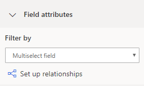
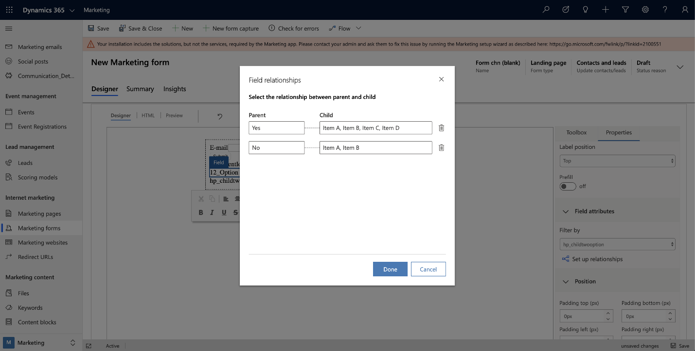

# Create and manage input fields for use in forms

[!INCLUDE[consolidated-sku-rtm-only](../includes/consolidated-sku-rtm-only.md)]

Each field that appears in a marketing form must map unambiguously to a contact or lead field in your Dynamics 365 database, where values submitted for that field will be stored. When you're designing a form, the **Toolbox** tab of the designer lists a design element for each field that is already set up, so all you need to do to add that field is drag the matching field element to your form (see also [Design your digital content](design-digital-content.md)). The most commonly used fields (such as name, address, and email) are set up by default, but if you want to use additional fields, you must set them up first. Read this topic to learn how to create and manage fields for use in your marketing forms.

> [!IMPORTANT]
> Don't map more than one marketing-form field to the same field in the database. If you do, you might experience issues such as empty drop-down lists for the double-mapped field. If you are having issues related to redundant field mappings, delete all of the redundant fields, create a new one to replace them, and update your forms as needed.

## Create or edit a marketing-form field

To create a new marketing-form field, do one of the following:

- Go to **Marketing templates** > **Form fields** to see the full list of all fields currently available to your organization, and then select **+New** in the command bar. This creates a new, blank field mapping and opens it for editing.

- While working on an existing marketing form, look at the **Toolbox** tab to the right side of the canvas. Under the **Fields** heading here, you'll see a design element for each field that is already set up on your instance. If you don't see the one you want, select **+New** next to the **Fields** heading. A quick-create flyout slides in from the side of the screen, where you can make all the most important settings, and then select **Save**. The new **Field** element is then added to the **Toolbox** tab.

To edit an existing field, go to **Marketing templates** > **Form fields** to see the full list of all fields currently available on your instance. Browse, search, sort, and filter the list to find the field you want to edit, and then select it to open it.

## Marketing-form field configuration

The following table describes all configuration settings that are available for marketing-form fields. All settings are available when working with the field record itself; the quick-create form provided when creating a field from the form designer includes the most important of these settings, but not all of them.


|        **Setting**        |       **Description**      |
|---------------------------|---------------------------|
|         **Label**          |      Name of the form field record. This becomes the name of the element provided in the designer for placing the field. It should almost always match the field name.    |
|         **Field type**          |                                                                                                                                 The type of data&mdash;such as text, number, or date&mdash;accepted by the field. More information: [Field type and format options](#field-type-and-format-options)                                                                                                                                 |
| **Contact mapping** | Choose the contact field to map to this marketing-form field. Leave this blank to disable contact mapping for this field. You must provide a value for **Contact field mapping**, **Lead field mapping**, or both; you won't be able to save your field mapping without a value in at least one of these fields. |
|  **Lead mapping**   |                                                                                                                                                                                    Choose the lead field to map to this marketing-form field. Leave this blank to disable lead mapping for this field. You must provide a value for **Contact field mapping**, **Lead field mapping**, or both; you won't be able to save your field mapping without a value in at least one of these fields.  |
|  **Placeholder**  |                                                                                                          Defines the "ghost text" shown in the field until a value is entered, typically displayed in a gray color. Use this to indicate what kind of value should be entered. If the user doesn't replace the ghost text by entering a value, the field is submitted as blank.                                                                                                           |
|     **Default value**     |                       The default label shown for the field when you add it to a form. You can override this default for any specific form by configuring the field element that creates the input field for that form; you might do this to translate the form to a different language. More information: [The form element for marketing pages](content-blocks-reference.md#the-form-element-for-marketing-pages)                       |
|     **Required**     |                       Choose whether a field must contain a value before the form can be submitted. Required fields have a red asterisk placed next to the field label.                       |
|     **Required error message**     |                       Create a custom error message that appears when a user has not entered information in a required field.                        |
|        **Label position**         | Choose whether you want the field label positioned on top, or to the left or right of the field. |
|        **Character width**         | Set a custom width for the characters entered in the field. |
|        **Maximum characters**         | Define the maximum number of characters that can be entered in the field. |
|        **Hide field**         | Toggle this switch to hide a field. Hidden fields are not displayed to form recipients. |
|        **Prefill**         | Provides returning contacts with a form that already shows their previously entered information, like their name and email address. More information: [Enable prefilling for forms](form-prefill.md) |

## Field type and format options

| **Type**  | **Format** | **Rendering control** | **Description**|
|-----------|------------|-----------------------|----------------|
| Single line of text    | Email         | Email&nbsp;Input<br />Text Box               | Creates a simple input field that accepts values that resemble an email address.                                                                                                           |
| Single line of text    | Text          | Text Box              | Creates a simple input field that accepts all types of text values.                                                                                                                         |
| Single line of text    | Text Area     | Text Area             | Creates a text area input field that accepts all types of text values.                                                                                                                     |
| Single line of text    | URL           | URL&nbsp;Input             | Creates a simple input field that accepts values that resemble a URL.                                                                                                                      |
| Single line of text    | Phone         | Phone&nbsp;Input           | Creates a simple input field that accepts values that resemble a phone number.                                                                                                             |
| Single line of text    | n/a           | Text Area             | Creates a text area, several lines high, for entering a large amount of text.                                                                                                              |
| Option set             | n/a           | Radio Buttons         | Maps to a field with a limited number of predefined values (as defined in the database). Creates a set of radio buttons, with one button for each value.                                  |
| Option set             | n/a           | Drop-down              | Maps to a field with a limited number of predefined values (as defined in the database). Creates a drop-down list for selecting a value.                                                  |
| Two options            | n/a           | Check box              | Maps to a Boolean field, which accepts a value of either true or false. Creates a check box, which is selected when true and clear when false.                                              |
| Two options            | n/a           | Drop-down              | Maps to a field that accepts one of just two possible values (typically true or false). Creates a drop-down list with two entries, with the display text for each defined in the database. |
| Two options            | n/a           | Radio&nbsp;Buttons         | Maps to a field that accepts one of just two possible values (typically true or false). Creates a pair of radio buttons, with the display text for each defined in the database.           |
| Whole number           | n/a           | Number&nbsp;Input          | Creates a simple input field that accepts a whole number (no decimals).                                                                                                                    |
| Floating point number  | n/a           | Number&nbsp;Input          | Creates a simple input field that accepts a floating-point (decimal) number. Supports a level of precision up to 5 decimal places and can range from -100,000,000,000 to 100,000,000,000.  |
| Decimal number         | n/a           | Number Input          | Creates a simple input field that accepts a floating-point (decimal) number. Supports a level of precision up to 10 decimal places and can range from -100,000,000,000 to 100,000,000,000. |
| Date and time          | Date Only     | Date Picker           | Creates a date picker, which lets visitors choose a date from a pop-up calendar display. Does not accept a time.                                                                           |
| Date and time          | Date and Time | Date-Time Picker      | Creates a date and time picker, which lets visitors choose a date from a pop-up calendar and a time from a drop-down list.                                                                   |
| Lookup field          | n/a | Lookup      | Creates a field that is linked to a particular entity type, enabling you to create a drop-down list of options that were created in advance. For example, you could use a lookup field to create a drop-down list of all accounts. More information: [Adding lookup fields](marketing-fields.md#adding-lookup-fields-and-troubleshooting).<br><br>Lookup fields *are not* supported when integrating an external form page using the form capture method. Instead, you should use an embedded marketing form. More information: [Embed forms on external websites](/dynamics365/marketing/embed-forms).                                                                   |

When you publish a marketing page, Dynamics 365 Marketing hosts it by using its portals feature at a public URL that you can share with prospects. When you first create the page, Dynamics 365 Marketing automatically creates a new website record for it, where you can go to analyze its traffic and performance. More information: [Register link clicks and website visits](register-engagement.md)

## Cascading form fields

Cascading fields allow you to create hierarchy relationships between two option fields in a marketing form. You can use cascading fields to create parent-child relationships for filtering option sets from a parent field. The filtering will show users fewer options from the child set once the user chooses an option from the parent level. The child option set stays hidden until a choice is made in the parent option set. Supported [data fields](marketing-fields.md#field-type-and-format-options) for creating cascading fields include option sets, two options, and multiselect option sets.

To create a cascading field:

1. Add two multiselect options or option set (radio button) fields to a form.
1. Select the child set that you want to nest into the parent field.
1. On the **Properties** pane, go to **Field attributes** > **Filter by** and select **Set up relationships**.

    

1. Set the parent and child options that will be connected.

    

> [!NOTE]
> If there are no fields that can be selected as a parent, the **Field attributes** section is not shown.

## Adding lookup fields and troubleshooting

After creating a custom entity to use with a lookup field, or if your lookup field is not working, you should double check that you have the settings listed below enabled for the entity you're using with the lookup field.

1. The lookup data you will be configuring will be available on the Internet. You will need to assess which personally identifiable and sensitive information might be made available online. Once you acknowledge that by enabling the related option, you are able to complete the configuration.  
1. Define contact and lead mapping. If you choose to map both, they should return the same type of entity for the mapping to be completed.
1. For each entity you select for the mapping, define:
    -  The view that controls which values are shown. If you want to show all the active values only, you can select the related view. For example, if you are configuring an **Account** lookup, you can select the **Active Accounts** view.
    -  The attribute used for searching. For example, the **Account name** could be used for an **Account** lookup.
1. Check the security roles for the configuration you selected.

    > [!TIP]
    > If the lookup field that you want to set up is a custom field you've created, ensure that Service User Roles are set up for the entity. For a new custom entity, you will need to enable the proper Security Role permission for your org. You will often need to set the Security Role manually.
    > 
    > To set the Security Role manually:
    > 
    > 1. Open the **Settings** menu  at the top of the page and select **Advanced settings**.
    > 1. The advanced settings area opens in a new browser tab. Note that this area uses a horizontal navigator at the top of the page instead of a side navigator. Navigate to **Settings** > **System** > **Security**.
    > 1. Select the **Security roles** icon.
    > 1. Go to **Marketing Services User Extensible Role** > **Custom Entities**.
    > 1. Under the **Custom Entities** tab, find the name of your custom entity and mark the **Read** column box (the second column) green.
    > 1. If you use a filter, make sure the **Marketing Services User Extensible Role** has read permissions for entities used in the corresponding view. For example, if you use the view “Accounts being followed” as an Account filter, you need to ensure that the role has a read privilege for the custom entity.

1. Check field-level security access.

    > [!TIP]
    > If a custom field is used as a lookup field or in a filter view, ensure that field-level security is correctly set up. This applies only, if “Field Security” is enabled for the custom field. Learn more: [Column-level security to control access](/power-platform/admin/field-level-security).
    >
    > To set up field-level security:
    >
    > 1. Open the **Settings** menu  at the top of the page and select **Advanced settings**.
    > 1. The advanced settings area opens in a new browser tab. Note that this area uses a horizontal navigator at the top of the page instead of a side navigator. Navigate to **Settings** > **System** > **Security**.
    > 1. Select the **Field Security Profiles** icon.
    > 1. Select the **New** icon to create a new Field Security profile and enter a name in the General section.
    > 1. In the **Users** section, add the system user "**# D365 Marketing**".
    > 1. In the **Field Permissions** section, add the **Read** permission to all required fields.

### Set lookup fields via API

You can use the JavaScript API to perform a search request in the background and populate the lookup field with items containing the specified search term.

For example, you can search for all items containing “Microsoft” after the form is loaded:

```
MsCrmMkt.MsCrmFormLoader.on("afterFormLoad", function() {
    MsCrmMkt.MsCrmFormLoader.fillLookupFromSearch("b9051065-5851-41db-94bc-b7e1dc6bb646", "Microsoft")
        .then(function (r) {
            console.log("Success performing search");
        }).catch(function (e) {
            console.error("Error performing search");
        });
    });
```

These are the details of the function, available under ```MsCrmMkt.MsCrmFormLoader``` methods:

- Function Name: ```.fillLookupFromSearch(lookupFieldId, searchTerm)```
- Description: Performs a search request in the background and populates the specified lookup field with results.
- Parameters
  - ```lookupFieldId```:
    - type: string
    - description: lookup input field ID, for example "b9051065-5851-41db-94bc-b7e1dc6bb646"
  - ```searchTerm```:
    - type: string
    - description: what to search for, for example john@contoso.com
- Returns: ```Promise<boolean>```

Find more functions in the [developer documentation](/dynamics365/marketing/developer/marketing-form-client-side-extensibility#javascript-api)

### See also

[Design your digital content](design-digital-content.md)  
[Design elements reference](content-blocks-reference.md)  
[Create, view, and manage marketing forms](marketing-forms.md)

[!INCLUDE[footer-include](../includes/footer-banner.md)]
