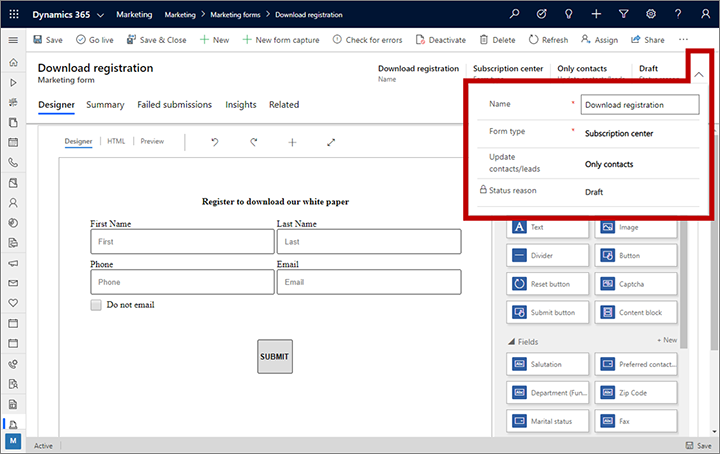
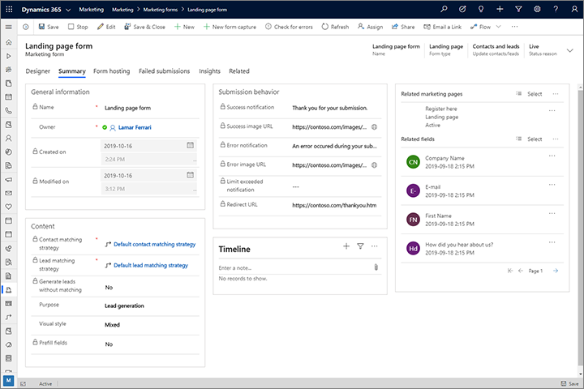
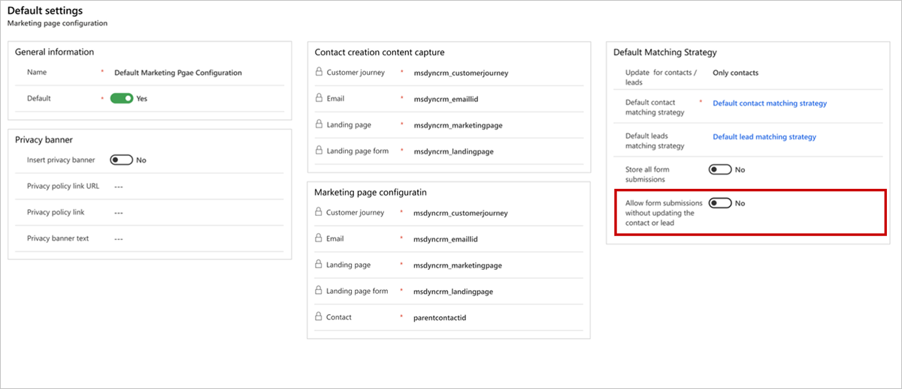
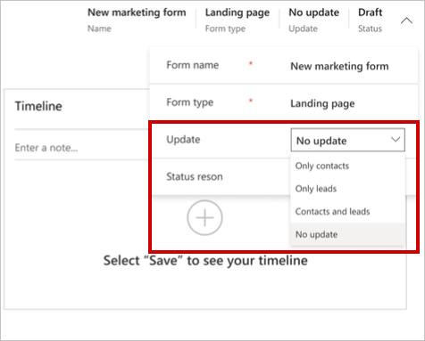
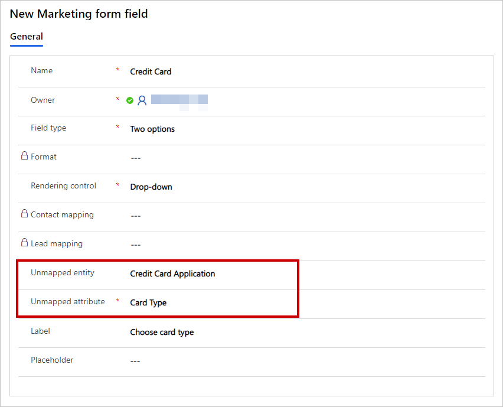
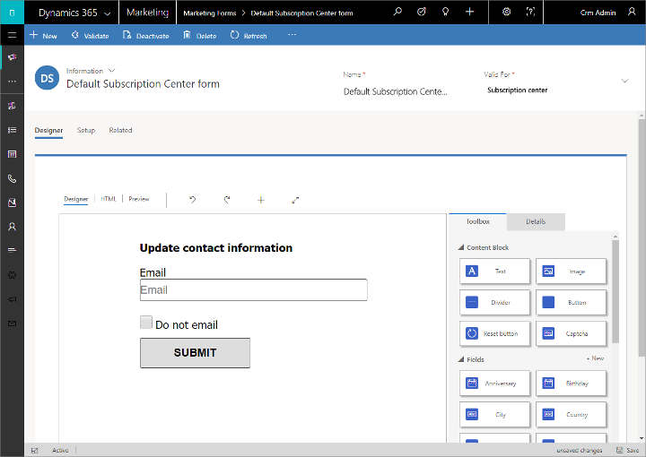

# Create, view, and manage marketing forms

A marketing form defines a set of input fields arranged into a form layout. You'll probably build a small library of reusable forms that you can place on all your various marketing pages as needed. To add a marketing form to a specific marketing page, use a form element to position the form and choose local settings for it, which apply to that page only.

Each marketing form is made from a collection of fields, buttons, graphical elements, and a few configuration settings. Each field included in your form must be set up in Dynamics 365 Marketing as a [marketing form field](marketing-fields.md), which establishes options for how that field is presented in forms where it appears, and which lead or contact fields it maps to in the database. Some features of a marketing form depend on which type of form it is&mdash;for example, a subscription center form can include subscription lists.

## Marketing form types and subscription behavior

As with marketing pages, each marketing form has a type, which maps directly to the page type where you can use that form. Though you can include more than one form on a marketing page, all forms on the page must be of the same type, and that type must match the type of the page itself. The available types are:

- **Landing page form**: This is a general-purpose form for collecting contact information on marketing pages that are not subscription centers or forwarding forms. Landing page forms can also offer mailing-list subscriptions for opt-in, but they can't show the visitor their current subscriptions or allow them to opt out of any lists (for this, they must use a subscription form). When the form is submitted, Dynamics 365 Marketing tries to match the incoming data to an existing contact; if a match is found, the matching record is updated, otherwise a new record is created. The new or updated contact will also be subscribed to each mailing list where the check box is selected, but will not change their subscription status for any mailing list where the check box is cleared.
- **Subscription form**: Provides fields where contacts can view and edit their contact details, and shows a collection of mailing lists (with check boxes) where the contact can add or remove subscriptions. When the form is submitted, all contact fields are updated to match the submission, and the contact is removed from all lists where the check box is cleared and added to all lists where the check box is selected. A subscription form only modifies existing contacts, and never creates new ones.
- **Forward to a friend**: Provides a short collection of fields, each of which will accept an email address entered by a contact when forwarding a marketing message to other colleagues.

You should usually choose your form type before you start designing the form. For details about how to set the form type, see [Form summary and configuration](#form-summary). For more information about how the form type affects your form's design and requirements, see [Design and validate your form content](#form-content)

## Create and edit marketing forms

To create a new marketing form, do one of the following actions:

- Go to **Marketing** > **Internet marketing** > **Marketing forms** to go to the list of all forms currently available on your instance, and then select **New** in the command bar. You'll first be asked to choose a template, which establishes the form type, column layout, and sample content. Then you'll be in the form designer.
- While working on an existing [marketing page design](create-deploy-marketing-pages.md), add a form element to your design, and then select **New** on the **Properties** tab instead of choosing an existing form (be sure to save your page design first if you haven't already done so). You'll then be asked to choose a template, which establishes the form type, column layout, and sample content. Then you'll be in the form designer.

The form designer is similar to other types of [digital content designers](design-digital-content.md) in Dynamics 365 Marketing, but only provides design elements and settings that are appropriate for marketing forms.

To edit an existing form, do one of the following actions:

- Go to **Marketing** > **Internet marketing** > **Marketing forms** to go to the form list page. Use the search, sort, and filter controls to find the form you want to edit, and then select its name in the list to go to the form designer.
- Open a marketing page where you use the form, select the form element in the canvas, and then go to the **Properties** tab of the page designer and open it from there.

## Form summary and configuration

Each marketing-form record includes a **Summary** tab and a few basic settings in the header. Use these to set options and get more information about the form.

### Settings in the header

The header settings are available at the top of the page no matter which tab is shown. To edit them, select the **More header fields** button (which looks like a down-pointing chevron) at the side of the header to open a drop-down dialog with the following settings:

- **Name**: Enter a name for the form. This is the name you'll see in the forms list and when adding the form to a marketing page.
- **Form type**: Choose whether the form should function as a **Landing page**, **Subscription center**, or **Forward to a friend** form. This setting affects the requirements for what your form must contain and where you can use it. More information: [Marketing form types](#form-types) and [Design and validate your form content](#form-content)
- **Update contacts/leads**: Choose which types of records can be created or updated in response to a form submission. Usually you should leave this set to **Contacts and leads**, which will update both types of records and link them together as needed to support lead scoring and insights. However, you might instead choose to update **Only contacts** or **Only leads** if you want to prevent one of these types of records from being changed. If you choose **Only contacts** or **Only leads**, you can even allow form submissions without updating the contact or lead. This gives you the option to collect form data, then export to Excel create a custom Workflow or Flow to map the data to an entity of your choosing. More information: [How form settings affect lead scoring and interaction records](#form-setting-effects)
- **Status reason**: Shows the current go-live status of the form. A form must be live before you can use it in a marketing page or embed it on an external site. You can't change this setting here; use buttons on the command bar instead. More information: [Go live to make your marketing form available for use](#form-go-live)

    

### Settings on the Summary tab

The following settings and information are provided on the **Summary** tab:

- **General information**: Here you can read and assign a name to the form record, read and set the owner, and see when the form was created and last modified.
- **Contact and Lead matching strategies**: These settings control which incoming form-field values are matched against existing contact and lead records. If an existing record has matching values in all the specified fields, then that record will be updated with the incoming values (for the other fields); if no match is found, then a new contact and/or lead record will be created. Default strategies are provided for new forms. More information:  [Set matching strategies](mkt-settings-matching.md)
- **Generate leads without matching**: This setting controls whether or not the form will attempt to match an existing lead (using the specified **Lead matching strategy**), or if instead it will always create a new lead for each submission. Set to **No** to apply the matching strategy, or to **Yes** to create a new lead every time.
- **Purpose** and **Visual style**: These fields provide more information about the form. For form templates, these values affect how the form can be found on the **Purpose** and **Visual style** tabs of the template gallery. These settings don't affect the actual layout or functionality of the form in any way.
- **Prefill fields**: Set to **Yes** to enable prefilling for the form; set to **No** to disable it. You can only change this option for landing-page forms&mdash;subscription-center forms always use prefilling, while forward-to-a-friend forms never use it. More information: [Enable prefilling for forms](form-prefill.md)
- **Submission behavior**: These settings establish how the form interacts with people who submit it. They establish the default settings for when you place the form in a marketing page using a [form element](content-blocks-reference.md#form-element), though you can override these by editing the form element properties. They also establish the behavior for when the form is embedded on an external website. The following settings are provided here:
    - **Success notification**: Enter a message to show to visitors right after they submit the form. Use this to thank the submitter and confirm their submission.
    - **Success image URL**: The success-notification message is rendered as an overlay dialog that includes a small graphic. By default, it shows a green circle with a check mark. If you prefer a custom graphic (such as your organization's logo), then upload the graphic somewhere and enter the full URL here.
    - **Error notification**: Enter a short message that tells the user that a temporary error has prevented the system from accepting the form submission. For example, "We can't accept your form submission right now. Please try again later."
    - **Error image URL**: The error-notification message includes a small graphic. By default, it shows a red circle with an X mark. If you prefer a custom graphic, then upload the graphic somewhere and enter the full URL here.
    - **Limit exceeded notification**: Enter a short message announcing that the system has stopped processing new submissions temporarily, and inviting the user to try again later. This situation can occur if the server detects a submission pattern consistent with abuse of the system and has therefore entered a defensive stance.
    - **Redirect URL**: Enter a URL to send the submitter to immediately after they submit the form. This typically would be a page on your own website that thanks the submitter and confirms their submission, or some other message related to the purpose of your marketing page.
    - **Store all form submissions**: Marketing-form records  provide a tab called **Form submissions**, where you can see all incoming submissions for the current form that haven't been processed yet. Failed submissions will remain listed here so you can inspect,  possibly fix, and resubmit them. Set this option to **Yes** if you'd also like to keep a record of all successfully processed submissions here, which you'll also be able to inspect, update, and resubmit if needed. Set this to **No** to keep only pending and failed submissions in the list. Either way, all successfully processed submissions will be applied to your database, and you'll always be able to see these submissions on the **Insights** > **Submissions** tab (but you can't edit or resubmit from there). More information: [Edit and resubmit form submissions](failed-submissions.md)

- **Timeline**: Shows a history of notes and other activities related to the current form. Most types of entities in Dynamics 365 Marketing include this type of display.
- **Related marketing pages**: Here you can see a list of marketing pages where this form is used. Select any listed page to open it.
- **Related fields**: Here you can see a list of fields used in this form. Select any listed field to open its definition.

    

### How form settings affect lead scoring and interaction records

Typically, you'll use marketing forms as part of your lead generation and scoring strategy. If so, then it's important to understand how some of the settings in the header and on the **Summary** tab can affect contact generation, lead generation, record updates, lead scoring, and interaction records. The most important setting in this regard is the **Update contact/leads** setting in the header, which  affects what happens when a contact submits a form, as described in the following subsections. For more information about these issues, see [Design lead-scoring models](score-manage-leads.md).

#### Create/update both contacts and leads

When a form is submitted with **Update contact/leads** set to **Contacts and leads** (which is the standard and recommended setting):

- Both leads and contacts will be created or updated as needed.
- The system applies the **Contact matching strategy** to see if an existing contact matches the submission.
  - If a matching contact is found, update its fields to match the submission.
  - If no contact is found, then create a new one based on the submission.
- If **Generate leads without matching** is set to **Yes**, the system always creates a new lead, regardless of the **Lead matching strategy**.
- If **Generate leads without matching** is set to **No**, the system applies the **Lead matching strategy** to look for an existing lead that matches the submission.
  - If a matching lead is found, update its fields to match the submission.
  - If no lead is found, create a new one based on the submission.
- The system stores the found/created contact ID in the **Parent Contact for lead** lookup field for the found/created lead.
- The system generates a form-submitted interaction record with both the found/created lead ID and the found/created contact ID.

#### Create/update leads only

When a form is submitted with **Update contact/leads** set to **Only leads**:

- Contacts are never created or updated, so the **Contact matching strategy** setting is ignored and has no effect.
- If **Generate leads without matching** is set to **Yes**, the system always creates a new lead, regardless of the **Lead matching strategy**.
- If **Generate leads without matching** is set to **No**, the system applies the **Lead matching strategy** to look for an existing lead that matches the submission.
  - If a matching lead is found, update its fields to match the submission.
  - If no lead is found, create a new one based on the submission.
- The system checks whether a Dynamics 365 Marketing cookie is present on the contact's computer. (If the cookie is present, that means that this contact used this computer to open a subscription center or submit a form to Dynamics 365 Marketing before, so the system can recognize the contact.)
  - If a cookie is found, then store the contact ID in the **Parent Contact for lead** lookup field for the lead.
  - If no cookie is found, then newly created leads won’t have any parent contact (but existing leads will keep their parent contact, if present).
- The system generates a form-submitted interaction record with the found/created lead ID. If a cookie was found, then the contact ID is also stored in the interaction record, but if no cookie was found, the contact ID is null.

> [!IMPORTANT]
> Leads with no parent contact can’t be scored by lead-scoring models, and interactions with no contact ID can't contribute to a lead score.

#### Create/update contacts only

When a form is submitted with **Update contact/leads** set to **Only contacts**:

- Leads are never created or updated, so the **Lead matching strategy** setting is ignored and has no effect.
- The system applies the **Contact matching strategy** to see if an existing contact matches the submission.
  - If a matching contact is found, update its fields to match the submission.
  - If no contact is found, then create a new one based on the submission.
- The system generates a form-submitted interaction record that includes the found/created contact ID (but the lead ID is null).

#### Do not create/update contacts or leads

You can also collect form data, but choose not to create new contacts or update contacts or leads. This feature allows you to access data from form submissions in a form submission entity. It does not map or update any fields to an entity at the time of the form submission. This option provides advanced users the flexibility to decide how to handle the form submission entity without changing any contact or lead data in the CRM database.

> [!IMPORTANT]
> Forms created without updating contacts or leads cannot be used in customer journeys, as the contact or lead will not be mapped and the journey cannot provide a matching strategy. The submission record created can, however, be exported to Excel, or be linked to update any entity record via a Workflow or a Flow.

To prevent mapping form data to contacts or leads, go to **Settings** > **Advanced settings** > **Marketing settings** > **Landing pages** > **Default Marketing page configuration** and switch on **Allow for form submissions without update to contact/lead**.

After you enable allowing form submissions without updating contacts or leads, you will have the option to select **No update** in the marketing form settings.The submission records are created at the time of submission, however the process stops before any contact or lead is updated.

When a landing page type form is submitted with **Update contact/leads** set to **No update**:

- Contacts and leads are not created or updated, so the **Lead matching strategy** and **Contact matching strategy** setting is not required and has no effect.
- The system generates a form-submitted interaction record with the field submission values, but leaves the lead ID null. The contact ID will also be left null unless it is available from previous interactions such as a form submission or email link click.
- The no update setting only works with landing page form types.
- While not updating any contact or lead, no update enables selection of form fields of entities other than a contact or lead. This provides users with a rich selection of form fields and allows the possibility to use the option sets under these fields. The no update setting does not map the fields or create any matching strategy, and works as a prototype selection for data collection purposes only.
- The fields used in the form can be from any entity, however they will not map to the specific entity. The fields will only be used for data collection purposes.
- The unmapped fields can be created when needed to use as an option set from any entity, such as custom fields and custom entities.
    
    For example, if you want to use a “Card type” custom field inside your form, under a “Credit card application” custom entity, you would use the following parameters when creating the form field:

    - Unmapped entity = Credit Card Application
    - Unmapped attribute = Card Type

    As shown in the image below, this would give you a field with “Debit” and “Credit” options that you created previously, which you could then use as a dropdown field for collecting credit card applications without updating contacts or leads.

    

> [!NOTE]
> Advanced users can create custom [Workflows](../customerengagement/on-premises/customize/workflow-processes.md) to map form data collected through the **No update** option to custom entities. Learn more: [Map form data to entities with custom Workflows](entity-mapping.md)

## Design and validate your form content

When creating or editing a form, you'll be in the form designer, which is an example of the Dynamics 365 Marketing digital-content designer that offers design elements for working with forms.

Use the designer to add, configure, and arrange the various fields, buttons, and graphical elements that your form requires by working as follows:

- Assemble your form by dragging fields and design elements from the **Toolbox** tab to the canvas.
- Configure each element by selecting it and going to the **Properties** tab. More information: [Design elements reference](content-blocks-reference.md)

> [!TIP]
> The **Toolbox** tab of the form designer shows each field for which a field mapping is established. If you don't see the field you are looking for, then you probably need to set up a mapping for it as described in [Create and manage input fields for use in forms](marketing-fields.md)

The designer also provides the usual tools for editing the HTML code and viewing previews in various screen sizes and orientations. More information: [Design your digital content](design-digital-content.md)

Design element availability and requirements vary by form type, as outlined in the following table. Be sure to include all the elements that are required for the type of form you are designing.

| **Design element type** |**Landing page** | **Subscription center** |**Forward to a friend** |
|----------|----------|----------|--------------------------|
| **Text**, **Image**, **Divider**, and **Button** | Yes               | Yes                     | Yes                      |
| **Field**                           | Yes               | Yes                     | No                       |
| **Subscription List**               | Yes               | Yes                     | No                       |
| **Forward to a friend**             | No                | No                      | **Required**             |
| **Do not bulk email**              | Yes               | **Required**            | No                       |
| **Remember me**                    | Yes               | Yes                     | No                       |
| **Submit button**                  | **Required**      | **Required**            | **Required**             |
| **Reset button**                    | Yes               | No                      | Yes                      |
| **Captcha**                          | Yes               | No                      | No                       |

You can also view and edit the raw HTML code for the form by going to the **Designer** > **HTML** tab. There, you can paste code you've copied from other applications and add features that aren't available in the graphical designer (such as custom scripts for validating form input).

When you're done designing your form, select **Check for errors** to make sure you've included all the required content and settings. Dynamics 365 Marketing checks your form and displays the results. If it reports any errors, read the error text, try to correct the issue, and then check for errors again until the form passes validation.

> [!IMPORTANT]
> Forms are nearly always intended to create or update one or more database records&mdash;especially contact or lead records. However, record creation will fail if any fields required by the database are missing when the form is submitted. When you're designing a form, always be sure to identify all of the fields required by your database, and add a form element with its **Required** check box selected for each of them. That will ensure that contacts who submit the form will get an error message if any required values are missing. If you don't do this, then form submissions might simply be ignored without informing contacts of the problem. Your database could be customized to require fields that you don't expect, so be sure to talk to your system customizer or administrator if you're not sure which fields are required. The **Check for errors** function for forms doesn't identify all of the fields required by your database, especially custom fields, so you can't depend on it to inform you of this issue. Always be sure to test your form to confirm that it creates the types of records you expect it to.

## Go live to make your marketing form available for use

Your marketing form remains in draft status while you are building it, and it is therefore editable in Dynamics 365 Marketing but is unavailable for use on marketing pages. When your form is ready for use, you must publish it by selecting **Go Live**. Your design will be checked for errors and then, provided it passes, be moved to the live state, thereby making it available for use on a marketing page or to be [embedded on an external site](embed-forms.md). If a problem is found, read the error message, address the issue, and try again.

You can edit a live form by selecting **Edit** in the command bar. While you are editing it, it remains functional on all live pages where it is already being used, and available for use on new pages. After editing, select **Save** to go live with your changes. Your design will be checked for errors and then, provided it passes, your updates will be published.

You can prevent a live form from being available for use on new pages by selecting **Stop** in the command bar. <!-- Stopped forms can't be added to new pages, but will continue to function on pages that are already live. However, if you edit or stop a page that includes a stopped form, you'll need to go live with the form (or pick another live form) before you can go live with that page again. -->

More information: [Go live with publishable entities and track their status](go-live.md)

## Establish marketing-form templates

As with marketing pages themselves, marketing forms are also based on templates, so when you need to create a new form, you are provided with a collection of form templates to help get you started more quickly.

Dynamics 365 Marketing comes with a collection of sample form templates, and you can also save your own templates, which you might do to establish your own visual identity and quickly create new forms that conform to it.

You can view, edit, and create form templates by going to **Marketing** > **Marketing templates** > **Form templates**. The process for creating a new template is nearly the same as creating a new form.

## Add a form to a marketing page

Use a form element to add a form to a landing page. After adding the element, you'll choose (or create) the actual form that the element will show and can also choose other configuration settings that affect how it will work on that page.

When you're choosing which form the element will show, you can only choose forms whose type matches the type of marketing page you are working on (landing page, subscription center, or forward to a friend).

More information: [The form element for marketing pages](content-blocks-reference.md#the-form-element-for-marketing-pages)

## View submissions and gain insights from form interactions

Once your form is part of a live marketing page, it will start to collect information about how people are using it, including records of form submissions and other details. The system provides a wealth of information, including analytics, KPIs, graphs, and more, to help you gain insights from your marketing results. More information: [Analyze results to gain insights from your marketing activities](insights.md)

### See also

[Design your digital content](design-digital-content.md)  
[Design elements reference](content-blocks-reference.md)  
[Create input fields for forms](marketing-fields.md)

[!INCLUDE[footer-include](../includes/footer-banner.md)]