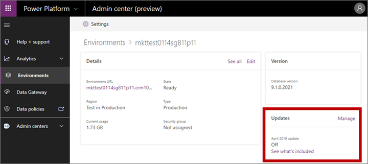
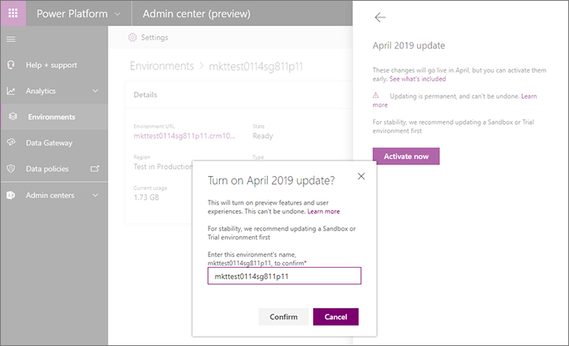

# Activate and use preview features

From time to time, [!INCLUDE[cc-microsoft](../includes/cc-microsoft.md)] makes new [!INCLUDE[pn-marketing-business-app-module-name](../includes/pn-marketing-business-app-module-name.md)] features available as *preview features*, which you can enable and use if you want to get familiar with upcoming features before they're officially released and fully supported. Read this topic to learn about which preview features are currently available, how to activate them, and how to use them.

> [!IMPORTANT]
> [!INCLUDE[cc_preview_features_definition](../includes/cc-preview-features-definition.md)]
> [!INCLUDE[cc_preview_features_no_MS_support](../includes/cc-preview-features-no-ms-support.md)]  

## Enable preview features

Most preview features aren't installed or enabled by default. A system administrator must explicitly enable and install them before they will become available to any instance.

> [!NOTE]
> If you already enabled the preview features that were available for the February 2019 update and would now like to try the new preview features released in March 2019, then all you need to do is [update your instance](apply-updates.md). You don't need to opt-in again as described in this section.

> [!NOTE]
> If you already have a [!INCLUDE[pn-microsoftcrm](../includes/pn-microsoftcrm.md)] environment (including a trial), but don't yet have [!INCLUDE[pn-marketing-business-app-module-name](../includes/pn-marketing-business-app-module-name.md)] installed on it, and you'd like to install [!INCLUDE[pn-marketing-app-module](../includes/pn-marketing-app-module.md)] with the preview features already enabled, then you can do both at once by first enabling the preview on your instance (as described here) and then installing  [!INCLUDE[pn-marketing-app-module](../includes/pn-marketing-app-module.md)].

To enable the preview features:

1. Sign in to [!INCLUDE[pn-marketing-business-app-module-name](../includes/pn-marketing-business-app-module-name.md)] (or any app on your tenant) as an administrator.

1. Go to your [Power platform admin center](https://admin.powerplatform.microsoft.com/) (this link will bring you there).

1. Select **Environments** in the side navigator. A list of environments on your tenant opens. (Environments are also sometimes called *instances* or *organizations*.)

1. Select the environment where you want to enable the preview.
    > [!CAUTION]
    > We highly recommend that you only enable preview features on a sandbox or trial environment, not on a production environment. You can [copy a production instance](manage-marketing-instances.md) to a sandbox if you want to test on your exact configuration, and sandbox environments can be reset, backed up, and restored as you test features without impacting your production users.

1. Find the **Updates** section of the page, and then select the **Manage** link at the top of this section.

    

    > [!NOTE]
    > If the **Manage** link isn't present, and it says **On** under **April 2019 update**, then you've already enabled the preview for this environment. But you might still need to install the features, so skip ahead to step 8 to make sure.

1. The **April 2019 update** flyout slides in from the side of the page. Select the **Activate now** button at the bottom of the flyout.

1. The **Turn on April 2019 update?** dialog box opens. To confirm that you want to enable the preview features for your selected environment, enter the environment name in the field provided here and then select **Confirm**.

    

1. [Open the Dynamics 365 admin center](dynamics-365-admin-center.md).

1. Go to the **Applications** tab of the admin center to see a list of applications you have installed.  
    

    The list shows a row marked **Dynamics 365 Marketing Application** for each entitlement (license) you have for [!INCLUDE[pn-marketing-business-app-module-name](../includes/pn-marketing-business-app-module-name.md)]. Free entitlements show a **Status** of **Not configured**. Installed entitlements show a **Status** of **Configured** and include the name of the environment where they are installed at the end of their application name.

1. From the list on the **Applications** tab, select the **Dynamics 365 Marketing Application** where you want to enable the preview, and then choose **Manage** from the side panel.
    - If you're adding the preview to an existing [!INCLUDE[pn-marketing-business-app-module-name](../includes/pn-marketing-business-app-module-name.md)] installation, then choose the configured application that includes the name of the environment you just enabled for the preview.
    - If you're installing [!INCLUDE[pn-marketing-business-app-module-name](../includes/pn-marketing-business-app-module-name.md)] for the first time, then choose an unconfigured entitlement. Later, when asked by the setup wizard, choose the environment you just enabled for the preview.

1. The setup wizard launches. Follow the instructions on your screen to update or install on your selected environment. For more information about the setup wizard, see [Run the setup wizard](purchase-setup.md).

## Preview support and feedback

If you wish to report an issue with a preview feature, please [open a support ticket](https://docs.microsoft.com/power-platform/admin/get-help-support) and include the following tags in the **Issue title** of your ticket:

- For marketing-contacts monitoring, please include: [PREVIEW][MCM]
- For social posting, please include: [PREVIEW][SOCIAL]
