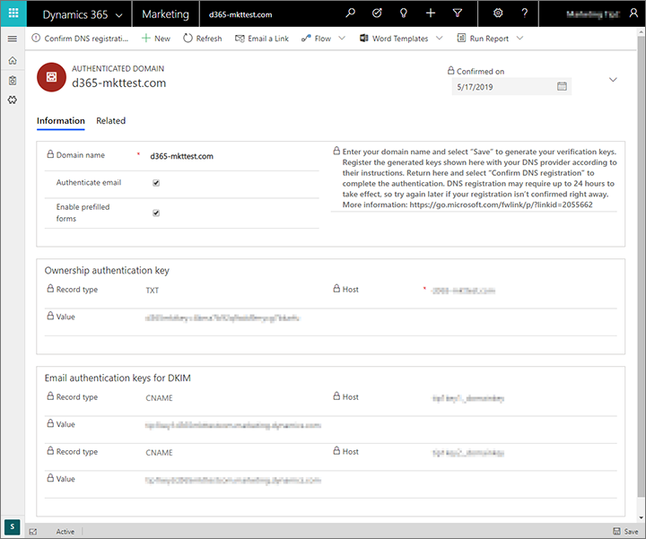
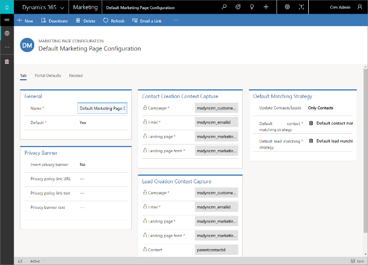
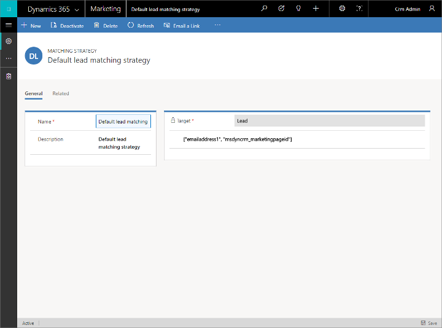

# Marketing settings

[!INCLUDE[cc_applies_to_update_9_0_0](../includes/cc_applies_to_update_9_0_0.md)]

The **Marketing settings** section contains pages that let you configure the core marketing functionality for landing pages, email marketing, and marketing services.

To find these settings, open **Settings** > **Advanced settings** and choose one of the pages under the **Marketing settings** heading in the left column. You can also access these same settings by finding the **Marketing settings** section in the right column and choosing the icons there.

See the remaining sections of this topic for information about how to work with each page in the **Marketing settings** section.

## Authenticate your domains

Domain authentication is important for two reasons:

- For *marketing email messages*, it enables recipient email servers to confirm that the from-address shown on each of your messages actually belongs to your organization, and that your organization has approved Dynamics 365 for Marketing to send messages on its behalf. Messages that fail this test are increasingly likely to get filtered away as spam, which can dramatically impact your deliverability.
- For *externally hosted forms*, it confirms that you own the domain and therefore establishes an enhanced trust relationship with your domain, which enables embedded marketing forms to be prefilled with data for known contacts.

The primary purpose of email-domain authentication is to detect forged messages and domains, and thereby prevent spam, phishing, and other fraudulent activity. A method called _DomainKeys Identified Mail_ (DKIM) helps make these authentications possible. Domain authentication is implemented through the internet DNS system, and is based on public/private key encryption and signatures.

When you error check or go live with a marketing email message, the verification system makes sure the message uses a from-address that specifies an authenticated domain registered and confirmed for your organization. You'll get a warning if you try to send a message that has a from-address that has an unregistered domain; you'll get an error if you try to send a message that uses a from-address that uses a domain that is registered as belonging to another organization. You can ignore the warning (but will probably have low deliverability), but you can't go live with the error.

To learn more about email marketing and deliverability see [Best practices for email marketing](get-ready-email-marketing.md). To learn more about embedded forms and prefilling, see [Integrate with landing pages on external websites](embed-forms.md).

### Which domains to authenticate

Set up as many authenticated domains as you need to cover all the from-addresses you use in your marketing emails, plus all domains and subdomains where you want to support embedded forms with prefill enabled.

- When you're authenticating a domain for email, use the full domain name as it appears in your email return addresses. Email addresses take the form _&lt;MailAccount&gt;_@_&lt;domain&gt;_, so if your email address is `lamar.ferrari@contoso.com`, then the domain you need to authenticate is `contoso.com` (not `www.contoso.com` or any other subdomain).
- When you're authenticating a domain to support prefilled forms, you must authenticate each subdomain individually. So if you have forms on `contoso.com`, `www.contoso.com`, and `events.contoso.com`, then you must set up a separate domain-authentication record for each of them and specify the full subdomain each time.

> [!IMPORTANT]
> To use form prefilling, the page hosting the form must be served over HTTPS (not HTTP).

### Authenticate a domain

To set up Dynamics 365 for Marketing and the DNS to authenticate marketing email messages and embedded forms for a given domain:

1. Go to **Settings** > **Advanced settings** > **Marketing settings** > **Authenticated domains**. A list of existing authenticated domains opens.
1. Select **New** on the command bar to add a new domain.
1. A new authenticated domain record opens. Make the following settings:

    - **Domain name**: Enter the name of the domain you want to authenticate. This must be a domain that your organization owns, and which you can access through your DNS provider.
    - **Authenticate email**: Select this check box if you want to authenticate email for this domain using DKIM.
    - **Enable prefilled forms**: Select this check box if you want to authenticate marketing forms [embedded](embed-forms.md) on this domain for the purpose of supporting prefill for known contacts. This check box also enables [page personalization](personalized-page-content.md) on this domain.

1. Select **Save** from the command bar. Dynamics 365 for Marketing saves the new record and generates a set of authentication keys for your specified domain. The page reloads to show the new keys. The following are provided:

    - **Ownership authentication key**: Proves that your organization owns the domain.
    - **Email authentication keys for DKIM**: Prove that Dynamics 365 for Marketing is authorized to send messages that show your organization's domain name in the from-address.

    

1. Contact your DNS provider and tell them you'd like to create some DNS records for domain authentication and DKIM. They will typically provide you with an online form where you can create DNS records by submitting the **Host** and **Value** values for each authentication key generated by Dynamics 365, or they may instead ask you to send them these values in an email. The procedure varies by DNS provider, so be sure to follow their instructions.
1. When you are done setting up the DNS records with your provider, return to your authenticated-domain record in Dynamics 365 for Marketing and select **Confirm DNS registration** on the command bar. Dynamics 365 checks to make sure the values are correctly set up and active in the DNS system. If you get a success message, then everything is working and you're done. DNS registration may require up to 24 hours to take effect, so try again later if your registration isn't confirmed right away.

As you are setting up an authenticated domain, you can track the progress of both its **Ownership status** and **Email status** , each of which is reported as one of the following:

| **Status** | **Description** |
| --- | --- |
| Waiting to confirm | The system has generated the keys you requested and is waiting for you to register them with your DNS provider and then return here to confirm them (by selecting **Confirm DNS registration** on the command bar). |
| Confirmed | The authentication keys have been registered with DNS and confirmed in Dynamics 365 for Marketing. This domain is ready to use. |
| Cancelled | The registration was cancelled. |
| Not requested | You didn't request this type of authentication. |
| Confirming DNS registration | Dynamics 365 for Marketing is working to confirm the registration with DNS. |
| Keys not found on DNS | Dynamics 365 for Marketing successfully checked for the keys in the DNS system, but they weren't there. This may be because your key registrations are still being implemented by the DNS (allow up to 24 hours). It could also mean that you haven't registered the keys or that something went wrong while you were entering them. You can check again by selecting   **Confirm DNS registration** on the command bar. If problems persist after 24 hours, please contact Microsoft Support and/or your DNS provider for assistance. |
| Internal error (record not found) | An internal error occurred while confirming the DNS registration. Please contact Microsoft Support for assistance. |
| Internal error (query failed) | An internal error occurred while confirming the DNS registration. Please contact Microsoft Support for assistance. |

## CDS-A connector settings

Use these settings to connect your Dynamics 365 for Marketing instance to [!include]. This will enable you to share interaction data with external systems such as [!include]. For more information about how to use these settings, see [Create custom analytics with Power BI](custom-analytics.md).

## Configure landing pages

Use the **Settings** > **Advanced settings** > **Marketing settings** > **Landing pages** page to set up a privacy banner, set hosting defaults, and configure defaults for how data submitted through a landing page form is matched to existing contact or lead records.

When you first arrive at **Settings** > **Advanced settings** > **Marketing settings** > **Landing pages**, you'll see a list of all marketing-page configuration sets. This is a standard list page, where you can view, sort, search, and filter the list to find a specific record, and use the command bar buttons to add or remove a record. Select any configuration set in the list to open, view, and edit it.

### Set the default (active) configuration set

You can set up as many configuration sets as you want, but only one can be active at a time. To change the active configuration set, find and open the set you want to activate in the landing-page configuration list, and then set its **Default** field to **Yes**; the existing default configuration will lose its default status.

There must always be exactly one landing-page configuration that is set as the default.

### Set up a privacy banner for landing pages

We recommend that you include a privacy banner on all your landing pages. This will let your customers know that you take their privacy seriously, and it might also be required in some jurisdictions. Use the following settings in the **Privacy banner** section to create and enable your privacy banner:

- **Insert privacy banner**. Choose **Yes** to enable this feature; choose **No** to disable it. When the privacy banner is enabled, the text and link defined in the other settings in this section will be added to each new marketing page that you create. The banner will also be added to any existing page that you open for editing; however, it won't be added to pages that are already published because these are read-only.
- **Privacy banner text**. Enter a summary of your privacy policy here.
- **Privacy policy link URL**. We recommend that you provide a detailed privacy policy somewhere on your own organization's website. If you have such a page, enter its full URL here.
- **Privacy policy link text**. This text is placed under the **Privacy banner text**, and creates a link to the **Privacy policy link URL** you specified. Enter a short string of text that tells users what to expect, such as "Click here to read our complete privacy policy."

### Configure how incoming form data is matched to existing records

Most of your landing pages will include an input form that visitors can use to sign up for an offer, event, or mailing list by entering their name, email address, and other information. When a visitor submits a form, [!INCLUDE[pn-microsoftcrm](../includes/pn-dynamics-365.md)] accepts the submitted values and checks to see whether it should update an existing record or create a new one.

The **Contact creation context capture** and **Lead creation context capture** sections show where various types of information about the marketing context are stored when a submission results in a new contact or lead record. Here, you can see which fields in the contact or lead entity store each type of context information.

Use the **Default matching strategy** section to set defaults for which types of entities your marketing forms will create and update (leads and/or contacts), and how incoming values are matched against existing records to decide whether to create a new record or update an existing one. These defaults will be applied to each new marketing form that you create and they are saved with the form, so you can override them at the from level by changing them there. Changing these settings won't affect any existing forms. The following settings are available:

- **Update contacts/leads**. When a landing page submission is received, this setting establishes which types of records it can create or update&mdash;leads, contacts, or both.
- **Default contact matching strategy**. Shows the name of the field-matching strategy that you have set up to match incoming data against existing contact records. If a match is found according to this strategy, it will update that record. If no match is found, it will create a new contact. You can choose from among existing strategies here or select **New** to create a new one. See the next section for information about how to set up your field-matching strategies.
- **Default lead matching strategy**. Same as the **Default contact matching strategy** setting, but for lead records.

For more information about how to create and edit matching strategies, see [Set matching strategies](#matching-strategy).

### Set portal defaults

Settings on the **Portal defaults** tab control how your marketing pages are hosted in Dynamics 365 for Marketing. The following settings are available:

- **Website**. Identifies the portal website where all new marketing pages will be published while the current configuration record is active. This defaults to the event website that was provisioned for you when you signed up for Dynamics 365 for Marketing, but you can choose another if you have one. If you change this, pages that you've already published will remain on their current portal, but new pages will go to the new portal.
- **Page language**. Sets the default language to use in the portal.
- **Container page**. Sets the container page used for marketing pages.

## Choose entities to sync with the marketing insights service

The marketing insights service provides analytical tools for working with customer records. It helps you to better understand your customers and set up subscription lists and target segments for use in email-marketing campaigns. The marketing insights service also makes dynamic field values available for use in marketing email messages as they are processed and sent.

The analytical and data-crunching capabilities of the marketing insights service is very powerful, but also resource-intensive, so the solution maximizes performance by synchronizing the relevant customer and account data between Dynamics 365 for Marketing and this service. The marketing insights service also collects and manages all interaction data. For optimal performance and functionality, choose only the entities you need&mdash;no more and no less.

> [!IMPORTANT]
> The sync settings are permanent, so once you begin syncing an entity you won't be able to remove it again later. Syncing occurs often, and each entity that you sync requires storage space and processing time, so you should only sync those entities you are sure you will need.

The most-used entities (including contacts, accounts, and events) are synced by default, but you can sync any set of entities that you want, including custom entities. The following features require all the relevant data to be present in the marketing insights service:

- **Segmentation**: All entities that you need to query in your segmentation criteria must be present.
- **Dynamic email content**: All entities with field values that you want to show as dynamic data in an email message must be present.
- **Lead scoring**: All entities with field values that you want to use in you scoring models must be present.

> [!NOTE]
> You can only sync entities that are configured with **Change tracking** enabled. Entities without change tacking won't be listed on the **Customer insights sync** page. If you are a system customizer or admin, then you can find this setting by doing the following:
> 
> 1. Open the **Settings** menu  at the top of the page and select **Advanced settings**. The [!INCLUDE[pn-microsoftcrm](../includes/pn-microsoftcrm.md)] advanced-settings area then opens in a new browser tab. Note that this area uses a horizontal navigator at the top of the page instead of a side navigator.
> 1. Navigate to **Settings** > **Customization** > **Customization**.
> 1. Select **Customize the system** (or select **Solutions** and open a solution if your entity is part of a solution).
> 1. Find and select the entity you want to sync.
> 1. On the **General** tab for the entity, select the **Change tracking** check box.
> 1. Save and publish the change.
> 
> [!INCLUDE[proc-more-information](../includes/proc-more-information.md)] [Customizing Dynamics 365 for Marketing](customize.md)

To sync a new entity with the marketing insights service:

1. Go to **Settings** > **Advanced settings** > **Marketing settings** > **Customer insights sync**.

1. Find and select the check box for each entity you want to sync.

1. Select **Publish changes** and then confirm your setting when prompted.

1. Wait for up to a minute, until you see an announcement near the top of the page that "your changes have been accepted...". If you don't see the announcement, select **Publish changes** again and then wait again; repeat until you see the message.  
    

1. Depending on how much data needs to be synced (and other factors), you may need to wait for several minutes (or _up to six hours_) before your data is available for use in your segments, messages, and scoring models. Here are some ways you'll be able to tell that a new entity is synced and ready for use (you only need to check one of these):

    - The check box for the relevant entity on the **Customer insights sync** page is shown as checked and grayed out when you first enter the page. The check box is gray to indicate that you can't disable the sync once it has started. You must reload the page manually to see this change.
    - The relevant entity is shown in the [assist-edit menu](dynamic-email-content.md#assist-edit) for marketing email messages.
    - The relevant entity is shown in the **Profiles** list in the [segment designer](segmentation-lists-subscriptions.md). (Note that you must either create a new query group or remove all clauses from the existing query group to see the **Profiles** drop-down list here&mdash;otherwise the contact entity is already selected by default.)
    - The relevant entity is shown in the **Entity** list when you are editing a condition for a [lead scoring rule](score-manage-leads.md).

## Set matching strategies

Matching strategies define how form submissions are matched to existing contacts or leads when deciding whether to update an existing record or to create a new one.

For example, a simple contact-matching strategy might be based on email address alone. When a submission is received, [!INCLUDE[pn-microsoftcrm](../includes/pn-dynamics-365.md)] will check whether any existing contact has the submitted email address. If a match is found, the submission is used to update that contact; if no match is found, a new contact is created with the received values.

For leads, if an existing lead record is found to match an incoming form submission, then the new submission will become part of that lead's history and could affect the lead's score.

You'll probably have just a few matching strategies of each type&nbsp;many organizations use just one of each. Therefore, you can define each strategy just once and then it'll be available for selection each time you create a new form, and when you define the default strategies for all new forms. There are three places where you can view and create matching strategies:

- Go to **Settings** > **Advanced settings** > **Marketing settings** > **Matching strategy** to view, create and edit all strategies that are available on your instance.
- You can select a default strategy of each type (lead and contact). These will be selected by default each time a user creates a new marketing form, but users can then customize the setting as needed for each individual form. [!INCLUDE[proc-more-information](../includes/proc-more-information.md)] [Configure landing pages](#config-mkt-pages)
- When you are creating or editing a marketing form, you'll  be able to select from among the available strategies, or create new ones. [!INCLUDE[proc-more-information](../includes/proc-more-information.md)] [Create, view, and manage marketing forms](marketing-forms.md)

In each case, the settings are the same.

Describe your strategy by entering a **Name** and **Description**. Set the **Target** field to the type of entity your strategy applies to (lead or contact).

The list under the **Attributes** heading specifies which contact or lead attributes (fields) to consider when looking for a match. The matching record must have identical values for *all* the attributes shown here, so the more attributes you use, the narrower your search will be. Often the email address alone is enough to use as a unique identifier for contacts, but you might use additional attributes (such as first and last name) if you think some of your contacts might share an email address, or if you want tighter control (at the risk of creating extra contact records for the same person).

For lead matching, you might consider adding both **emailaddress1** and a lead-origin attribute such as **msdyncrm_marketingpageid** (this is the out-of-box configuration). This enables the system to identify leads based on the combination of email address and the specific marketing page that created the lead. By including the page ID as part of your lead-matching strategy, you'll be able to have multiple leads for a single contact, with each lead tracking interest in a different campaign (provided each campaign is using its own marketing page). For [forms embedded on an external site](embed-forms.md), the  marketing-page ID will be the form-page ID configured for the form.

Use the buttons in the toolbar for the **Attributes** section to add, edit, and remove attribute in the list.

## Default marketing settings

Use the **Settings** > **Advanced Settings** > **Marketing settings** > **Default marketing settings** page to set up collections of settings that establish various defaults used throughout the app. You can store as many settings sets as you want, but only the one marked as **Default** is active.

Choose an existing configuration to edit or delete it or choose **+ New** from the command bar to create a new one.

### The General tab

Make the following settings here:

- **Name**. The name of the default-settings set, as shown on the list page.
- **Owner**. The user that owns the set.
- **Default**. Set to **Yes** to activate the current default-settings set on your instance.

### The Marketing email tab

Use the **Marketing email** tab to set defaults that apply to your marketing email messages. You will always be able to override these defaults for individual messages, but it will be more convenient for users if you set the defaults to their most-used values. You can also enable or disable Litmus integration here for all users. The following settings are available:

- **Default content settings**. Choose a default content-settings record to provide dynamic values for test sends and the preview feature of the marketing email designer. Users will be able to override this default by choosing another contact while previewing or test sending a specific message if needed. [!INCLUDE[proc-more-information](../includes/proc-more-information.md)] [Use content settings to set up repositories of standard and required values for email messages](dynamic-email-content.md#content-settings)
- **Default contact**. Choose a default contact record to provide dynamic values for test sends and the preview feature of the marketing email designer. Users will be able to override this default by choosing another contact while previewing or test sending a specific message if needed.
- **Enable Litmus integration**: Set this to **Yes** to enable the  [inbox preview feature](prepare-marketing-emails.md#inbox-preview), which provides pixel-perfect renderings of how your email messages will look on specific client and platform combinations. The feature is provided by a [!INCLUDE[cc-microsoft](../includes/cc-microsoft.md)] partner called Litmus Software, Inc. ([litmus.com](https://litmus.com/)), and is optional. 

[!INCLUDE[proc-more-information](../includes/proc-more-information.md)] [Check your work with previews and test sends](prepare-marketing-emails.md#preview-message)

### The Customer journey tab

Use the **Customer journey** tab to choose the default time zone that you will use when starting and stopping your customer journeys.

### The Double opt-in tab

Use the **Double opt-in** tab to enable set up the double opt-in feature. For complete details about this feature, including how to use the settings provided here, see [Set up double opt-in for new subscriptions and consent changes](double-opt-in.md).

### The Bypass email deduplication tab

Normally, Dynamics 365 for Marketing deduplicates outgoing marketing email messages to ensure that each message is sent just once to each unique email address. That means that if more than one contact record in the target segment has the same email address, only one of those contacts will receive the message. Duplicate email addresses probably indicate that the same person is represented by two different records in your database (for example, because they registered at different times using two different first-name variants, such as "Bob" and "Robert"), so this is the desired behavior.

However, some organizations need to send separate copies of the same email messages to multiple contacts that happen to be using the same email address; in this case, personalized content, such as account details, would probably be different for each recipient. If your organization requires this, then set **Bypass email deduplication** to **Yes**. Set it to **No** to revert to the standard deduplication behavior.

## Configure your social media accounts

Social posting enables Dynamics 365 for Marketing users to author, schedule, and publish posts to a variety of social media channels and accounts. You must configure and authenticate each channel and account that you'd like to make available for use with this feature. In the current version, you can configure accounts for Twitter, LinkedIn, and Facebook.

To add and authenticate a social media account:

1. Go to **Settings** > **Advanced Settings** > **Marketing settings** > **Social configuration**. A list view opens showing your existing social media accounts (if any).
1. Select **Create configuration** on the command bar.
1. A quick-create flyout slides in from the side of the screen. Make the following settings:
    - **Name**: Enter a name that you and others will easily recognize. Choose a name that gives a good idea what type of channel it is what type of content should be posted there, such as "Contoso Electronics LinkedIn."
    - **Social channel**: Choose the social-media site you want to connect to (such as LinkedIn or Facebook).
1. After you've selected a channel, links for the **Privacy policy** and **Terms of service** of your selected channel are provided. It's important that you read and understand these terms before you begin using this feature.
1. Provided you agree with the privacy policy and terms of service, select **Create** to continue.
1. Follow the instructions on your screen to sign in to your social media account and allow Dynamics 365 for Marketing to post through this account.
    > [!IMPORTANT]
    > If you are setting up a Facebook account that has more than one Facebook page associated with it, then pay extra attention to the settings offered while you are setting up the connection. One of the setup pages will ask you which of your Facebook pages you want to use&mdash;be sure to choose **All pages** first (to make all pages available) and then choose the specific page later on. Otherwise, Facebook will choose an arbitrary page from among those you have set up on the site. If you miss the **All pages** setting, then you must reauthorize the connection (as described in the following procedure) and try again.

If your sign-in times out, or if the password changes on one of your accounts, you can update an account by doing the following:

1. Go to **Settings** > **Advanced Settings** > **Marketing settings** > **Social configuration**.
1. Select a social media configuration from the list.
1. Select **Reauthorize** on the command bar.
1. Follow the instructions on your screen to update your sign-in details.

You can delete a social configuration at any time to prevent Dynamics 365 for Marketing from posting through that account from now on. Use the **Delete** button on the command bar to delete the currently shown or selected configuration.

For details about how to post messages to your configured accounts, see [Schedule and post messages on social media](social-posting.md)

## Data protection tools

Use the **Settings** > **Advanced Settings** > **Marketing settings** > **Data protection tools** page to enable data-privacy features of Dynamics 365 for Marketing. These currently focus on helping organizations comply with GDPR regulations in the European Union. For more information about GDPR, including how to use the settings here, see [Data protection and GDPR](gdpr.md).

### See also

[Create and deploy marketing pages](create-deploy-marketing-pages.md)  
[Check your work with previews and test sends](prepare-marketing-emails.md#check-your-work-by-using-previews-and-test-sends)
