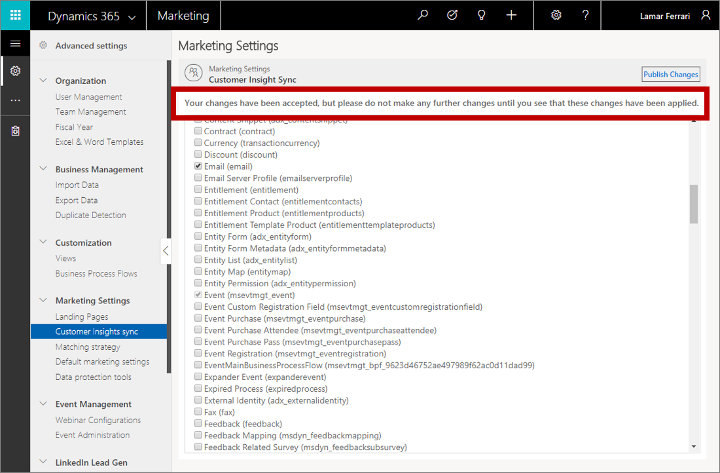

# Marketing settings

[!INCLUDE[cc_applies_to_update_9_0_0](../includes/cc_applies_to_update_9_0_0.md)]

The **Marketing settings** section contains pages that let you configure the core marketing functionality for landing pages, email marketing, and customer-insights services.

To find these settings, open **Settings** > **Advanced settings** and choose one of the pages under the **Marketing settings** heading in the left column. You can also access these same settings by finding the **Marketing settings** section in the right column and choosing the icons there.

See the remaining sections of this topic for information about how to work with each page in the **Marketing settings** section.

## CDS-A connector settings

Use these settings to connect your [!INCLUDE[pn-marketing-business-app-module-name](../includes/pn-marketing-business-app-module-name.md)] instance to [!include]. This will enable you to share interaction data with external systems such as [!include]. For more information about how to use these settings, see [Create custom analytics with Power BI](custom-analytics.md).

## Configure landing pages

Use the **Settings** > **Advanced settings** > **Marketing settings** > **Landing pages** page to set up a privacy banner, set hosting defaults, and configure defaults for how data submitted through a landing page form is matched to existing contact or lead records.

When you first arrive at **Settings** > **Advanced settings** > **Marketing settings** > **Landing pages**, you'll see a list of all marketing-page configuration sets. This is a standard list page, where you can view, sort, search, and filter the list to find a specific record, and use the command bar buttons to add or remove a record. Select any configuration set in the list to open, view, and edit it.

### Set the default (active) configuration set

You can set up as many configuration sets as you want, but only one can be active at a time. To change the active configuration set, find and open the set you want to activate in the landing-page configuration list, and then set its **Default** field to **Yes**; the existing default configuration will lose its default status.

There must always be exactly one landing-page configuration that is set as the default.

### Set up a privacy banner for landing pages

We recommend that you include a privacy banner on all your landing pages. This will let your customers know that you take their privacy seriously, and it might also be required in some jurisdictions. Use the following settings in the **Privacy banner** section to create and enable your privacy banner:

- **Insert privacy banner**. Choose **Yes** to enable this feature; choose **No** to disable it. When the privacy banner is enabled, the text and link defined in the other settings in this section will be added to each new marketing page that you create. The banner will also be added to any existing page that you open for editing; however, it won't be added to pages that are already published because these are read-only.
- **Privacy banner text**. Enter a summary of your privacy policy here.
- **Privacy policy link URL**. We recommend that you provide a detailed privacy policy somewhere on your own organization's website. If you have such a page, enter its full URL here.
- **Privacy policy link text**. This text is placed under the **Privacy banner text**, and creates a link to the **Privacy policy link URL** you specified. Enter a short string of text that tells users what to expect, such as "Click here to read our complete privacy policy."

### Configure how incoming form data is matched to existing records

Most of your landing pages will include an input form that visitors can use to sign up for an offer, event, or mailing list by entering their name, email address, and other information. When a visitor submits a form, [!INCLUDE[pn-microsoftcrm](../includes/pn-dynamics-365.md)] accepts the submitted values and checks to see whether it should update an existing record or create a new one.

The **Contact creation context capture** and **Lead creation context capture** sections show where various types of information about the marketing context are stored when a submission results in a new contact or lead record. Here, you can see which fields in the contact or lead entity store each type of context information.

Use the **Default matching strategy** section to set defaults for which types of entities your landing pages will create and update (leads and/or contacts), and how incoming values are matched against existing records to decide whether to create a new record or update an existing one. These defaults will be applied to each new landing page that you create and they are saved with the page, so you can override them at the page level by changing them there. Changing these settings won't affect any existing pages. The following settings are available:

- **Update contacts/leads**. When a landing page submission is received, this setting establishes which types of records it can create or update&mdash;leads, contacts, or both.
- **Default contact matching strategy**. Shows the name of the field-matching strategy that you have set up to match incoming data against existing contact records. If a match is found according to this strategy, it will update that record. If no match is found, it will create a new contact. You can choose from among existing strategies here or select **New** to create a new one. See the next section for information about how to set up your field-matching strategies.
- **Default lead matching strategy**. Same as the **Default contact matching strategy** setting, but for lead records.

### Set matching strategies for leads and contacts

Matching strategies define how page submissions are matched to existing contacts or leads when deciding whether to update an existing record or to create a new one.

For example, a simple contact-matching strategy might be based on email address alone. When a submission is received, [!INCLUDE[pn-microsoftcrm](../includes/pn-dynamics-365.md)] will check whether any existing contact has the submitted email address. If a match is found, the submission is used to update that contact; if no match is found, a new contact is created with the received values.

To view or set a matching strategy, open your marketing page configuration, and then select **Default contact matching strategy** or **Default lead matching strategy**. For more information about how to create and edit matching strategies, see [Set matching strategies](#matching-strategy).

### Set portal defaults

Settings on the **Portal defaults** tab control how your marketing pages are hosted in [!INCLUDE[pn-microsoftcrm](../includes/pn-dynamics-365.md)]. The following settings are available:

- **Website**. Identifies the portal website where all new marketing pages will be published while the current configuration record is active. This defaults to the event portal that was provisioned for you when you signed up for [!INCLUDE[pn-microsoftcrm](../includes/pn-dynamics-365.md)], but you can choose another if you have one. If you change this, pages that you've already published will remain on their current portal, but new pages will go to the new portal.
- **Page language**. Sets the default language to use in the portal.
- **Container page**. Sets the container page used for marketing pages.

## Choose entities to sync with the customer-insights services

The customer-insights services are external services that provide analytical tools for working with customer records. They help you to better understand your customers and help you set up subscription lists and target segments for use in email-marketing campaigns. The customer-insights services also make dynamic field values available for use in marketing email messages as they are processed and sent by the marketing services.

The analytical and data-crunching capabilities of the customer-insights services are very powerful, but also resource-intensive, so the solution maximizes performance by synchronizing the relevant customer and account data between [!INCLUDE[pn-marketing-business-app-module-name](../includes/pn-marketing-business-app-module-name.md)] and these external services. For optimal performance and functionality, choose only the entities you need—no more and no less.

> [!IMPORTANT]
> The sync settings are permanent, so once you begin syncing an entity you won't be able to remove it again later. Syncing occurs often, and each entity that you sync requires storage space and processing time, so you should only sync those entities you are sure you will need.

The most-used entities (including contacts, accounts, and events) are synced by default, but you can sync any set of entities that you want, including custom entities. The following features require all the relevant data to be present in the customer-insights services:

- **Segmentation**: All entities that you need to query in your segmentation criteria must be present.
- **Dynamic email content**: All entities with field values that you want to show as dynamic data in an email message must be present.
- **Lead scoring**: All entities with field values that you want to use in you scoring models must be present.

To sync a new entity with the customer-insights services:

1. Go to **Settings** > **Advanced settings** > **Marketing settings** > **Customer insights sync**.

1. Find and select the check box for each entity you want to sync.

1. Select **Publish changes** and then confirm your setting when prompted.

1. Wait for up to a minute, until you see an announcement near the top of the page that "your changes have been accepted...". If you don't see the announcement, select **Publish changes** again and then wait again; repeat until you see the message.  
    

1. Depending on how much data needs to be synced (and other factors), you may need to wait for several minutes (or _up to six hours_) before your data is available for use in your segments, messages, and scoring models. Here are some ways you'll be able to tell that a new entity is synced and ready for use (you only need to check one of these):

    - The check box for the relevant entity on the **Customer insights sync** page is shown as checked and grayed out when you first enter the page. The check box is gray to indicate that you can't disable the sync once it has started. You must reload the page manually to see this change.
    - The relevant entity is shown in the [assist-edit menu](dynamic-email-content.md#assist-edit) for marketing email messages.
    - The relevant entity is shown in the **Profiles** list in the [segment designer](segmentation-lists-subscriptions.md). (Note that you must either create a new query group or remove all clauses from the existing query group to see the **Profiles** drop-down list here&mdash;otherwise the contact entity is already selected by default.)
    - The relevant entity is shown in the **Entity** list when you are editing a condition for a [lead scoring rule](score-manage-leads.md).

## Set matching strategies

Use the **Settings** > **Advanced settings** > **Marketing settings** > **Matching strategy** page to set up various strategies for matching incoming landing-page submissions to existing leads and contacts. These are the strategies you can choose when setting up marketing pages and marketing-page defaults.

The first page you see shows a list of existing strategies. From here, you can choose an existing strategy to view, edit or delete it, or choose **+ New** on the command bar to create a new one.

Describe your strategy by entering a **Name** and **Description**. Set the **Target** field to the type of entity your strategy applies to (lead or contact).

The list under the **Attributes** heading specifies which contact or lead attributes (fields) to consider when looking for a match. The matching record must have identical values for *all* the attributes shown here, so the more attributes you use, the narrower your search will be. Often the email address alone is enough to use as a unique identifier for contacts, but you might use additional attributes (such as first and last name) if you think some of your contacts might share an email address, or if you want tighter control (at the risk of creating extra contact records for the same person).

For lead matching, you might consider adding both **emailaddress1** and a lead-origin attribute such as **msdyncrm_marketingpageid**. This enables the system to identify leads based on the combination of email address and the specific marketing page that created the lead, so if the same contact submits a different landing page for the first time then a new lead will be created.

Use the buttons in the toolbar for the **Attributes** section to add, edit, and remove attribute in the list.

## Default marketing settings

Use the **Settings** > **Advanced Settings** > **Marketing settings** > **Default marketing settings** page to set up collections of settings that establish various defaults used throughout the app. You can store as many settings sets as you want, but only the one marked as **Default** is active.

Choose an existing configuration to edit or delete it or choose **+ New** from the command bar to create a new one.

### The General tab

Make the following settings here:

- **Name**. The name of the default-settings set, as shown on the list page.
- **Owner**. The user that owns the set.
- **Default**. Set to **Yes** to activate the current default-settings set on your site.

### The Marketing email tab

Use the **Marketing email** tab to set defaults that apply to your marketing email messages. You will always be able to override these defaults for individual messages, but it will be more convenient for users if you set the defaults to their most-used values. You can also enable or disable Litmus integration here for all users. The following settings are available:

- **Default content settings**. Choose a default content-settings record to provide dynamic values for the preview feature of the marketing email designer. [!INCLUDE[proc-more-information](../includes/proc-more-information.md)] [Use content settings to set up repositories of standard and required values for email messages](dynamic-email-content.md#content-settings)
- **Default contact**. Choose a default contact record to provide dynamic values for the preview feature of the marketing email designer.
- **Enable Litmus integration**: Set this to **Yes** to enable the  [inbox preview feature](prepare-marketing-emails.md#inbox-preview), which provides pixel-perfect renderings of how your email messages will look on specific client and platform combinations. The feature is provided by a [!INCLUDE[cc-microsoft](../includes/cc-microsoft.md)] partner called Litmus Software, Inc. ([litmus.com](https://litmus.com/)), and is optional. 

[!INCLUDE[proc-more-information](../includes/proc-more-information.md)] [Check your work with previews and test sends](prepare-marketing-emails.md#preview-message)

### The Customer journey tab

Use the **Customer journey** tab to choose the default time zone that you will use when starting and stopping your customer journeys.

### The Double opt-in tab

Use the **Double opt-in** tab to enable set up the double opt-in feature. For complete details about this feature, including how to use the settings provided here, see [Set up double opt-in for new subscriptions and consent changes](double-opt-in.md).

### The Bypass email deduplication tab

Normally, [!INCLUDE[pn-marketing-business-app-module-name](../includes/pn-marketing-business-app-module-name.md)] deduplicates outgoing marketing email messages to ensure that each message is sent just once to each unique email address. That means that if more than one contact record in the target segment has the same email address, only one of those contacts will receive the message. Duplicate email addresses probably indicate that the same person is represented by two different records in your database (for example, because they registered at different times using two different first-name variants, such as "Bob" and "Robert"), so this is the desired behavior.

However, some organizations need to send separate copies of the same email messages to multiple contacts that happen to be using the same email address; in this case, personalized content, such as account details, would probably be different for each recipient. If your organization requires this, then set **Bypass email deduplication** to **Yes**. Set it to **No** to revert to the standard deduplication behavior.

## Data protection tools

Use the **Settings** > **Advanced Settings** > **Marketing settings** > **Data protection tools** page to enable data-privacy features of [!INCLUDE[pn-marketing-business-app-module-name](../includes/pn-marketing-business-app-module-name.md)]. These currently focus on helping organizations comply with GDPR regulations in the European Union. For more information about GDPR, including how to use the settings here, see [Data protection and GDPR](gdpr.md).

### See also

[Create and deploy marketing pages](create-deploy-marketing-pages.md)  
[Check your work with previews and test sends](prepare-marketing-emails.md#check-your-work-by-using-previews-and-test-sends)
