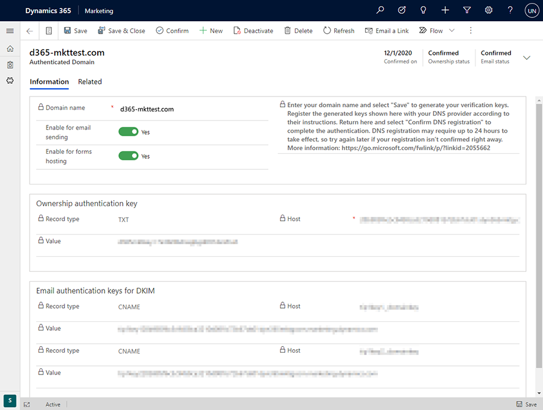

# Authenticate your domains

Domain authentication is important for two reasons:

- For *marketing email messages*, domain authentication enables recipient email servers to confirm that the from-address shown on each of your messages belongs to your organization. Authentication also confirms that your organization has approved Dynamics 365 Marketing to send messages on its behalf. Messages that fail this test are increasingly likely to get filtered away as spam, which can dramatically impact your deliverability.
- For *externally hosted forms*, domain authentication confirms that you own the domain, establishing an enhanced trust relationship with your domain. The enhanced trust relationship enables embedded marketing forms to be pre-filled with data for known contacts.

The primary purpose of email-domain authentication is to detect forged messages and domains, and thereby prevent spam, phishing, and other fraudulent activity. A method called _DomainKeys Identified Mail_ (DKIM) helps make these authentications possible. Domain authentication is implemented through the internet DNS system, and is based on public/private key encryption and signatures.

When you error check or go live with a marketing email message, the verification system requires that the message uses a from-address that specifies an authenticated domain registered and is confirmed for your organization. You'll get a warning if you try to send a message that has a from-address from an unregistered domain. You'll also get an error if you try to send a message that uses a from-address from a domain that is registered as belonging to another organization. You can ignore the warning (but will probably have low deliverability), but you can't go live with the error.

To learn more about email marketing and deliverability see [Best practices for email marketing](get-ready-email-marketing.md). To learn more about embedded forms and pre-filling, see [Integrate with landing pages on external websites](embed-forms.md).

## The default authenticated domain

By default, all new Dynamics 365 Marketing installations come with a pre-authenticated sending domain ending in "-dyn365mktg.com". The pre-authenticated domain means that you can begin sending authenticated emails right away. But you should still authenticate your own actual sending domains right away so your authenticated messages will show a from address that recipients will recognize as coming from your organization.

When a user creates a new email, the **From address** is automatically set to the email address registered for that user's Dynamics 365 Marketing user account. However, if that email address uses a domain that is not yet authenticated using DKIM, then the initial **From address** will be modified to use an authenticated domain (email addresses use the form *account-name*@*domain-name*). The resulting **From address** will still show the *account-name* of the user creating the message, but will now show a DKIM-authenticated *domain-name* that's registered for your Marketing instance (for example, "MyName@contoso-dyn365mktg.com"), which will provide the deliverability benefit, but probably isn't a valid return address. Users can overrule this by editing the **From address** after creating the message, but this will lower message deliverability.

## Which domains to authenticate

Set up as many authenticated domains as you need to cover all the from-addresses you use in your marketing emails, plus all domains and subdomains where you want to support embedded forms with pre-fill enabled.

- When you're authenticating a domain for email, use the full domain name as it appears in your email return addresses. Email addresses take the form _&lt;MailAccount&gt;_@_&lt;domain&gt;_, so if your email address is `lamar.ferrari@contoso.com`, then the domain you need to authenticate is `contoso.com` (not `www.contoso.com` or any other subdomain).
- When you're authenticating a domain to support pre-filled forms, you must authenticate each subdomain individually. So if you have forms on `contoso.com`, `www.contoso.com`, and `events.contoso.com`, then you must set up a separate domain-authentication record for each of them and specify the full subdomain each time.

> [!IMPORTANT]
> To use form pre-filling, the page hosting the form must be served over HTTPS (not HTTP).

> [!NOTE]
> All new instances and trials automatically authenticate their instance domain with DKIM and set that domain as the default sending domain for your instance. Therefore, you'll usually see at least one authenticated domain already set up for all new instances.

## Authenticate a domain

To set up Dynamics 365 Marketing and the DNS to authenticate marketing email messages and embedded forms for a given domain:

1. Go to **Settings** > **Advanced settings** > **Marketing settings** > **Authenticated domains**. A list of existing authenticated domains opens.
1. Select **New** on the command bar to add a new domain.
1. A new authenticated domain record opens. Make the following settings:

    - **Domain name**: Enter the name of the domain you want to authenticate. This must be a domain that your organization owns, and which you can access through your DNS provider.
    - **Enable for email sending**: Select this check box if you want to authenticate email for this domain using DKIM.
    - **Enable for forms hosting**: Select this check box if you want to authenticate marketing forms [embedded](embed-forms.md) on this domain for the purpose of supporting pre-fill for known contacts. This check box also enables [page personalization](personalized-page-content.md) on this domain.

1. Select **Save** from the command bar. Dynamics 365 Marketing saves the new record and generates a set of authentication keys for your specified domain. The page reloads to show the new keys. The following are provided:

    - **Ownership authentication key**: Proves that your organization owns the domain.
    - **Email authentication keys for DKIM**: Prove that Dynamics 365 Marketing is authorized to send messages that show your organization's domain name in the from-address.

    > [!div class="mx-imgBorder"]
    > 

1. Contact your DNS provider and tell them you'd like to create some DNS records for domain authentication and DKIM. They will typically provide you with an online form where you can create DNS records by submitting the **Host** and **Value** values for each authentication key generated by Dynamics 365 Marketing, or they may instead ask you to send them these values in an email. The procedure varies by DNS provider, so be sure to follow their instructions.

> [!NOTE]
> The "ownership authentication key" should be added to the root of your domain. The **Host** that you use can differ depending on your DNS provider. Some DNS providers require you to use the full domain name as a **Host**, while others (like AzureDNS and GoDaddy) require an **@** sign.

6. When you are done setting up the DNS records with your provider, return to your authenticated-domain record in Dynamics 365 Marketing and select **Confirm DNS registration** on the command bar. Dynamics 365 Marketing checks to make sure the values are correctly set up and active in the DNS system. If you get a success message, then everything is working and you're done. DNS registration may require up to 24 hours to take effect, so try again later if your registration isn't confirmed right away.

### Example DNS records for domain contoso.com

This example is valid if you are adding DNS records into the root domain contoso.com.

**TXT record**  
`TXT name: promo`  
`TXT value: d365mktkey=abc123abc123abc123abc123`  

**CNAME record 1**  
`Host name or Alias: eurkey1._domainkey`  
`Points to address: eurkey1contosocom.marketing.dynamics.com`

**CNAME record 2**  
`Host name or Alias: eurkey2._domainkey`  
`Points to address: eurkey2contosocom.marketing.dynamics.com`

### Example DNS records for subdomain promo.contoso.com

**TXT record**  
`TXT name: @`  
`TXT value: d365mktkey=abc234abc234abc234abc234`  

**CNAME record 1**  
`Host name or Alias: eurkey1._domainkey.promo`  
`Points to address: eurkey1promocontosocom.marketing.dynamics.com`

**CNAME record 2**  
`Host name or Alias: eurkey2._domainkey.promo`  
`Points to address: eurkey2promocontosocom.marketing.dynamics.com`

### DNS Confirmation Statuses

As you are setting up an authenticated domain, you can track the progress of both its **Ownership status** and **Email status**, each of which is reported as one of the following:

| **Status** | **Description** |
| --- | --- |
| Waiting to confirm | The system has generated the keys you requested and is waiting for you to register them with your DNS provider and then return here to confirm them (by selecting **Confirm DNS registration** on the command bar). |
| Confirmed | The authentication keys have been registered with DNS and confirmed in Dynamics 365 Marketing. This domain is ready to use. |
| Canceled | The registration was canceled. |
| Not requested | You didn't request this type of authentication. |
| Confirming DNS registration | Dynamics 365 Marketing is working to confirm the registration with DNS. |
| Keys not found on DNS | Dynamics 365 Marketing successfully checked for the keys in the DNS system, but they weren't there. This may be because your key registrations are still being implemented by the DNS (allow up to 24 hours). It could also mean that you haven't registered the keys or that something went wrong while you were entering them. You can check again by selecting   **Confirm DNS registration** on the command bar. If problems persist after 24 hours, [contact Microsoft Support](setup-troubleshooting.md#contact-support) and/or your DNS provider for assistance. |
| Internal error (record not found) | An internal error occurred while confirming the DNS registration. [Contact Microsoft Support](setup-troubleshooting.md#contact-support) for assistance. |
| Internal error (query failed) | An internal error occurred while confirming the DNS registration. [Contact Microsoft Support](setup-troubleshooting.md#contact-support) for assistance. |
| Internal error | An internal error occurred while confirming the DNS registration. [Contact Microsoft Support](setup-troubleshooting.md#contact-support) for assistance. |

## Prevent sending emails from unauthorized domains

To benefit from DKIM, the from-address for each message you send must show a domain that you've authenticated for DKIM. Microsoft is dedicated to helping our customers achieve maximum email deliverability, so we've added a few features to help make sure you don't overlook or inadvertently work around your DKIM setup:

- The error check for email messages will show a warning if you try to go live with an email message that has a from-address not associated with any of your DKIM domains.
- We recommend that you [set a default sending domain](mkt-settings-default-marketing.md) that is authenticated for DKIM. When this is set, then the from-address for all of your email messages will automatically be adjusted to show your selected default domain (if it initially uses a non-authenticated domain) each time you create a new email message or change the user shown in the **From** field. More information: [Default marketing settings](mkt-settings-default-marketing.md) and [Set sender and receiver options](email-properties.md#send-receive-options)
- All new instances and trials will automatically authenticate the instance domain with DKIM and set that domain as the default sending domain for your instance.

### See also

[Open the advanced settings](open-advanced-settings.md)  
[Best practices for email marketing](get-ready-email-marketing.md)  
[Integrate with landing pages on external websites](embed-forms.md)  
[page personalization](personalized-page-content.md)  

[!INCLUDE[footer-include](../includes/footer-banner.md)]