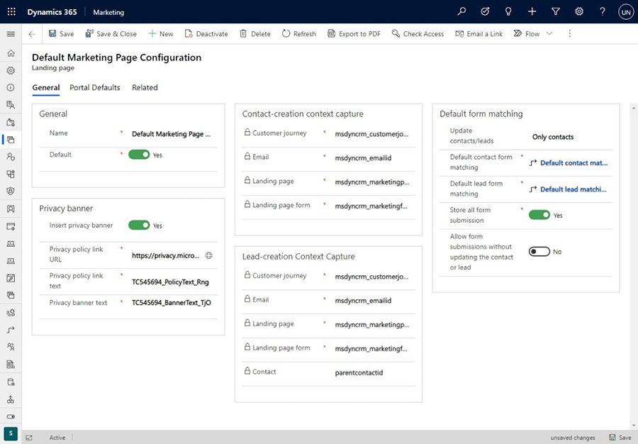

# Configure landing pages

Use the **Settings**> **Email marketing** > **Landing pages** page to set up a privacy banner, set hosting defaults, and configure defaults for how data submitted through a landing page form is matched to existing contact or lead records.

When you first arrive at **Settings** > **Email marketing** > **Landing pages**, you'll see a list of all marketing-page configuration sets. This is a standard list page, where you can view, sort, search, and filter the list to find a specific record, and use the command bar buttons to add or remove a record. Select any configuration set in the list to open, view, and edit it.

> [!div class="mx-imgBorder"]
> 

## Set the default (active) configuration set

You can set up as many configuration sets as you want, but only one can be active at a time. To change the active configuration set, find and open the set you want to activate in the landing-page configuration list, and then set its **Default** field to **Yes**; the existing default configuration will lose its default status.

There must always be exactly one landing-page configuration that is set as the default.

## Set up a privacy banner for landing pages

We recommend that you include a privacy banner on all your landing pages. This will let your customers know that you take their privacy seriously, and it might also be required in some jurisdictions. Use the following settings in the **Privacy banner** section to create and enable your privacy banner:

- **Insert privacy banner**: Choose **Yes** to enable this feature; choose **No** to disable it. When the privacy banner is enabled, the text and link defined in the other settings in this section will be added to each new marketing page that you create. The banner will also be added to any existing page that you open for editing; however, it won't be added to pages that are already published because these are read-only.
- **Privacy banner text**: Enter a summary of your privacy policy here.
- **Privacy policy link URL**: We recommend that you provide a detailed privacy policy somewhere on your own organization's website. If you have such a page, enter its full URL here.
- **Privacy policy link text**: This text is placed under the **Privacy banner text**, and creates a link to the **Privacy policy link URL** you specified. Enter a short string of text that tells users what to expect, such as "Click here to read our complete privacy policy."

## Configure how incoming form data is matched to existing records

Most of your landing pages will include an input form that visitors can use to sign up for an offer, event, or mailing list by entering their name, email address, and other information. When a visitor submits a form, Dynamics 365 Marketing accepts the submitted values and checks to see whether it should update an existing record or create a new one.

The **Contact creation context capture** and **Lead creation context capture** sections show where various types of information about the marketing context are stored when a submission results in a new contact or lead record. Here, you can see which fields in the contact or lead entity store each type of context information.

Use the **Default form matching** section to set defaults for which types of entities your marketing forms will create and update (leads and/or contacts), and how incoming values are matched against existing records to decide whether to create a new record or update an existing one. These defaults will be applied to each new marketing form that you create and they are saved with the form, so you can override them at the from level by changing them there. Changing these settings won't affect any existing forms. The following settings are available:

- **Update contacts/leads**: When a landing page submission is received, this setting establishes which types of records it can create or update&mdash;leads, contacts, or both.
- **Default contact form matching**: Shows the name of the field-matching strategy that you have set up to match incoming data against existing contact records. If a match is found according to this strategy, it will update that record. If no match is found, it will create a new contact. You can choose from among existing strategies here or select **New** to create a new one. See the next section for information about how to set up your field-matching strategies.
- **Default lead form matching**: Same as the **Default contact form matching** setting, but for lead records.
- **Store all form submissions**: Marketing-form records  provide a tab called **Form submissions**, where you can see all incoming submissions for the current form that haven't been processed yet. Failed submissions will remain listed here so you can inspect,  possibly fix, and resubmit them. Set this option to **Yes** if you'd also like to keep a record of all successfully processed submission here, which you'll also be able to inspect, update, and resubmit if needed. Set this to **No** to keep only pending and failed submission in the list. Either way, all successfully processed submissions will be applied to your database, and you'll always be able to see these submissions on the **Insights** > **Submissions** tab (but you can't edit or resubmit from there). More information: [Edit and resubmit form submissions](failed-submissions.md)

For more information about how to create and edit form matching, see [Set form matching](mkt-settings-matching.md).

## Set portal defaults

Settings on the **Portal defaults** tab control how your marketing pages are hosted in Power Apps portals (if you are using a portal to host your landing pages). The following settings are available:

- **Website**: Identifies the portal website where all new marketing pages will be published while the current configuration record is active. This defaults to the event website that was provisioned for you when you signed up for Dynamics 365 Marketing, but you can choose another if you have one. If you change this, pages that you've already published will remain on their current portal, but new pages will go to the new portal.
- **Page language**: Sets the default language to use in the portal.
- **Container page**: Sets the container page used for marketing pages.

### See also

[Open the administration settings](open-settings.md)  
[Create and deploy marketing pages](create-deploy-marketing-pages.md)  
[Set form matching](mkt-settings-matching.md)  
[Integrate Marketing with a CMS system or Power Apps portal](portal-optional.md)  
[Create interactive features with or without portals](portals.md)

[!INCLUDE[footer-include](../includes/footer-banner.md)]
