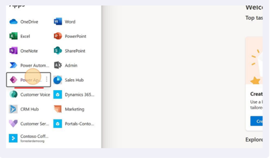
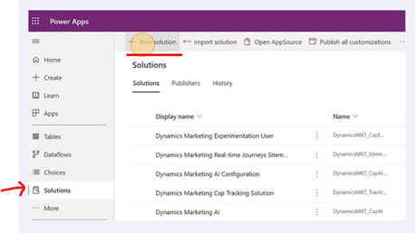
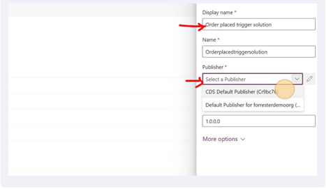
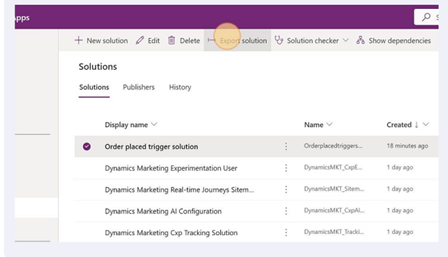
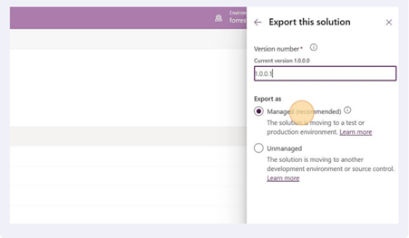

# Move triggers between environments (ALM process for triggers)

You may use multiple Dynamics 365 environments to support different stages of your application lifecycle management process. For example, you may have a development environment for creating and testing new features, a staging environment for pre-production testing, and a production environment for  final application deployment. Using multiple environments allows you to maintain separate configurations, isolate changes, and avoid potential conflicts that could impact your system’s stability.

Migrating triggers between environments is a key process that ensures that your team is using the most recent version of the triggers. [Power Platform solutions](transfer-solution.md) are the mechanism for implementing ALM by defining how code and metadata are packaged for transportation from one environment to another. Solutions include components such as entities, segments, journeys, connectors, flows, and forms but don't include customer data by default.

For ALM support, Dynamics 365 features must be built as "Solution-Aware," with entities modeled as solution components and dependencies known to Dataverse so they can be resolved during import. Environment-specific data, including usage data, is excluded from the solution, allowing for a streamlined and efficient ALM process. By utilizing solutions, you can achieve better control over your system's configuration, reduce errors, and ensure consistency across environments.

## Use Power Platform solutions to move triggers

You can move triggers in **any** state between environments (draft, published, or stopped). To do so, follow the steps below:

1. Open Power Platform solutions for your current source environment by selecting the app switcher in the upper left corner of the screen then selecting **Power Apps**.

    > [!div class="mx-imgBorder"]
    > 

    > [!IMPORTANT]
    > Ensure that the environment for Power Apps is the same as the one that you are currently working in (the one that has the triggers you want to migrate).

1. Select **Solutions** on the left pane and select **+ New Solution** in the top bar.

    > [!div class="mx-imgBorder"]
    > 

1. Name your solution and select a publisher. Make sure that the solution has a unique name that highlights the trigger or triggers that will be added.

    > [!div class="mx-imgBorder"]
    > 

1. Add only your "trigger" records to the solution. (**Component Type: Trigger**)
    - This can be done using the following steps:
        1. Select on **Add existing** dropdown on the top pane of the page.
        1. Select on **More** > **Other** > **Triggers**.
        1. Search for the trigger using the search functionality and select **Add** once you find the relevant record.

1. Adding the trigger records should add the following records to your solution as well:

    |     Trigger State    |     Components added    |
    |---|---|
    |     Draft    |     Trigger record, CustomerAPI record, and CatalogAssignment record    |
    |     Published    |     Trigger record, CustomAPI record, CatalogAssignment record, and customAPIrequestparameter records    |

1. Once done, you're ready to migrate the solution to the destination environment.
1. To migrate the solution, you need to export it. To export, follow the below steps: 

    - Select **Export Solution**.

    > [!div class="mx-imgBorder"]
    > 

    - Ensure that the solution is exported as **Managed**.

    > [!div class="mx-imgBorder"]
    > 

    - Select **Export**. Depending on the number of triggers in the solution, it takes a few minutes for the solution to be ready to download.

1. Once done, download your managed solution.
1. Navigate to the destination environment where you want to import the solution and the triggers.
1. Once there, use steps 1, 2, and 3 above to navigate to the **Solutions** page on the Power Apps portal where the solution can be imported.
1. To upload the managed solution that was downloaded from the source environment, select **Import Solution**.
1. Navigate to the target environment to check the triggers that are imported.
    - The state of the trigger is retained from the source environment. Draft triggers are imported in draft state, published triggers are imported in published state, stopped triggers are imported in draft state.

## Solution upgrade experience

Solution upgrades for solutions that contain managed triggers is slightly different from the migration of solutions for the first time between environments. Solution upgrades on triggers can vary depending on how the users work with the triggers in the destination or source environments.
Solution upgrades only change the state of the triggers when the triggers in the destination environment are in a draft state. The table below shows how state transitions occur for solution upgrades:

|     Trigger state at   destination    |     State of trigger post solution upgrade    |
|---|---|
|     Published    |     Doesn't change. Trigger remains in a published state irrespective of the state of trigger from upgraded solution.     |
|     Draft    |     State transition is allowed. The trigger’s state changes to the state of the trigger that is brought over from the source environment during solution upgrade.    |
|     Stopped    |     Doesn't change. The trigger remains in a stopped state irrespective of the state of the trigger from upgraded solution.    |

## Common questions

1. Can I import more than one trigger per solution?

    **Yes**. You can import any number of triggers per solution. At the destination, triggers that were imported in a published state will transition from a "publishing" state to a "published" state over a few minutes.

1. Do all triggers in a solution need to be in the same state when migrating?

    **No**. You can choose which state to import triggers on. The state of the triggers is retained at the destination.

1. My trigger kicks off a Power Automate flow. Will the Power Automate flow also be automatically added to the solution as a dependency once I add the trigger?

    **No**. If you have a Power Automate flow that is started based on the trigger, ensure that you're adding it to the solution along with the trigger record to ensure consistency and ease of use at the destination.

1. I want to move a custom trigger that is already integrated on my website. Are there some caveats that I need to know about?

    Migrating custom triggers is different from other trigger migration. Custom triggers typically have a code snippet that needs to be instrumented to the website to start tracking customer action. These code snippets contain an ingestion key that is associated only with the environment where the trigger has been created.

    So, when you migrate custom triggers between environments in the ALM process using Power Platform Solutions, we don't migrate the ingestion key, but rather, use the ingestion key for the destination organization as the key for the imported trigger.

    The ingestion key in the destination org will be different from the one for the source environment. Hence, this necessitates the need to re-instrument the code snippet where needed once the migration of the trigger is complete.

1. I migrated a trigger to my destination organization using a managed solution. Now, I don't think this is what I need and I want to delete it. But the delete button has been greyed out. What do I do?

    Managed triggers can't be deleted from the user interface. The reason for this is to account for the dependencies and ensure that you don't leave any orphan dependencies after deleting the trigger. Hence, a user who wants to delete a managed trigger can only do so by deleting the managed solution while all the triggers in the solution are in draft state.

    If the solution contains other components that you don't want removed, then the managed trigger can instead be deleted by upgrading to a new solution version that doesn't contain the managed trigger (and its related records when the trigger was added to the solution) but still contains the other components. The trigger intended to be deleted by this upgrade must be in draft state.

1. Can I migrate a combination of triggers and Power Automate flows in the same solution?

    **Yes**. You can move more than just triggers in the solution between the source and destination environments.

1. I imported many triggers in my solution in a published state. In the destination environment, I can see that some of them have come through in a published state while the others are showing up in a draft state. Is this an error?

    When a set of triggers are imported in a published state to the destination environment, they go through the process of publishing (a process that happens sequentially, a few triggers at a time). During that period, the triggers that are waiting in line to get published will display that they are in a "draft" state for a short period on initial import before transitioning to a "publishing" state and finally a "published/Ready to Use" state.

    If triggers are in a "draft" state for a long time, then this might indicate an issue. You can do either of two things:

    - **Self-serve**: One way to circumvent a potential issue where you see that imported "published" triggers are in a "draft" state for an extended period is to do a solution upgrade and reimport the trigger again.
    - **Reach out to your Microsoft representative**: Open a [support ticket](https://dynamics.microsoft.com/contact-us/) with the Microsoft support team to have one of the engineers investigate the issue and provide additional mitigation solutions.
