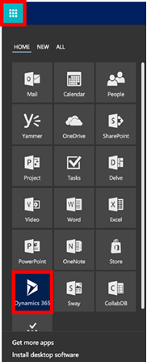
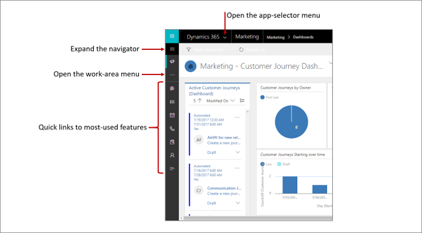

# Find your way around Marketing

[!INCLUDE[cc_applies_to_update_9_0_0](../includes/cc_applies_to_update_9_0_0.md)]

This introduction to [!INCLUDE[pn-marketing-business-app-module-name](../includes/pn-marketing-business-app-module-name.md)] explains how to find and open the app, and how to work with its common user interface elements including lists, forms, and business processes.

## Open Dynamics 365 for Marketing

To open the [!INCLUDE[pn-marketing-app-module](../includes/pn-marketing-app-module.md)] app, sign in to [!INCLUDE[pn-office-365](../includes/pn-office-365.md)], select the [!INCLUDE[pn-office-365](../includes/pn-office-365.md)] app launcher, and then select the **[!INCLUDE[pn-microsoftcrm](../includes/pn-dynamics-365.md)]** icon. On the [!INCLUDE[pn-microsoftcrm](../includes/pn-dynamics-365.md)] home page, select the tile for **[!INCLUDE[pn-marketing-app-module](../includes/pn-marketing-app-module.md)]**.

> [!NOTE]
> The apps listed in your app launcher depend on your subscription.

## Navigating among apps, areas, and entities

[!INCLUDE[pn-microsoftcrm](../includes/pn-dynamics-365.md)] is built out of applications (apps), areas, and entities.

- A [!INCLUDE[pn-microsoftcrm](../includes/pn-dynamics-365.md)] *application* provides a collection of functionalities for accomplishing a specific class of activity, such as marketing, sales, or finance. [!INCLUDE[pn-microsoftcrm](../includes/pn-dynamics-365.md)] is typically licensed at the application level. [!INCLUDE[pn-marketing-business-app-module-name](../includes/pn-marketing-business-app-module-name.md)] is an example of an application. Use the app-selector menu to navigate between the [!INCLUDE[pn-microsoftcrm](../includes/pn-dynamics-365.md)] apps that are available to your organization.

- A *work area* is a subdivision of an app, dedicated to a specific feature such as event management, online marketing, or administration. Each work area provides a targeted collection of entities for working in that area. In some cases, the same entity appears in more than one area (or even more than one [!INCLUDE[pn-microsoftcrm](../includes/pn-dynamics-365.md)] app). The contacts and dashboards entities, for example, appear in a variety of [!INCLUDE[pn-microsoftcrm](../includes/pn-dynamics-365.md)] apps and work areas. Use the work-area menu to navigate between work areas for your current app.

- *Entities* represent a specific type of data, such as a contact, lead, email message, or customer journey. Entities use a structured data format, which defines the collection of fields available to the entity. Each entity consists of a collection of individual records. For example, for the contacts entity, each record describes a single person, and each record includes a collection of fields such as first name, last name, and email address. Entities normally present two views: a list view, which is typically a table listing available records; and a form view, which shows all available data and settings for a single record. Use the side navigator to move between entities in your current work area.

### Move between apps

Use the app-selector menu to switch between [!INCLUDE[pn-marketing-app-module](../includes/pn-marketing-app-module.md)] and your other [!INCLUDE[pn-microsoftcrm](../includes/pn-dynamics-365.md)] apps.

The apps you see listed in your app-selector menu will depend on which apps you have licensed. When [!INCLUDE[pn-marketing-app-module](../includes/pn-marketing-app-module.md)] is installed, you will have the following three apps at least:

- **Marketing**: Go here to access all core marketing features, including the **Marketing**, **Portals**, **Events**, **Settings**, and **Training** work areas.
- **Surveys**: Go here to set up surveys that you can use together with your marketing emails, customer journeys, and events. Surveys are provided by [!INCLUDE[pn-voice-of-the-customer-full](../includes/pn-voice-of-the-customer-full.md)], which is also available for use with other [!INCLUDE[pn-microsoftcrm](../includes/pn-dynamics-365.md)] products. To maintain wide compatibility, it uses a slightly different user interface than the [!INCLUDE[pn-marketing-app-module](../includes/pn-marketing-app-module.md)] app, which is why it is broken out into its own app here. [!INCLUDE[proc-more-information](../includes/proc-more-information.md)] [Create and run online surveys](surveys.md)
- **[!INCLUDE[pn-custom-app-module](../includes/pn-custom-app-module.md)]**: This app combines features from many of the various [!INCLUDE[pn-microsoftcrm](../includes/pn-dynamics-365.md)] apps you have licensed into a single navigation structure (but most [!INCLUDE[pn-marketing-business-app-module-name](../includes/pn-marketing-business-app-module-name.md)] end-user features _aren’t_ included here). It uses an interface similar to the Surveys app. Administrators, and especially customizers, may prefer to work here rather than in [!INCLUDE[pn-marketing-business-app-module-name](../includes/pn-marketing-business-app-module-name.md)] because more settings are available, and the user interface is the one described in the customizer and portals documentation. [!INCLUDE[proc-more-information](../includes/proc-more-information.md)] [Engage with customers online with portals](portals.md), [Customize Dynamics 365 for Marketing](customize.md), and [Administrator Guide for Dynamics 365 Customer Engagement](../admin/admin-guide.md)

All of the apps listed in the app-selector menu operate on the same database as one another, so settings made in the one app (including for customization, user administration, events, LinkedIn Lead Gen, [!INCLUDE[pn-voice-of-the-customer](../includes/pn-voice-of-the-customer.md)], and more) will affect all the other apps.

### Move between entities, records, and work areas

It's easy to get around [!INCLUDE[pn-marketing-business-app-module-name](../includes/pn-marketing-business-app-module-name.md)] and get back to your favorite or most-used records.

Usually, the navigator is docked and out of the way, but still provides quick links to common features.

Expand the navigator to gain easy access to all features and work areas.

## Working with list views

Usually, when you first open an entity, you'll see the list view, which shows a list of records belonging to that entity, formatted as a table. For example, if you open the contacts entity, you'll see a list of individual contacts.

From here, you can do the following:

- **Sort the list**: Select a column heading to sort the list by values in that column. Select the heading again to sort in the opposite direction.
- **Search the list**: Enter text in the search field above the list to show only those records that contain your text.
- **Filter the list**: Select a letter at the bottom of the list to show only records with names that start with that letter.
- **Choose a system view**: A system view is predefined to show commonly used list views such as active contacts, tasks assigned to you, closed leads, and so on. The current system view&mdash;My Active Contacts, in the preceding image&mdash;is shown as a heading above the list. To change the system view, select the down arrow next to this heading and choose the view you want. To set a view as the default, select the pushpin icon next to the view.
- **Go to a page in the list**: If the list contains more records than can be shown on one page, use the paging controls at the bottom of the list to move forward and backward through the pages.
- **Create records**: Select **New** to create a new, blank record.
- **Open a record**: Select any record in the list to open its form page, which shows all the details about the record.
- **Operate on records**: Use the commands in the command bar to operate on records in the list and perform related actions. Some commands (such as **Delete**) require that you first select one or more target records by placing a check mark in the leftmost column, while others operate on the entire list. You can export the list to an [!INCLUDE[pn-excel-short](../includes/pn-excel-short.md)] workbook (possibly based on a template), open charts and dashboards, and more, depending on the type of records you are working with.

## Working with forms

Forms show all the details about a single record and sometimes also provide special features for working with it, such as the digital content designer for marketing emails and marketing pages. Usually you'll open a form by selecting a record that appears in a list view, but you can also open a form by following a link from another form to a related record.

From here, you can do the following:

- **Operate on the record**: Use the commands in the command bar to operate on the current record or perform a task related to the record. The available commands vary based on the record type, but you can typically use the command bar to delete the record, refresh the page, email a link to the record, reassign the record owner, or export the record by using a [!INCLUDE[pn-ms-word-short](../includes/pn-ms-word-short.md)] template.
- **Choose a form view**: Each form view provides a collection of related fields from the record, or related features, such analytics or a designer. Some types of records provide just one view, some provide several. The current form view (when available) is shown above the record name, near the top of the page. To change the form view, click the down arrow next to the form-view name to open a menu, and then select the new view that you want.
- **Chose a form-view tab**: Some form views are further divided into tabs. When tabs are available, they're listed below the record name. Select any tab name to go to that tab. Each tab provides a collection of related fields from the record.
- **Read and edit important field values**: Some form views display a few especially important fields in the heading bar, opposite the record name. These are typically fields that are fundamental to working with records of the current type (such as a the name of the record owner).
- **View and edit all field values**: In the main body of the form, you'll find the fields related to the current tab, form view, and record type. Fields marked with a red asterisk are required, and you can't save the record without their having valid values. Fields marked with a blue plus sign are especially important or recommended, but are not strictly required. Fields showing a lock icon are read-only and can't be edited.

## Working with business processes

Business processes help everyone follow best practices, even for situations that don't occur very often. Where available, business processes provide a step-by-step timeline for the stages of a process at the top of the form view for the relevant record. You open the menu for the active stage, enter each field of required and business-critical data, and then select the next stage when you're ready to work with it. Some business processes (such as a telemarketing script) can be completed in the time it takes to make a single phone call, while others (like event planning) might take several weeks.

### See also

[Open the advanced settings](open-advanced-settings.md)