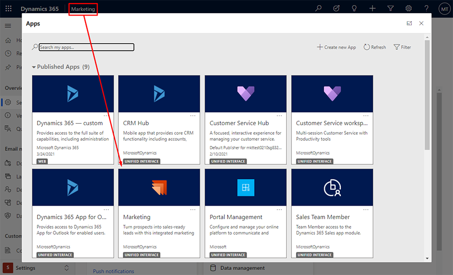
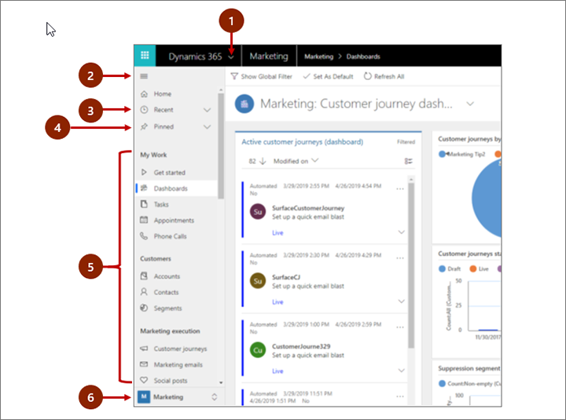
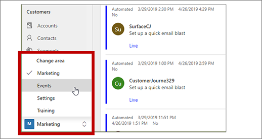
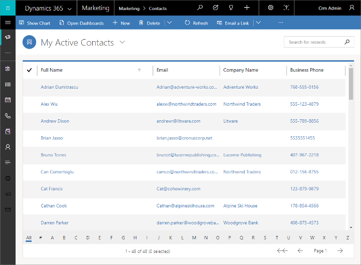
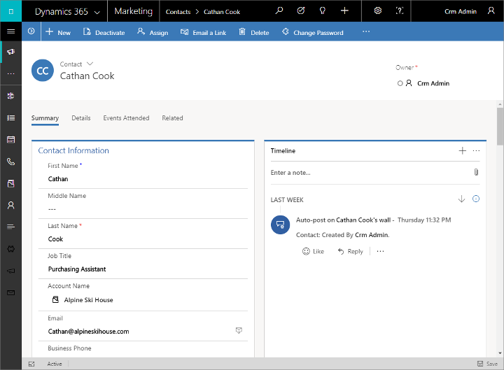
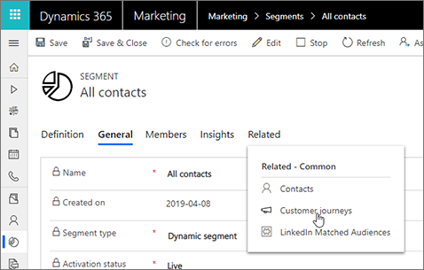
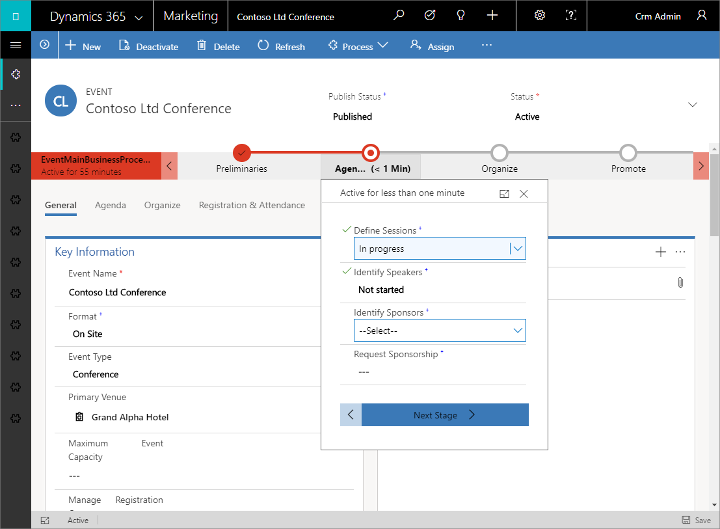

# Find your way around Marketing

This introduction to Dynamics 365 Marketing explains how to find and open the app, and how to work with its common user interface elements including lists, forms, and business processes.

## A fully responsive app built on the new Unified Interface

Dynamics 365 Marketing is built to run exclusively on the new Unified Interface for Dynamics 365 applications. The Unified Interface uses responsive web design principles to provide an optimal viewing and interaction experience on any device, regardless of screen size or orientation. There is no need to install a special client on each device, or to switch to a different site based on which device you are using.

Many Dynamics 365 applications support both the new Unified Interface and the older web-client interface, but nearly all are moving to the Unified Interface. Some administration and customization features, and some integrated user features, may require you to switch to a web-client app from time to time, but soon all features are expected to be available on the Unified Interface.

> [!NOTE]
> Marketing typically shares data with other Dynamics 365 applications running on the same instance, and operates on many of the same database entities, including contacts, leads, accounts, and more. Some Marketing-specific features, such as displays of analytics and insights from marketing initiatives, require the Unified Interface and therefore won't show any data when you view those entities in web-client apps.

More information: [About Unified Interface for model-driven apps in Power Apps](/power-platform/admin/about-unified-interface)

## Navigating among apps, areas, and entities

Dynamics 365 is built out of applications (apps), areas, and entities.

- A Dynamics 365 *application* provides a collection of functionalities for accomplishing a specific class of activity, such as marketing, sales, or finance. Dynamics 365 is typically licensed at the application level. Dynamics 365 Marketing is an example of an application. Use the app-selector menu to navigate between the Dynamics 365 apps that are available to your organization.

- A *work area* is a subdivision of an app, dedicated to a specific feature such as event management, online marketing, or administration. Each work area provides a targeted collection of entities for working in that area. In some cases, the same entity appears in more than one area (or even more than one Dynamics 365 app). The contacts and dashboards entities, for example, appear in a variety of Dynamics 365 apps and work areas. Use the work-area menu to navigate between work areas for your current app.

- *Entities* represent a specific type of data, such as a contact, lead, email message, or customer journey. Entities use a structured data format, which defines the collection of fields available to the entity. Each entity consists of a collection of individual records. For example, for the contacts entity, each record describes a single person, and each record includes a collection of fields such as first name, last name, and email address. Entities normally present two views: a list view, which is typically a table listing available records; and a form view, which shows all available data and settings for a single record. Use the side navigator to move between entities in your current work area.

### Move between apps

Use the app-selector menu to switch between Marketing and your other Dynamics 365 apps.

> [!div class="mx-imgBorder"]
> 

The apps you see listed in your app-selector menu will depend on which apps you have licensed. When Marketing is installed, you will have the following three apps at least:

- **Marketing**: Go here to access all core marketing features, including the **Marketing**, **Events**, **Settings**, and **Training** work areas.
- **Surveys**: Go here to set up surveys that you can use together with your marketing emails, customer journeys, and events. Surveys are provided by Customer Voice, which is also available for use with other Dynamics 365 products. To maintain wide compatibility, it uses a slightly different user interface than the Marketing app, which is why it is broken out into its own app here. More information: [Create and run online surveys](surveys.md)
- **Dynamics 365&mdash;custom**: This app combines features from many of the various Dynamics 365 apps on your instance into a single navigation structure (but most Dynamics 365 Marketing end-user features *aren't* included here).

All of the apps listed in the app-selector menu operate on the same database as one another, so settings made in the one app (including for customization, user administration, events, LinkedIn Lead Gen, Customer Voice, and more) will affect all the other apps.

### Move between entities, records, and work areas

It's easy to get around Dynamics 365 Marketing and get back to your favorite or most-used records. The following illustration shows the primary navigation elements.

Legend:

1. **App selector**: Open this menu to move between apps, for example, to move between Dynamics 365 Marketing and the Dynamics 365&mdash;custom app.
1. **Collapse/expand button**: Select this to collapse the navigator to allow more room for the main part of the page. If the navigator is already collapsed, select this button to expand it again.
1. **Recent records**: Expand this entry to view a list of records you were recently using. Select an record here to open it. Select the push-pin icon next to a record listed here to added to your favorites (pinned records).
1. **Favorite records**: Expand this entry to view and open your favorite (pinned) records. Use the **Recent records** list to add records here. Select the remove-pin icon next to a record listed here to remove it from this list.
1. **Entity navigator**: This area lists each entity and dashboard available for the current work area. Select any entry here to open the named dashboard or list-view for that entity.
1. **Work-area selector**: Open this menu to move to another work area. The current work area is named here.

Use the work-area select at the bottom of the navigation panel to move between the main work areas of the Marketing app, which are:

- **Marketing**: Provides access to all the core marketing features, including contacts, leads, segments, customer journeys, email messages, marketing pages, lead-scoring models, and more.
- **Events**: Provides access to all of the event-management features.
- **Settings**: Provides access to system settings used to administrate the system (requires admin privileges).
- **Training**: Provides links to online help pages and tutorials recommended for new users.

## Working with list views

Usually, when you first open an entity, you'll see the list view, which shows a list of records belonging to that entity, formatted as a table. For example, if you open the **Marketing email** entity, you'll see a list of individual email messages.

Legend:

1. **Select records**: Select one or more records by placing a check in this column. Depending on where you are working, you may be able to apply a single operation to all the selected records at once using buttons in the command bar.
1. **Open a record**: Select any record in the list to open its record view, which shows all the details about the record. Usually you should select from the **Name** column to open a record from the current entity. Some entities provide links to records from related entities in other columns (such as a related contact).
1. **Sort the list**: Select a column heading to sort the list by values in that column. Select the heading again to sort in the opposite direction. An arrow in the column heading indicates which column is being sorted and in which direction.
1. **Choose a system view**: A system view is predefined to show commonly used list views such as active contacts, tasks assigned to you, closed leads, and so on. The current system view is shown as a heading above the list. To change the system view, select the down arrow next to this heading and choose the view you want. To set a view as the default, select the pushpin icon next to the view in the open menu.
1. **Filter the list**: Select a funnel icon next to a column heading to filter the list by values in that column. The funnel icon shows as filled to indicate which column is being filtered (if any).
1. **Command bar**: Use the commands in the command bar to operate on records in the list and perform related actions. Some commands (such as **Delete**) require that you first select one or more target records by placing a check mark in the leftmost column, while others operate on the entire list. You can export the list to an Excel workbook (possibly based on a template), open charts and dashboards, and more, depending on the type of records you are working with.
1. **Search the list**: Enter text in the search field above the list to show only those records that contain your text.
1. **Paging and filtering**: If the list contains more records than can be shown on one page, use the paging arrows at the bottom of the list to move forward and backward through the pages. Select a letter to show only those records whose names start with that letter.

## Working with record views

Record views show all the details about a single record and sometimes also provide special features for working with it. Usually you'll open a record view by selecting a record that appears in a list view, but you can also open a record view by following a link from a related record.

Legend:

1. **Tabs**: Most record views are divided into tab. Each tab provides a collection of related fields from the record. When tabs are available, they're listed below the record name. Select any tab name to go to that tab. The current tab is shown underlined.
1. **Form view selector**: Each form view provides a collection of related fields from the record, or related features, such analytics or a designer. Some types of records provide just one view, some provide several. The current form view (when available) is shown above the record name, near the top of the page. To change the form view, click the down arrow next to the form-view name to open a menu, and then select the new view that you want.
1. **Command bar**: Use the commands in the command bar to operate on the current record or perform a task related to the record. The available commands vary based on the record type, but you can typically use the command bar to go live, delete the record, refresh the page, email a link to the record, reassign the record owner, or export the record by using a Word template.
1. **Heading bar**: Some record views display a few especially important fields in the heading bar, opposite the record name. These are typically fields that are fundamental to working with records of the current type (such as a the record name or record owner).
1. **View and edit all field values**: In the main body of the record view, you'll find all of the fields related to the current tab, form view, and record type. Fields marked with a red asterisk are required, and you can't save the record without their having valid values. Fields marked with a blue plus sign are especially important or recommended, but are not strictly required. Fields showing a lock icon are read-only and can't be edited.

## Find related records

Nearly all types of records show a **Related** tab after you have saved them at least once. This tab is actually a drop-down list that you can use to find other types of records that use or reference the displayed record. For example, if you are viewing a lead-scoring model, select **Lead scores** from the **Related** drop-down list to find all the leads that model has scored.

 When you choose an entity name from the **Related** drop-down list, a new tab named for that entity opens, showing a list of all related records of that type. The **Related** tab remains available, and you can still use it to find other types of records that reference the current one.

## Working with business processes

Business processes help everyone follow best practices, even for situations that don't occur very often. Where available, business processes provide a step-by-step timeline for the stages of a process at the top of the relevant record. You open the menu for the active stage, enter each field of required and business-critical data, and then select the next stage when you're ready to work with it. Some business processes (such as a telemarketing script) can be completed in the time it takes to make a single phone call, while others (like event planning) might take several weeks.

### See also

[Open the administration settings](open-settings.md)  
[About Unified Interface for model-driven apps in Power Apps](/power-platform/admin/about-unified-interface)

[!INCLUDE[footer-include](../includes/footer-banner.md)]