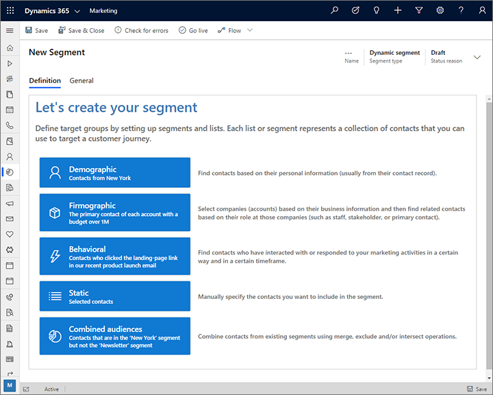
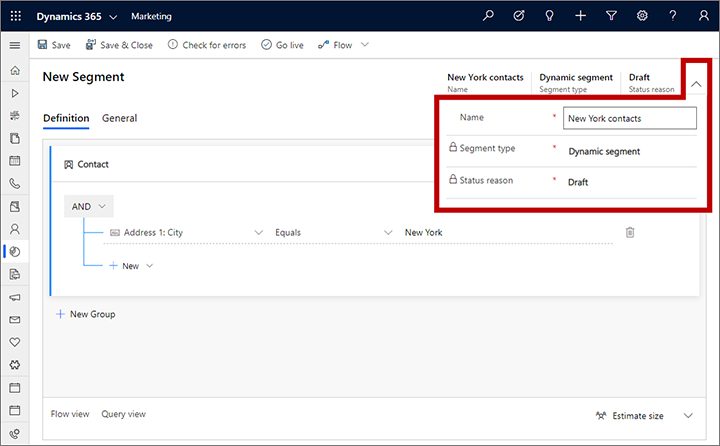

# Early access: Create segments with the new segmentation designer

[!INCLUDE [cc-marketing-early-access-2019w2](../includes/cc-marketing-early-access-2019w2.md)]

The segmentation designer is a key tool for establishing target markets in Dynamics 365 Marketing. It enables you to query across multiple related entities, including contacts, leads, accounts, events, marketing lists, and more. It also enables you to query the marketing-insights service to find contacts that have shown engagement with your marketing initiatives, or contacts that you may be failing to reach (due to issues such as email bounces).

Many Dynamics 365 Marketing customers have asked us to provide a more streamlined and easier to use tool for designing segments in Dynamics 365 Marketing, so we've been working to redesign the interface to more closely resemble other querying tools found in Dynamics 365 (such as the advanced-find feature). The segment designer still provides more power than you'll find in any other search tool for Dynamics 365, and remains the only tool that lets you query interaction records from the marketing-insights service.

As previously, segments are mostly used to establish target audiences for your customer journeys. (You can also use subscription lists to target a journey, but you can't use other types of static or dynamic marketing lists to do so.)

Read this topic to learn how to work with the new segment designer.

## Create and go live with a new segment

Read this section to get a basic overview of how to create a segment and start it running so you can see its members and use it to target a customer journey.

1. Go to **Customers** > **Segments** to open a list of current segments.

1. Select **New** to start creating your new segment.

1. To help you get started, the designer asks you to choose which type of segment you want to create. This selection will establish the initial structure of your segment and also affects the user interface you'll see for working with it. Read the names and descriptions shown, and choose one of the following to get started:

    - **Demographic**: Creates a dynamic profile segment prepared to query contact records directly, but you can still add relations as needed to create a query of arbitrary complexity. For details about how to work with this kind of segment, see [Design a demographic or firmographic segment](#segment-profile)
    - **Firmographic**: Creates a dynamic profile segment prepared with a relation to the accounts entity already in place. Other than this, this is the same as selecting **Demographic**. For details about how to work with this kind of segment, see [Design a demographic or firmographic segment](#segment-profile)
    - **Behavioral**: Creates a behavioral segment, which queries interaction records from the marketing-insights service to find contacts that have interacted in specific ways with your marketing initiatives, such as by opening an email, clicking a link, or visiting a web page. For details about how to work with this kind of segment, see [Design a behavioral segment](#segment-interaction)
    - **Static**: Creates a segment where you manually select each member rather than creating a logical query. For details about how to work with this kind of segment, see [Design a static segment](#segment-static)
    - **Combined audiences**: Creates a compound segment, which combines any number of existing segments union, exclude, and/or intersect operators. For details about how to work with this kind of segment, see [Design a compound segment (combined audiences)](#segment-compound)

    

1. The segment designer opens, showing settings and tools that are appropriate for your selection. Start by naming your segment. Select the expansion button at the side of the header area to expand a drop-down dialog where you can make a few key settings. Use it to enter a **Name** for your new segment.

    

1. Select **Save** on the toolbar to save your segment.

1. Use the tools provided by the designer to establish your segment membership criteria, as described elsewhere in this topic, for your selected segment type.

1. When you're done designing the segment, select **Go live** on the toolbar to start running the segment, find all of its members (as needed), and make it available for use with your customer journeys. Once your segment is live, it will include a **Members** tab, where you can go to see exactly which contacts are part of the segment.

See the remaining sections of this topic for more information about each type of segment available here.

## Design a demographic or firmographic segment

_Demographic and firmographic segments_ are dynamic segments that query _profile records_ stored in the marketing insights database. Profile records include the entities you normally work with in the Dynamics 365 UI, such as contacts, accounts, leads, and any other entities. They are synced between your Dynamics 365 organizational database (where you can work with them in the UI and other Dynamics 365 apps) and the marketing insights database (where you can query them from a segment).

This type of segment is called _dynamic_ because its membership is defined as a query, which provides a logical description of the contacts the segment should contain, but doesn't list any contacts by name. Member ship in dynamic segments can change from moment to moment in response to new contacts being added or updated in the database.

Both demographic and firmographic segments are examples of dynamic profile segments. The only difference is that new firmographic segments are created with a relation to the accounts entity by default (which you are free to remove).

To create a demographic or firmographic segment, create a segment and then select the **Demographic** or **Firmographic** option, as described in [Create and go live with a new segment](#create-segment). Then design your segment logic as described in the remaining subsections of this section.

### Create an entity group

An *entity group* is a collection of logical clauses and clause groups. An entity group can be quite simple (possibly with just one clause), or very complex (featuring multiple nested clause groups and relations). Your segments can also include multiple entity groups combined with union, exclude, and/or intersect operators, but often you'll have just one entity group. See the next section for more information about combining multiple entity groups. 

The following image shows an example of typical entity group in a dynamic profile segment query. It highlights the key features of the designer that you'll use to create your query.

Legend:

1. **Top entity (contacts)**: At the top of each entity group in the designer you'll see a reference to the contact entity. This is because each entity group must ultimately resolve to a list of contacts from the contact entity.
1. **Related entity**: Related entities link to the next-higher entity in the query structure through a specific field in one of the two entities. Use related entities to find a collection of non-contact records (such as accounts) and then find the contacts related to those found records. In this example, you see a relation to the account entity annotated as **Account (Contact -> Account (Company name)**. That means that we are linking to the **Account** entity, which relates back to the **Contact** entity&mdash;in this case through a lookup field on the contact entity called **Company name**. This relation opens a clause group that will find some accounts based on the criteria nested below this relation, and then relates back to the contact entity by finding all of the contacts that work for the found companies (contacts that link to those companies through the contact **Company name** field). If needed, you can nest related entities within each other as your work farther and farther away from the contact entity.
1. **Clause group**: Clause groups are collections of logical clauses (rows) that are combined using either AND or OR operators. The AND operator is more exclusive; it only finds records that meet all of the criteria of each clause in the group. The OR operator is more expansive; it finds all records that meet any of the criteria for the group. Use the drop-down list at the top of the clause group to select the operator. You can nest clause groups inside one another. The system resolves the most deeply nested groups first and then works its way up. The example shown here will find _accounts_ (the parent entity) that are either in the _financial_ or _accounting_ industry, but only those that also have a category of _preferred customer_.
1. **Single clause (row)**: Clauses represent the basic building blocks of the query. Each asks a specific question about a specific field value and finds records that answer that question. Each row starts by naming a field from the parent entity, followed by an operator (such as equals, contains, starts with, or ends with), followed by a value. Use the drop-down lists and fields provided to define the field, operator, and value for each new clause that you add, as needed. The example shown here finds contacts where the _city_ part of their address _equals__New York_.
1. **New item button**: Use the **New** buttons to add a new row, clause group, or related entity at that location in the query structure. Select the button to open a drop-down list, and then select which type of item you want to add there (**New row**, **New group**, or **New related entity**). Finally, configure the new row, clause group, or relation as needed using the drop-down lists and fields provided for the new item.
1. **New group button**: Use the **New group** button to add a new contact entity group to the query. Each entity group resolves to a collection of contacts, which you then combine using union, exclude, and/or intersect operators. A Sankey diagram is provided at the bottom of the page to help you visualize how your entity groups combine and flow into each other. The effect is similar to creating a compound segment, but in this case you are combining entity groups within a single segment rather than individual existing segments.
1. **Explore related entities**: Select this button to open a diagram that illustrates how various entities relate to each other in your database (especially, how they relate back to the contact entity). This can help you decide how to make use of related entities in your query.
1. **Full-screen editor**: Select this button to open the segment designer in full-screen mode, which provides more screen real estate for viewing and editing your query.
1. **Expand/collapse entity group**: Select this button to expand or collapse all the rows in this entity group. This lets you switch between getting the big picture and viewing individual query details, which can be handy if your query includes several entity groups.
1. **Command menu and expand/collapse clause group button**: To delete a clause group, open the command menu ( **...** ) and select **Delete**. To expand or collapse a clause group, select the chevron button next to the command menu. The expand/collapse buttons lets you switch between getting the big picture and viewing individual rows, which can be handy if your query includes several clause groups.
1. **Delete button**: To remove a clause (row) from your query, select the delete button next to the row you want to remove.

> [!NOTE]
> For clauses that query fields of type _multi option set_ or _lookup_, you can only specify one value in each clause. To find multiple values in these types of fields, create multiple clauses that query the same field and combine them using the OR operator.

### Combine multiple entity groups

You can design your segment to include multiple entity groups and then set rules for how to combine the groups. Often, you could obtain the same results with a single, complex entity group, but it can be sometimes be easier to design and visualize your segment using multiple entity groups instead.

The following image shows the dynamic-profile segment designer with when several entity groups are present.

Legend:

1. **Collapsed entity group**: All of the entity groups in this example are shown as collapsed, which means you can't see the detailed logic of each group. However, this view makes it easy to see all the groups and adjust the logic being used to combine them. Use the chevron button at the right side of each entity group to expand or collapse it.
2. **Entity group operator**: Between each entity group is an operator, which establishes the logic for combining the previous group with the next one. Use this drop-down list to choose one of the following:
   - **Union**: Combines all members of the two groups.
   - **Intersect**: Finds only contacts that are members of both groups. Contacts present in just one of the groups will be removed.
   - **Except**: Removes all contacts from the incoming group from the current result.
3. **Sankey diagram**: This diagram makes it easy to visualize the way all of the various groups are being combined by your selected logic. It indicates how two incoming groups will be combined, the order of the combination, and the approximate effect that the combination logic will have on the resulting, combined group. Select the **Flow view** tab at the bottom of the page if you don't see the diagram there.

### View and edit the raw query

The segment designer provides a graphical interface for creating the logic for a dynamic segment. As  you work with the settings, you are actually creating a text-based query in the background. This is the query that the system will actually run against your database. Usually you don't need to use the query for anything, but sometimes it can help in troubleshooting. You can also copy/paste queries into the designer, which you might use to create a copy of an existing segment or to share a query design through email.

To find, view, and edit the query, scroll to the bottom of the page and open the **Query view** tab here.

## Design a behavioral segment

_Behavioral segments_ query the _interaction_ records stored in the marketing insights database. Each of these records is generated automatically in response to something a contact did (such as open an email or visit a web page), and is related to the specific contact record associated with that action (if known). Interaction records are used to generate various insights displays in the Dynamics 365 Marketing UI, but they aren't synced to the Dynamics 365 organizational database.

The result of a behavioral segment query is always a set of contacts who performed the relevant type of interaction according to the conditions established by the query.

This type of segment is _dynamic_ because its membership is defined as a query, whose results can change from moment to moment in response to new interactions being added to the database.

To create a behavioral segment, create a segment and then select the **Behavioral** option, as described in [Create and go live with a new segment](#create-segment).

The following image shows an example of typical behavioral segment query and outlines key features of the designer user interface.

Legend:

1. **Interaction name**: Use this drop-down list to select the type of interaction the behavioral segment will look for.
2. **Full-screen editor**: Select this button to open the segment designer in full-screen mode, which provides more screen real estate for viewing and editing your query.
3. **Show/hide interaction filters**: Select this button to show or hide filters for setting limits on the total number of interactions and/or a moving-window time period.
4. **Interaction filters**: Use these to set a minimum or exact number of interactions that a contact must have performed to be included in this segment. You can also set a moving-window filter to only consider interactions that occurred recently, such as in the last two weeks. To enable the moving-window filter, change the third drop-down list from **interactions** to **interactions in the last**. The date of the moving window is always calculated based on the current date, so if you enable this, then some contacts may slip out of the segment with each passing day unless they remain engaged. In this example, the filter will find contacts who clicked on a message at least once in the past 45 days.
5. **Additional restrictions**: These settings work just like they do for demographic and firmographic segments, but here they enable you to filter results based on values for the selected type of interaction records. For example, you might want to find clicks on email messages sent by a particular customer journey (as shown here). As with [demographic and firmographic segments](#segment-profile), you can add as many clauses and clause groups as you need here.

> [!NOTE]
> Behavioral segments can only contain one entity group, and do not offer the ability to estimate the segment size.

## Design a static segment

_Static segments_ let you select individual contacts, one by one, to create custom segments without requiring any logical expressions.

When you are working with a static segment, you'll see a list of all of the contacts from your database, with a check box shown for each. Select the check box for each contact you want to include in the segment and clear the check box for all other contacts.

To create a static segment, create a segment and then select the **Static** option, as described in [Create and go live with a new segment](#create-segment).

Because your database probably includes many contacts, the designer often can't show all of them on one page. It provides paging controls at the bottom and a search filter at the top. Select the filter button at the top of the list to open a form where you can build a query that can help you find the contacts you want to add.

When you're done picking contacts for your static segment, select Go live on the command bar, as usual. Once the segment is live, it will include a **Members** tab, which lists all contacts in the segment.

> [!IMPORTANT]
> Static segments can contain a maximum of 5,000 members. If you need to curate a larger list than this, then please create a static marketing list instead. You can bring a static marketing list into a dynamic profile segment using relations if needed. For more information about marketing lists and how they are different from segments, see [Marketing segments vs. marketing lists](segments-vs-lists.md) and [Create a marketing list using in-app marketing (Sales)](../sales-enterprise/create-marketing-list-using-app-marketing-sales.md).

## Design a compound segment (combined audiences)

_Compound segments_ combine two or more existing segments using union, exclude, and/or intersect operators to create a new segment based on the original segments. You can combine any or all other types of segments to create a compound segment, as needed.

To create a compound segment:

1. Create a segment and then select the **Combined audiences** option, as described in [Create and go live with a new segment](#create-segment).

1. The compound segment designer opens. Select your first segment at the top of the **Add: Segment** panel.

    

    > [!TIP]
    > Only existing, live segments are shown in the list. If you don't see a segment here that you are expecting, check to make sure it's live (not draft).

1. Select the segment that you want to combine with the first one in the field at the bottom of the **Add: Segment** panel.
1. In the space between your two segments in the **Add: Segment** panel, select an operator for combining your first two segments. The operators work as follows:

   - **Union**: combines all members of the next segment with the results so far.
   - **Exclude**: removes members of the next segment from the results so far.
   - **Intersect**: removes all members from the results so far that are not also members of the next segment.

    

1. Select **Add** at the bottom of the **Add: Segment** panel to add your first two segments. The display updates to show a Sankey diagram. This makes it easy to visualize the how the various groups are being combined by the logic you design. It indicates how two incoming groups will be combined, the order of the combination, and the approximate effect that the combination logic will have on the resulting, combined group.

    

1. The **Add: Segment** panel now moves one position forward. To add another segment, choose a segment in the field at the bottom of the panel, select an operator, and then select **Add**.

    

1. Continue to compose your compound segment by adding more segments as needed and choosing an operation for each. As you work, you'll build a Sankey diagram of how your segments are combined, and how contacts flow into and out of the segment as a result of each operation.

    > [!TIP]
    > To remove a segment, replace a segment, or change operators, use the **Edit** button  or **Delete** button  provided at the segment intersection where you want to modify in the diagram.

1. When you're done, save your segment and go live.

## Work with legacy segments

When you enable the new segment designer on an existing Marketing instance, all of your legacy segments will continue to work, but some types of legacy segments can't be displayed using the new segment designer. This mostly affects segments that include relations to non-contact entities because the new designer uses a different type of query statement to establish relations (the legacy designer used TRAVERSE, while the new designer uses RELATE). As a result, you may experience the following:

- On opening a legacy segment that includes TRAVERSE statements, it will open in the legacy designer, but will continue to function exactly as it did before the update. You can still edit, go live, and use these legacy segments.
- You can't paste older query strings that include TRAVERSE statements into the new segment designer. If you do, you'll see an error message. Please use the new designer to recreate these queries using the new standard.

### See also

[Working with segments](segmentation-lists-subscriptions.md)  
[Segments vs. lists](segments-vs-lists.md)  
[Design profile-based dynamic segments](segments-profile.md)  
[Design interaction-based dynamic segments](segments-interaction.md)  
[Generate interaction segments from journey results](generate-segment-from-journey.md)  
[Manage segment memberships from a contact record](manage-segments-from-contacts.md)  