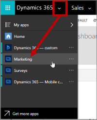
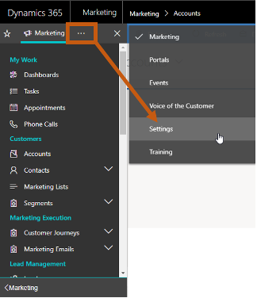
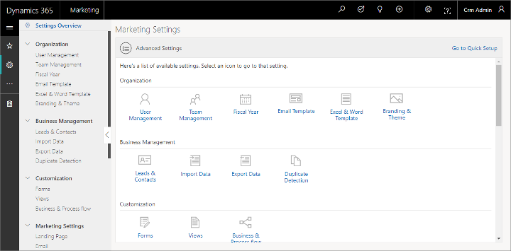

# Open the advanced settings

Administrators use advanced settings to fine-tune application behavior, set defaults, manage users, enable webinars, check quotas, and more. If you also use Dynamics 365 Sales, many of the settings you find here also apply to that app, though some settings are unique to Sales or Marketing.

1. If you haven't already done so, sign in to Dynamics 365 Marketing as a user with [administrator privileges](admin-users-licenses-roles.md). Then use the app-selector menu to open the **Marketing** app.

    

1. Expand the work-area area menu at the bottom of the side navigator and select **Settings**.

    

1. The side navigator is updated to show pages available in the **Settings** work area, with **Advanced Settings** selected.

## Work with advanced settings

  

- Use the **Advanced settings** column on the left side of the window to navigate between settings pages, which are organized into sections. Select an entry under a heading to open the related settings page. You can also collapse or expand the section headings as needed.
- When you first open the **Advanced Settings** page, the main part of the window provides the same sections as the **Advanced settings** column, and provides icons for opening the same settings pages that are also available in the navigator.

See the subtopics in this section for details about how to work with each group of settings provided on the **Advanced Settings** page.

### See also

[Find your way around Dynamics 365](navigation.md)

[!INCLUDE[footer-include](../includes/footer-banner.md)]