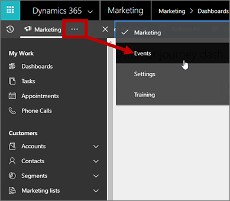

# Open the event management work area

[!INCLUDE[cc_applies_to_update_9_0_0](../includes/cc_applies_to_update_9_0_0.md)]

The event management features of [!INCLUDE[pn-marketing-business-app-module-name](../includes/pn-marketing-business-app-module-name.md)] are collected into their own work area to make it easy to find all the relevant entities and settings while you are focusing on events.

To find the event management work area:

1. If you haven't already done so, sign in to [!INCLUDE[pn-microsoftcrm](../includes/pn-microsoftcrm.md)] as a user with [event-management privileges](manage-users.md). Then use the app-selector menu to open the **Marketing** app.

    

1. Expand the side navigator bar,  select the ellipsis (**…**) button to open the work area menu, and then choose **Events**.

    

1. You are now in the Events work area, and can navigate between event-related entities using the side navigator, just as with the core **Marketing** work area.

    

For more information about how to get around in [!INCLUDE[pn-marketing-business-app-module-name](../includes/pn-marketing-business-app-module-name.md)] and work with its common features, see [Find your way around Marketing](navigation.md).