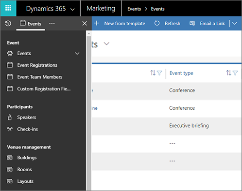

# Open the event management work area

The event management features of Dynamics 365 Marketing are collected into their own work area to make it easy to find all the relevant entities and settings while you are focusing on events.

To find the event management work area:

1. If you haven't already done so, sign in to Dynamics 365 as a user with [event-management privileges](admin-users-licenses-roles.md). Then use the app-selector menu to open the **Marketing** app.

    

1. Expand the work-area area menu at the bottom of the side navigator and select **Events**.

    

1. You are now in the Events work area, and can navigate between event-related entities using the side navigator, just as with the core **Marketing** work area.

    

For more information about how to get around in Dynamics 365 Marketing and work with its common features, see [Find your way around Marketing](navigation.md).

[!INCLUDE[footer-include](../includes/footer-banner.md)]