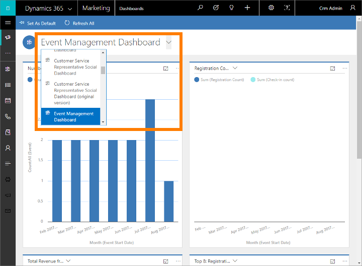
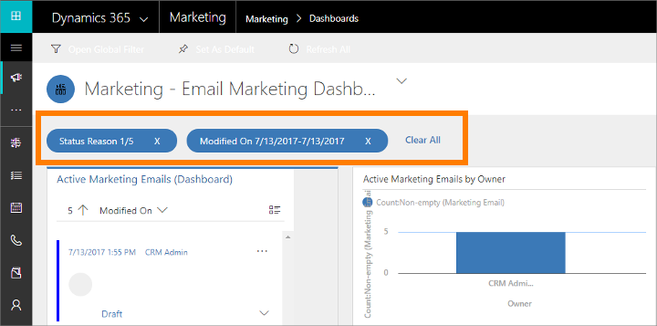
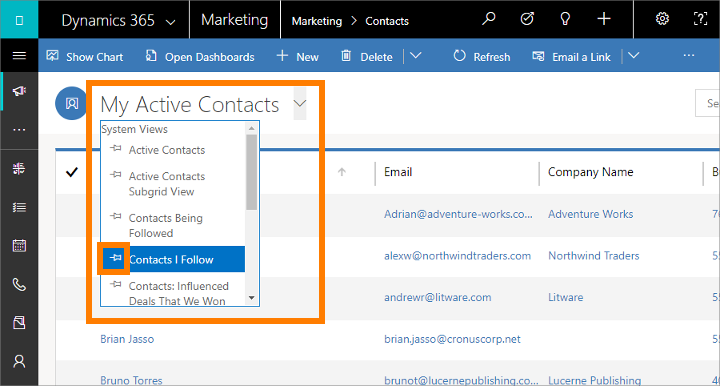
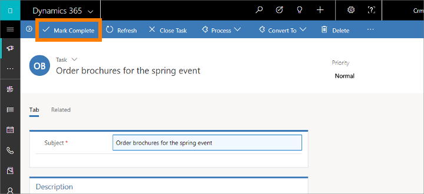

# Organize your daily work

You can use common features of Dynamics 365 to organize your daily work, including using dashboards to get an overview of your most important information, planning and recording activities (such as appointments, tasks, and phone calls), creating new records quickly, and assigning records (including activities) to a user or a team.

## Get the big picture with dashboards

Dashboard provide charts, graphs, and statistics that help give you an overview of your data. Dynamics 365 features several types of dashboards, and each dashboard provides a variety of views and options.

### Application dashboards

Application dashboard give you the widest view, and draw data from throughout your application&mdash;possibly even from several Dynamics 365 applications.

Usually, an application dashboard is the first thing you see when you sign in to Dynamics 365 Marketing. You can get back to it any time by going to **Marketing** > **My Work** > **Dashboards**. Most Dynamics 365 applications have a similar application dashboard.

### Choose an application dashboard

Several standard dashboards are provided, each of which focuses on a particular user role, such as event management, marketing, or sales. The name of the current dashboard is shown at the top of the window. To switch to another dashboard, select the dashboard name, and then select the dashboard you want to open from the drop-down list.

A wide variety of dashboards is available, each optimized for a different application and situation. The following dashboards are provided with Dynamics 365 Marketing, and are specifically tailored for marketing users:

- Lead Generation Dashboard
- Customer Journey Dashboard
- Email Marketing Dashboard
- Event Management Dashboard

Each dashboard is interactive, so to learn more about a data point in a graph, try selecting it. For graphs that support interactivity, this will update all the graphs on the page so that they focus on the data point you chose—typically by adding a filter. You can continue exploring your data like this. Each time you add a new filter, you'll see it listed at the top of page. To remove a filter, select its **X** icon here; or select **Clear All** to go back to the top-level view.

### Set a dashboard as default

To see a specific dashboard every time you sign in to Dynamics 365 Marketing, set it as the default. To do this, open the dashboard, and on the command bar, select **Set as Default**.

### Entity dashboards

In addition to the home dashboard described earlier, some entities provide their own dashboards. These are available for account, contact, and lead entities.

To see an entity dashboard, go to the list view for the entity, and then on the command bar, select **Open Entity Dashboard**.

### Chart panes

In addition to entities dashboards, some entities provide chart panes, which is another way to see analytics and charts about your data in a particular entity. Some entities provide both dashboards and chart panes, whereas others offer just one, or neither.

To see a chart pane, go to the list view for the relevant entity, and then on the command bar, select **Show Chart Pane**.

## Use activities to plan and record various tasks

Keep track of all your communications with activities in Dynamics 365 Marketing. Activities function like to-do items&mdash;they provide relevant details to help you get your task done and record relevant information as you work so you can review what you've done. For example, you can make or schedule a phone call, set up an appointment, and assign yourself tasks. These actions are all considered types of activities.

The system automatically time-stamps every activity and shows who created it and who is, or was, assigned to it. You and other people on your team can scroll through the activities to see the history as you work.

To get the most out of Dynamics 365, it's important for everyone to track all their work by adding an activity for every phone call, task, or appointment. That way, a customer's history is complete. Customer journeys can also generate and assign activities automatically to help make sure you follow up on leads and requests generated by the journey.

### See activities on your dashboards

Many dashboards provide a widget that shows your most relevant activities. Usually, these are activities assigned to you that are due sometime soon. The dashboard is usually the first page you'll see on signing in to Dynamics 365 Marketing, so this can be a good way to set your priorities for the day.

### Find and create activities by type

Use the navigator to view lists of all activities of a particular type, and to view specific records of that type. Go to one of the following to see activities of the listed type:

- **Marketing** > **My Work** > **Tasks**
- **Marketing** > **My Work** > **Appointments**
- **Marketing** > **My Work** > **Phone Calls**

In each case, you'll arrive at a standard list view, which you can use to sort, search, filter, create, and delete activities of the selected type.

You can apply a standard filter (system view) to any of these views by selecting the view selector (the down arrow next to the view name at the top of the page) and choosing a relevant entry from the drop-down list (such as **My Phone Calls**). To set one of these views as the default, select the push-pin icon next to the relevant view.

Activities that you create from these list views stand alone, which means they won't be related to other relevant records in Dynamics 365. These are probably most useful for when you want to schedule something personal, like a doctor's appointment or sporting event. Otherwise, to keep a history of your interactions with a customer, campaign, or event, you should add new activities while working with the relevant record, so those activities become part of the history that other people on your team can view.

### View and create activities related to specific records

Most often, you'll want to associate each activity with a contact, account, event, customer journey, or other type of record to help you keep a history of activities related to it. This can be useful when reviewing meetings related to a given account, or to find phone call records related to making bookings for an event.

Many entities in Dynamics 365 provide lists of related activities. To see them, open the relevant entity (such as a contact, event, marketing email, or nearly any other type of record) and look for its **Timeline** display. This is usually visible when you first open the record, but sometimes you'll need to open a new tab to see it. From here, you can see all activities already related to the selected record, and add new activities (which are automatically related to it).

### Mark an activity complete

After you call someone, complete a task, or go to an appointment, you can mark the activity for that action as completed by opening the relevant activity and then selecting **Mark Complete** in the command bar.

## Quick create – Enter new records fast

The quick-create command makes it fast and easy to enter almost any type of information into the system. The command is on the navigation bar (also referred to as the nav bar), so it's always available whenever you need to enter new information into the system.

With quick create, you need to complete only a few fields. Later, when you have more time or more information, you can fill in more details.

1. On the nav bar, select the plus sign  to open a menu of available entities, and then select the type of entity you want to create.

1. A quick-create form slides in from the side of the screen, presenting only the most important and required fields. Fill in the fields, and then select **Save**.

## Assign a record to a user or team

If you would like another person in your organization to handle a particular account, contact, or other task, you can assign the record to that person. You can also assign a record to a team or to yourself.

1. Use the navigator to go to the entity (such as contact or account) that you want to assign.

1. In the list of records, select the record that you want.

1. On the command bar, select **Assign**.

1. In the **Assign** dialog box, select the **Assign to** box to toggle between **Me** and **User** or **Team**.

1. If you have chosen to assign to **User** or **Team**, in the **User or team** field, select the **Lookup** icon to choose a user or a team.

1. Select **Assign**.

### See also

[Generate activities from a customer journey](generate-activities-from-customer-journey.md)  
[The event management dashboard](event-management-dashboard.md)

[!INCLUDE[footer-include](../includes/footer-banner.md)]