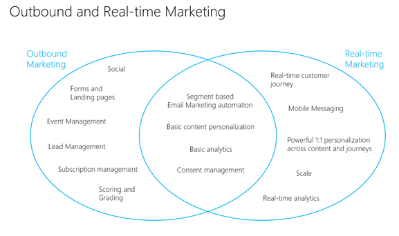

# Overview (Marketing)

<iframe src="https://www.microsoft.com/videoplayer/embed/RWNgjy" frameborder="0" allowfullscreen=""></iframe>

Dynamics 365 Marketing is a marketing automation application that helps turn prospects into business relationships. The app is easy to use, works seamlessly with Dynamics 365 Sales, and has built-in business intelligence. Use Dynamics 365 Marketing to:

- **Respond to customer actions in real time**
  Respond in the moments that matter with real-time, event-based journeys.
- **Hyper-personalize your messaging**
  Personalize messages with dynamic text and images from a flexible set of data sources.
- **Connect with customers on the channels they use the most**
  Leverage mobile channels to create text messages and push notifications to reach your customers where they are.
- **Create graphical email messages and design interactive customer journeys to support marketing initiatives**  
  Create engaging emails, target the right audience, and automate dynamic customer journeys that are triggered by a specific date or segment membership.
- **Tap into LinkedIn's business prospects**  
  Capture leads from LinkedIn, qualify your hottest leads with automated lead scoring, and manage your leads through a custom lead business process.
- **Engage through social media**
  Leverage the power of social media by scheduling and posting messages to Facebook, Instagram, LinkedIn, and Twitter.

## Included with Dynamics 365 Marketing

Dynamics 365 Marketing includes a bundle of apps and solutions carefully selected to support marketing departments and coordinate with sales. Some of these apps and solutions are also available as bundles or add-ons with other Dynamics 365 products, while others are only available as part of the Marketing package. The following are included:

- **Real-time marketing**
  Also known as customer journey orchestration, real-time marketing
- **Outbound marketing**  
  Provides email marketing, customer journeys, behavior tracking, lead scoring, marketing pages, and more. These features form the core of the Marketing app and are unique to Dynamics 365 Marketing.
- **Event planning**  
  Organize and promote in-person or webinar events, which include an online portal that attendees can use to review the event schedule and speakers, and to register for the event. This feature is currently available only with Dynamics 365 Marketing.
- **Dynamics 365 Customer Voice**  
  Create online surveys and analyze the results. This feature is bundled with the Marketing app, but is also available separately as an add-on for other Dynamics 365 products.
    > [!NOTE]
    > Dynamics 365 Customer Voice is included in the Marketing standalone application, but not included in Marketing attach.
- **Dynamics 365 Connector for LinkedIn Lead Gen Forms**  
  Import leads generated with LinkedIn's lead tools into Dynamics 365. This feature is bundled with the Marketing app, but is also available separately as an add-on for other Dynamics 365 products.

All these features are fully integrated and work together to create a comprehensive marketing solution.

## When to use outbound versus real-time marketing

Marketing automation tools on the market are typically classified into two categories: business to business (B2B) and business to consumer (B2C).

Outbound marketing thrives in the B2B marketing automation. You can send emails and newsletters, create forms and landing pages to capture leads which you can score and grade, then hand off to sales. It also has a great feature for managing in-person events and webinars that includes seamless integration with Microsoft Teams. Out of the box, outbound marketing provides email and social channel capabilities, but you can also build you own custom channels. [Learn more about outbound marketing](user-guide.md).

Real-time marketing works great as a B2C platform that can perform at scale. It allows you to engage with customers at specific moments through email and mobile channels as they interact with different parts of your organization. Because each customer's interaction is unique, real-time marketing has powerful capabilities to design personalized experiences throughout the customer’s life cycle. [Learn more about real-time marketing](real-time-marketing-user-guide.md).

> [!div class="mx-imgBorder"]
> 

[!INCLUDE[footer-include](../includes/footer-banner.md)]