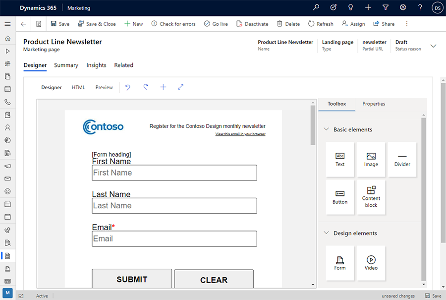
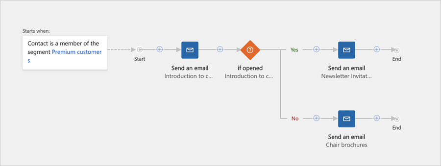
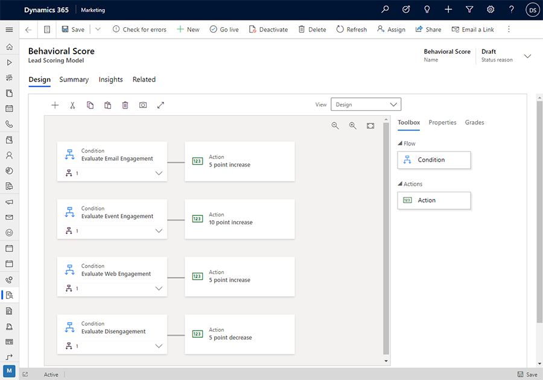
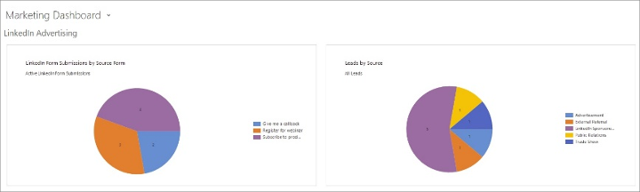

# Overview (Marketing)

<iframe src="https://www.microsoft.com/videoplayer/embed/RE4FRAO" frameborder="0" allowfullscreen=""></iframe>

Dynamics 365 Marketing is a marketing automation application that helps turn prospects into business relationships. The app is easy to use, works seamlessly with Dynamics 365 Sales, and has built-in business intelligence. Use Dynamics 365 Marketing to:

- **Create graphical email messages and online content to support marketing initiatives**  
  Customizable templates for emails and landing pages amplify your digital voice. Intuitive drag-and-drop design tools simplify content creation, from personalizing the message to setting up lead scoring.
- **Design interactive customer journeys to nurture leads with personalized experiences**  
  Use the drag-and-drop journey designer to create an automated, multi-channel campaign that sends personalized email messages, generates follow-up activities, launches workflows, and more. Each contact in the target group travels down a customized path that reacts to their interactions and identifies your best prospects. Track campaigns and analyze results to build profitable long-term relationships.
- **Tap into LinkedIn's business prospects**  
  Quickly target and connect with the right LinkedIn audiences by importing leads generated with LinkedIn's lead tools directly into Dynamics 365.
- **Share information across teams**  
  Securely share information about leads and contacts across your business, and understand how every interaction affects your results. Connect sales and marketing processes to automate follow-ups and track the progress of every lead.
- **Know your leads better**  
  Develop a deeper understanding of your market with a 360-degree view of every lead and customer. Connected processes and a single source of information ensure that both sales and marketing have the latest data, including key contacts, recent activities, past purchases, and open opportunities.
- **Organize and publicize events**  
  Keep all the information about your event venues, logistics, ticketing, sessions, speakers, sponsors, and more in one place so your whole team can coordinate while working on them. Host webinar events with ease using built in Microsoft Teams integration. Then generate an online event website where attendees can review event information and register online. Integrate your events into your marketing email messages and customer journeys to help get the word out.
- **Analyze and document your marketing return on investment (MROI)**  
  Use dashboards and reports to track the performance of your marketing initiatives, and to identify your best lead sources and marketing activities. Bring together sales and marketing results to track and increase their impact on your business.
- **Prioritize leads for more wins**  
  Set up automated lead-scoring rules that automatically identify your hottest leads based on how they interact with your events and customer journeys. As soon as a lead meets an agreed-on sales-ready score, the system automatically routes it to a salesperson to follow up while the lead is still hot. Route the most promising leads to sales when they reach an agreed-on sales-ready grade.
- **Make survey results more actionable**  
  Easy-to-create surveys help you gather actionable feedback from customers. Understand individual customer needs and expectations so you can grow relationships and revenue.
- **Configure and expand the application**  
  Customize the application to fit your specific business needs. Make basic customizations by using tools built right into the app. Expand its capabilities and add new features by installing third-party packages from our thriving marketplace—Microsoft AppSource. And it's easy to connect with Dynamics 365 partners to get expert help. The Marketing app is built on the same platform and database as the Sales app, so both teams share the same records, and customizers can leverage their existing knowledge when adding custom features.

## Included with Dynamics 365 Marketing

Dynamics 365 Marketing includes a bundle of apps and solutions carefully selected to support marketing departments and coordinate with sales. Some of these apps and solutions are also available as bundles or add-ons with other Dynamics 365 products, while others are only available as part of the Marketing package. The following are included:

- **Core marketing**  
  Provides email marketing, customer journeys, behavior tracking, lead scoring, marketing pages, and more. These features form the core of the Marketing app and are unique to Dynamics 365 Marketing.
- **Event management**  
  Organize and promote in-person or webinar events, which include an online portal that attendees can use to review the event schedule and speakers, and to register for the event. This feature is currently available only with Dynamics 365 Marketing.
- **Dynamics 365 Customer Voice**  
  Create online surveys and analyze the results. This feature is bundled with the Marketing app, but is also available separately as an add-on for other Dynamics 365 products.
    > [!NOTE]
    > Dynamics 365 Customer Voice is included in the Marketing standalone application, but not included in Marketing Attach.
- **Dynamics 365 Connector for LinkedIn Lead Gen Forms**  
  Import leads generated with LinkedIn's lead tools into Dynamics 365. This feature is bundled with the Marketing app, but is also available separately as an add-on for other Dynamics 365 products.

All these features are fully integrated and work together to create a comprehensive marketing solution.

## A fully responsive app built on the new Unified Interface

Dynamics 365 Marketing is built to run exclusively on the new Unified Interface for Dynamics 365 applications. The Unified Interface uses responsive web design principles to provide an optimal viewing and interaction experience on any device, regardless of screen size or orientation. There is no need to install a special client on each device, or to switch to a different site based on which device you are using.

Many Dynamics 365 applications support both the new Unified Interface and the older web-client interface, but nearly all are moving to the Unified Interface. Some administration and customization features, and some integrated user features, may require you to switch to a web-client app from time to time, but soon all features are expected to be available on the Unified Interface.

> [!NOTE]
> Marketing typically shares data with other Dynamics 365 applications running on the same instance, and operates on many of the same database entities, including contacts, leads, accounts, and more. Some Marketing-specific features, such as displays of analytics and insights from marketing initiatives, require the Unified Interface and therefore won't show any data when you view those entities in web-client apps.

More information: [About Unified Interface for model-driven apps in Power Apps](https://docs.microsoft.com/power-platform/admin/about-unified-interface) and [Find your way around Marketing](navigation.md)

## Design attractive and effective messages for email marketing campaigns

Email is a key component of most online marketing campaigns. Use the drag-and-drop marketing-email designer to create attractive messages quickly, based on professional, customizable templates. All templates are carefully designed to look great on a variety of devices, platforms, and email clients.

> [!div class="mx-imgBorder"]
>   

Key marketing email design features include:

- Simple, no-code, drag-and-drop content designer
- Professional email templates to speed up email creation
- General and client-specific email previews
- Seamless integration with Litmus, a third-party service that specializes in generating pixel-perfect previews that show how your messages will look on nearly any combination of clients, form factors, and orientations
- HTML code editor for adding advanced customization and dynamic content, easy collaboration between power users and business users, and importing templates and designs from other systems
- Detailed open, click, and forward results for each message
- Heatmap, location maps, and other advanced visualizations of email results

When you create a new message, you'll start by choosing a template that establishes a column layout and, optionally, a complete initial graphic design. The content designer provides a canvas with an editable preview and a tabbed toolbox for adding new design elements (like images, buttons, or text boxes), configuring selected design elements, and applying styles. When working with text elements, you'll get an inline toolbar for applying local text styling and adding dynamic content, like mail-merge fields.

After you're done with the message design, select **Check for Errors** to check the message for errors and required content. After the message is validated, you publish the message to activate it on your server so that it can be sent from a customer journey.

More information: [Email marketing overview](prepare-marketing-emails.md)

## Use marketing pages to interact with contacts online

Create and publish professional-looking landing pages to capture website visitors as contacts or leads. Each landing page typically includes a form that captures data straight into your Dynamics 365 database, and can also include promotional text, images, links, and other information.

Other types of marketing pages include subscription centers, which enable contacts to manage their mailing list subscriptions, and forward-to-a-friend pages, which enable contacts to share your marketing messages with their colleagues.

Design your marketing pages by using the graphical, drag-and-drop content designer, which works just like the email designer. When your page is ready, publish it to make it available to users on the internet. The system uses the standard Power Apps portals feature to publish and operate all marketing pages.

> [!div class="mx-imgBorder"]
>   

Key marketing page features include:

- Simple, no-code, drag-and-drop designer to create and publish landing pages that include lead or contact forms
- Consistent content-editing experience for emails, landing pages, and forms
- Ready-to-use form and page templates
- Prospect behavior tracked on landing pages to analyze performance and score leads
- Subscription center and forward-to-friend pages to support email marketing
- Tight integration with customer journeys, email marketing, and lead scoring
- In-browser preview showing how your page will look on various screen sizes and orientations
- HTML code editor for advanced customization with no restrictions (optional)

When you create a new page, you'll start by choosing a template that establishes a column layout, page type, and (optionally) a complete initial graphic design with sample images, fonts, and colors. Then you'll be in the Dynamics 365 content designer, which provides a canvas with an editable preview and a tabbed toolbox for adding new design elements (like images, buttons, forms, or text boxes), configuring selected design elements, and applying styles. When working with text elements, use the inline toolbar to apply local text styling. Usually you'll add a form element to create a form on the page.

After you're done with the page design, select **Check for Errors** to check the page for errors and required content. After the page is validated, publish the page to activate it on your server so that it can be accessed by internet users who know the URL or have selected a link. Then publicize your page by using marketing emails, customer journeys, social-media posts, links from your official website, QR codes, and other appropriate channels.

After your page has been active for a while, see how it's performing, how many leads or contacts were captured, and more.

More information: [Create and deploy marketing pages](create-deploy-marketing-pages.md)

## Create automated, interactive customer journeys

Customer journey orchestration lets marketers create multiple-step, multichannel marketing campaigns that target a specific segment, deliver marketing email messages, respond to contact interactions, launch Dynamics 365 workflows, and more.

Key campaign-automation features include:

- A library of pre-designed and custom templates to instantly outline your basic strategy
- Visual drag-and-drop journey designer
- All marketing content available in one place, viewable, and editable by using embedded content designers
- Event-driven, extensible automation
- During and after execution, in-place insights are provided by the designer so you can see where contacts went and what they did there
- The ability to create custom channels in customer journeys to extend the marketing capabilities

When creating or editing a journey, you'll assemble a pipeline by selecting the plus buttons on the canvas to open the in-place editor, which lets you choose various types of journey tiles. You configure each tile in the pipeline by selecting it and editing the properties in the pane on the right side of the page.

Each journey starts with an audience tile, which establishes which contacts will be engaged in the journey. Then, you'll typically add an email tile, which sends a marketing email message to everyone in the segment. The message might include links to an event website or marketing page. Later in the pipeline, you can add an If/then tile, which branches the path and waits for each contact to open a message, select a link, or submit a related marketing page. Depending on what each contact does with the message, the If/then tile will send them down a different path, where you can add appropriate follow-up actions. If/then tiles can react to a wide variety of contact interactions, including email opens, email clicks, event registrations, survey responses, and more.

After you're done with the journey design, select **Check for Errors** to check for missing content, unpublished content, and other errors. After the journey is validated, you must publish the customer journey to enable it to run (though you can set its actual start and end dates in the future).

More information: [Use customer journeys to create automated campaigns](customer-journeys-create-automated-campaigns.md)

## Create custom channels for customer journeys

Beyond the out-of-the-box channels provided in customer journeys, you can create custom channels to extend the marketing capabilities in Dynamics 365 Marketing. You can create a custom channel, such as text (SMS) or social media, and expose the channel as a "tile" in the journey designer. These custom channels provide similar capabilities as the out-of-the-box channels such as sending communications, tracking customer interactions, and adding triggers to branch the paths within a customer journey.

Custom channel development takes advantage of the existing extensibility infrastructure and tooling in Dynamics 365 such as custom entities, workflows, and plug-ins, which allow developers and partners to leverage their knowledge of Dynamics 365 to build custom channels.

## Plan, promote, and manage marketing events and webinars

Live events and webinars are often a vital sales-and-marketing channel, but they can be complex to arrange, execute, and follow up on. The Dynamics 365 Marketing event management feature helps you every step of the way, from initial planning and budgeting, through promotion and publication, attendee registration, webinar broadcasting, final analytics, lead generation, and evaluation of ROI.

  

Key event management features include:

- Seamless contact, registration, and attendance management features in one system
- The ability to create Microsoft Teams live events for webinars and Teams meetings for interactive online meetings
- Business processes that guide users through the essential steps of event planning
- Session, session-track, and speaker management
- Managing attendee passes to grant access to specific sessions or tracks
- Venue management for tracking buildings, rooms, and room layouts
- Guest logistics for registering hotels, room allocation, and reservations
- Tracking sponsors and their sponsorships for each event
- Reviewing the attendance history of each contact, including events and sessions attended
- Dynamics 365 Customer Voice survey integration
- Publishing a fully functioning event website with:
  - Self-service attendee registration
  - Important details about all published events, including event name, venue, passes, session schedule, and speakers
  - All information drawn directly from your Dynamics 365 event planning records, with updates automatically reflected on the portal

To create, view, and edit your events and all event-related records, go to the **Events** work area of Dynamics 365 Marketing, where you can create a new event and, working from this single event record, add most of the other types of records and information that you need to plan, publish, promote, and analyze it. Like many types of records in Dynamics 365, the event record provides a customizable business process workflow that guides users through each step of the process.

Use other parts of the **Event** work area to work with specific record types that relate to event planning, such as logistics, sessions, attendees, sponsors, and more. Depending on what you are doing at the time, you might access these records when working in the parent event record, or you might go to a dedicated area to work only with a specific record type, or to work across events.

After your event, session, track, speaker, and pass records are all in place for an event, you are ready to publish it on the event website, where attendees can read about the event and register for it. You can set up the registration to be available to anyone or by invitation-only.

More information: [Event planning and management](event-management.md)

## Generate, score, and qualify leads for sales

As a marketer, your primary goals are to generate demand, identify sales prospects, and forward the best prospects as leads for salespeople to follow up with. Dynamics 365 supports this process from discovery all the way to close.

> [!div class="mx-imgBorder"]
>  

Key lead-management features include:

- **Generate leads across multiple channels**  
    Create multichannel customer journeys to attract the best leads from LinkedIn, email, web landing pages, events, webinars, and more. Easily import marketing lists by using familiar tools such as Microsoft Excel.
- **Lead nurturing**  
    Apply insights and implement automated customer journeys to nurture leads by delivering highly relevant, perfectly timed messages and personalized experiences.
- **Lead qualification**  
    Use business process flows to guide each lead through the lead-generation demand waterfall model, from discovery, through nurturing, and on to qualification and close.
- **Lead scoring**  
    Set up flexible lead-scoring models based on:
    - Demographics and other information drawn from lead, contact, and account records and their multilevel relationships.
    - Regency, frequency, and monetary-value (RFM) rules based on automatically collected interaction data, including email clicks, websites visited, event registrations, and more.
    - Each rule can either add or subtract from the total lead score, depending on the nature of each interaction, and scores can be set to depreciate over time.
- **Lead prioritization**
    - Score each lead by using multiple scoring models.
    - Assign sales-readiness grades per scoring model.
- **Analysis and insights**  
    Evaluate the success of your marketing initiatives, and apply lessons learned to your future campaigns, by using rich analytic tools, including:
    - Demand-generation dashboards that measure conversion, volume, velocity, and more.
    - Charts and widgets that measure the effectiveness of lead scoring models by calculating metrics such as total leads scored over time, sales readiness distribution per model, and more.
    - Charts and widgets that measure the health and quality of each lead by using metrics such as lead age, lead interaction timeline, lead qualification progression, and more.

When creating or editing a rule, you'll assemble its logic using a drag-and-drop rule designer. Each rule has a condition (which establishes a certain property or event) and an action (which establishes how the score for a lead that meets the condition will be adjusted).

To establish a condition, drag a **Condition** tile from the **Toolbox** tab to a position at the left side of the canvas. Go to the **Properties** tab to establish the rules for a selected condition tile. Each condition is relatively simple, but you can stack several conditions to design more complex logic by dragging extra condition tiles onto an existing condition tile.

To establish what happens when a condition is met, drag an **Action** tile from the **Toolbox** tab to the space on the right side of a **Condition** tab, then go to the **Properties** tab to set the rule.

Regardless of how many condition/action pairs your scoring rule has, you must also establish a single set of grades that apply for the entire rule. Each grade applies to a range of scores and has a name. Grades can't overlap. Though you can establish as many grades as you want, the most important distinction will be the sales-ready grade. When a lead achieves this grade, it is considered marketing-qualified and can be submitted to a salesperson for acceptance and further attention. Use the **Grades** tab to set up a grade schedule and sales-ready threshold for your rule.

More information: [Design lead-scoring models](score-manage-leads.md)

## Connect to LinkedIn to import promising new leads straight into Dynamics 365

Bring your LinkedIn leads into Dynamics 365 for follow-up and nurturing.

  

Use the Microsoft Dynamics 365 Connector for LinkedIn Lead Gen Forms to automatically sync leads captured on LinkedIn with your Dynamics 365 organization so that your sales and marketing teams can develop and nurture them. Features include:

- **Support for multiple LinkedIn member accounts**  
    If your organization includes multiple marketing managers, each running campaigns on their own LinkedIn account, you can configure Dynamics 365 to collect leads from all accounts simultaneously.
- **Customizable lead creation and matching**  
    Configure how lead submissions captured on LinkedIn are associated with and updated on Dynamics 365.
- **Analyze lead performance across sources**  
    Track and analyze the performance of leads captured on LinkedIn versus other sources.

LinkedIn integration relies on the Lead Gen Forms capability of LinkedIn to capture leads. This is a paid LinkedIn service, which you must subscribe to enable the integration.

More information: [LinkedIn Lead Gen integration](linkedin-lead-gen-integration.md)

[!INCLUDE[footer-include](../includes/footer-banner.md)]