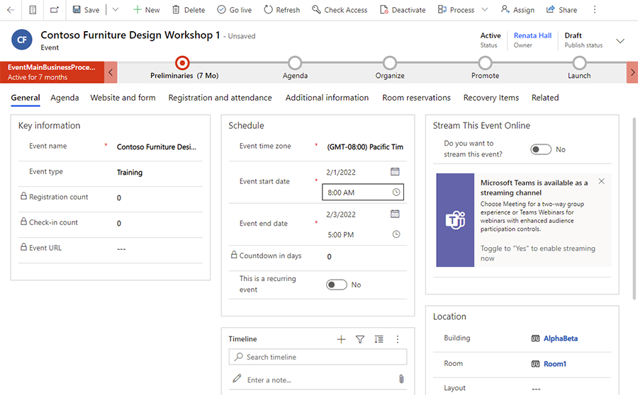
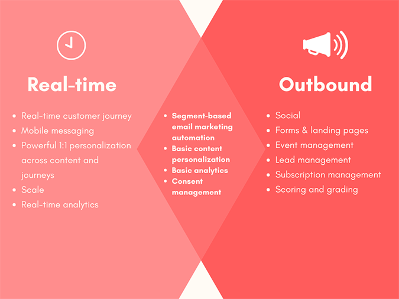

# Overview (Marketing)

<iframe src="https://www.microsoft.com/videoplayer/embed/RWNgjy" frameborder="0" allowfullscreen=""></iframe>

Dynamics 365 Marketing is a marketing automation application that helps turn prospects into business relationships. The app is easy to use, works seamlessly with Dynamics 365 Sales, and has built-in business intelligence.

Dynamics 365 Marketing includes a bundle of apps and solutions carefully selected to support marketing departments and coordinate with sales. Some of these apps and solutions are also available as bundles or add-ons with other Dynamics 365 products, while others are only available as part of the Marketing package. The following are included:

## Real-time marketing

> [!div class="mx-imgBorder"]
> 

Also known as customer journey orchestration, real-time marketing includes [event-based customer journeys](real-time-marketing-event-based-journey.md), [custom event triggers](real-time-marketing-custom-events.md), and [SMS](real-time-marketing-outbound-text-messaging.md) and [push notifications](real-time-marketing-push-notifications.md), allowing users to trigger customer journeys in real time, pick the right channel for each individual, and react to customer-led actions in the moments that matter.

- **Respond to customer actions in real time**: Respond in the moments that matter with real-time, event-based journeys.
- **Hyper-personalize your messaging**: Personalize messages with dynamic text and images from a flexible set of data sources.
- **Connect with customers on the channels they use the most**: Leverage mobile channels to create text messages and push notifications to reach your customers where they are.

## Outbound marketing

> [!div class="mx-imgBorder"]
> 

Provides [email marketing](prepare-marketing-emails.md), [customer journeys](customer-journeys-create-automated-campaigns.md), [lead scoring](set-up-lead-scoring.md), [marketing pages](create-deploy-marketing-pages.md), and more. These features form the core of the Marketing app and are unique to Dynamics 365 Marketing.

- **Create graphical email messages and design interactive customer journeys to support marketing initiatives**: Create engaging emails, target the right audience, and automate dynamic customer journeys that are triggered by a specific date or segment membership.
- **Tap into LinkedIn's business prospects**: Capture leads from LinkedIn, qualify your hottest leads with automated lead scoring, and manage your leads through a custom lead business process.
- **Get customer feedback with Customer Voice surveys**: Create online surveys and analyze the results. This feature is bundled with the Marketing app, but is also available separately as an add-on for other Dynamics 365 products.

> [!NOTE]
> Dynamics 365 Customer Voice is included in the Marketing standalone application, but not included in Marketing attach.

## Event planning

> [!div class="mx-imgBorder"]
> 

Organize and promote [in-person](set-up-event.md) or [webinar](teams-webinar.md) events, which include an online portal that attendees can use to review the event schedule and speakers, and to register for the event.

- **Manage all of your event needs in one place**: Dynamics 365 Marketing's event planning features allow seamless contact, registration, and attendance management features in one system.
- **Meet your audience where they are**: Host webinars on Microsoft Teams or on other webinar providers.
- **Continue the conversation with webinar participants**: Stay in touch with your webinar participants after hosting a webinar. You can send personalized registration materials, send surveys, and more to drive awareness and engagement.

## When to use real-time marketing and when to use outbound marketing

Real-time marketing and outbound marketing have a lot of in common. Both can be used for marketing automation to send personalized emails, can help with compliance, and can provide analytics.

So, what’s the difference?

Marketing automation tools on the market are typically classified into two categories:  business to consumer (B2C) and business to business (B2B).

### Real-time marketing

Real-time marketing works great as a B2C platform that can perform at scale. It allows you to engage with customers at specific moments through email and mobile channels as they interact with different parts of your organization. Because each customer's interaction is unique, real-time marketing has powerful capabilities to design personalized experiences throughout the customer’s life cycle. [Learn more about real-time marketing](real-time-marketing-user-guide.yml).

### Outbound marketing

Outbound marketing thrives in the B2B marketing automation. You can send emails and newsletters, create forms and landing pages to capture leads which you can score and grade, then hand off to sales. It also has a great feature for managing in-person events and webinars that includes seamless integration with Microsoft Teams. Out of the box, outbound marketing provides email and social channel capabilities, but you can also build you own custom channels. [Learn more about outbound marketing](user-guide.md).

> [!div class="mx-imgBorder"]
> 

But the lines between B2C and B2B are blurring; customers expect the same level of personalized experience and marketers want to pick the best from both sides. As Dynamics 365 Marketing continues to evolve, the Venn diagram above will eventually become one circle. But until then, the following guidelines can help you decide which features to use and when.

### Which is right for your business?

The approach will be different based on your current situation and what’s best for your business:

- If you are new to Dynamics 365 Marketing, explore the real-time capabilities and determine if they fit your needs. This will work well if you already have a rich set of customer data and need a way to engage with them.
- If you are looking to collect new prospects, you can combine the real-time capabilities with the forms and pages in outbound marketing without the hassle of integration.
- For lead capture, scoring, grading and seamless hand off to Dynamics 365 Sales, start with outbound marketing. Then use real-time marketing to continue that digital interaction with your customer in combination with the human interactions provided by your sales organization.
- If you are using Dynamics 365 Marketing today, you may discover that real-time customer journeys may unlock experiences that were difficult to realize using the outbound marketing customer journey. Don’t worry, existing customer journeys will continue to work! And as these two areas gradually merge into one, you will find capabilities that will make it easy for you to move and reuse the assets that you have already built.

Check out our [latest release plans](/dynamics365/release-plans/) and the [What’s new page](whats-new-marketing.md) to learn about our monthly releases.

[!INCLUDE[footer-include](../includes/footer-banner.md)]