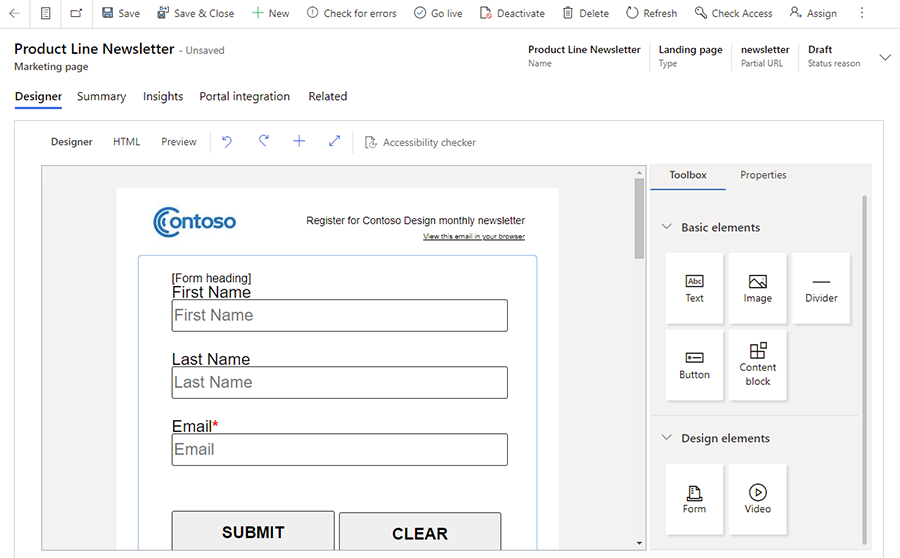
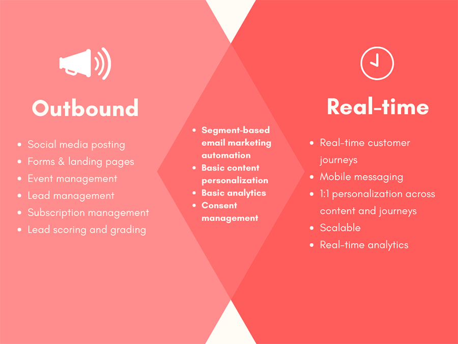

# Dynamics 365 Marketing overview

<iframe src="https://www.microsoft.com/videoplayer/embed/RWNgjy" frameborder="0" allowfullscreen=""></iframe>

[!INCLUDE[marketing-trial-cta](../shared/trials/marketing-trial-cta.md)]

Dynamics 365 Marketing elevates customer experiences, allowing you to orchestrate personalized journeys across all touchpoints to strengthen relationships and earn loyalty. The Dynamics 365 Marketing app works seamlessly with Dynamics 365 Sales, Dynamics 365 Customer Insights, Microsoft Teams, and other products and allows you to make faster and better decisions using the power of data and AI.

Dynamics 365 Marketing consists of two primary modules, along with event management. Both modules include capabilities to create graphical email and design interactive customer journeys to support marketing initiatives.

> [!IMPORTANT]
> The *Dynamics 365 for Customer Engagement* SKU/license (which included Dynamics 365 for Marketing) was deprecated in October 2019. Dynamics 365 for Customer Engagement licenses purchased prior to that date are now expiring. Learn more about the deprecation, including how to purchase a new license and migrate your data: [Deprecation: Dynamics 365 for Customer Engagement](ce-deprecation.md).

## Real-time marketing

> [!div class="mx-imgBorder"]
> 

Also known as customer journey orchestration, real-time marketing includes [trigger-based customer journeys](real-time-marketing-trigger-based-journey.md) that use [email](real-time-marketing-email.md), [text message](real-time-marketing-outbound-text-messaging.md) and [push notification](real-time-marketing-push-notifications.md) communication channels to reach customers. Real-time marketing allows you to trigger customer journeys in real time based on the signals and rich profile data you collect from your customers, pick the right channel for each individual, and connect in the moments that matter.

- **Respond to customer actions in real time**: Respond in the moments that matter with real-time, trigger-based journeys.
- **Hyper-personalize your messaging**: Personalize messages with dynamic text and images from a flexible set of data sources.
- **Connect with customers on the channels they use the most**: Use mobile channels to create text messages and push notifications to reach your customers where they are.

## Outbound marketing

> [!div class="mx-imgBorder"]
> 

Provides [email marketing](prepare-marketing-emails.md), [customer journeys](customer-journeys-create-automated-campaigns.md), [lead scoring](set-up-lead-scoring.md), [marketing pages](create-deploy-marketing-pages.md), and [social posting](social-posting.md), allowing you to seamlessly connect your marketing and sales processes.

- **Turn prospects into leads**: Capture leads, qualify the hottest leads with automated lead scoring, and manage your leads through a custom business process.
- **Leverage the power of social media**: Post messages to Facebook, Instagram, and Twitter. Capture leads from LinkedIn.
- **Get customer feedback with Customer Voice surveys**: Create online surveys and build customer journeys based on responses. This feature is bundled with the Marketing app, but is also available separately as an add-on for other Dynamics 365 products.

> [!NOTE]
> Dynamics 365 Customer Voice is included in the Marketing standalone application, but not included in Marketing attach.

Outbound marketing also includes advanced [in-person](set-up-event.md) and [webinar](teams-webinar.md) event planning features.

- **Manage all of your event needs in one place**: Dynamics 365 Marketing's event planning features allow seamless contact, registration, and attendance management features in one system.
- **Meet your audience where they are**: Host webinars on Microsoft Teams or on other webinar providers.
- **Continue the conversation with webinar participants**: Stay in touch with your webinar participants after hosting a webinar. You can send personalized registration materials, send surveys, and more to drive awareness and engagement.

## When to use real-time marketing and when to use outbound marketing

Real-time marketing and outbound marketing have a lot in common. Both can be used for marketing automation to send personalized emails, can help you be compliant, and provide analytics that generate insights to help you take the right action.

So, what’s the difference?

### Real-time marketing

Real-time marketing is a scalable platform that allows you to engage with customers at specific moments. Engagement takes place through email and mobile channels and is based on customer signals and rich profile data. In other words, journeys are customer-led. Communication starts when a customer takes a specific action. For example, a customer scanning a concert ticket or connecting to in-store Wi-Fi can trigger the delivery of personalized messages.

You can start journeys with predefined triggers, or you can create custom events. Custom events give you the flexibility to bring in data from other systems with just a few lines of code. With this flexibility, you can design personalized experiences as customers interact with marketing, sales, service, and other departments across your organization.

Real-time marketing also supports segment-based journeys, allowing you to orchestrate traditional marketing activities such as seasonal campaigns targeting loyal customers. [Learn more about real-time marketing](real-time-marketing-user-guide.yml).

### Outbound marketing

Outbound marketing thrives in B2B marketing automation. You can send emails and newsletters, create forms and landing pages to capture leads that you can score, grade, and then hand off to sales. It also has a great feature for managing in-person events and webinars that includes seamless integration with Microsoft Teams. Out of the box, outbound marketing provides email and social channel capabilities, but you can also build your own custom channels. [Learn more about outbound marketing](user-guide.md).

> [!div class="mx-imgBorder"]
> 

### Which is right for your business?

Real-time marketing is the next generation of Dynamics 365 Marketing features. As real-time marketing continues to evolve, almost all the current capabilities and features of outbound marketing will become available in real-time marketing, along with many more modern and enhanced capabilities. You should utilize real-time marketing unless there is a dependency on a specific feature or limitation that has not yet been addressed in real-time marketing.  

Learn more about the differences between real-time and outbound features: [Real-time vs outbound marketing journeys!](https://community.dynamics.com/365/dynamics-365-fasttrack/b/dynamics-365-fasttrack-blog/posts/realtime-vs-outbound-marketing-journeys).

Check out our [latest release plans](/dynamics365/release-plans/) and the [What’s new page](whats-new-marketing.md) to learn about our monthly releases.

[!INCLUDE[footer-include](../includes/footer-banner.md)]
