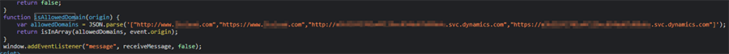
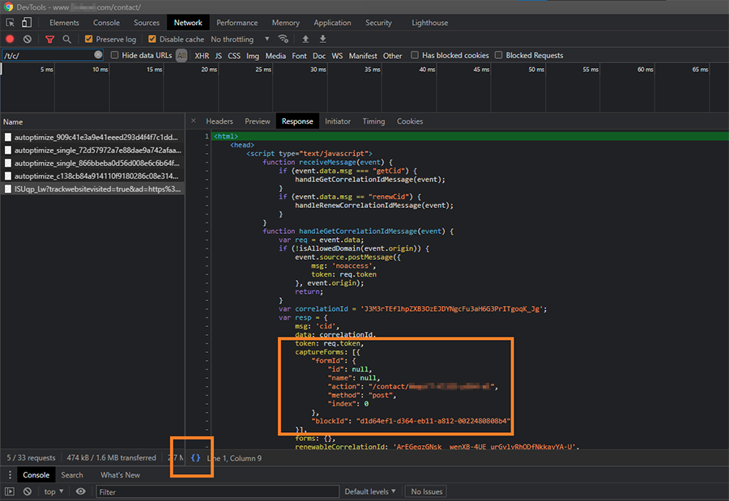

# Troubleshoot pages and forms

## Forms

### Form capturing isn't creating leads or contacts

If the form capture tool isn't creating leads or contacts, follow the troubleshooting steps below.

- Open the page where the form is hosted in the browser.
- Open DevTools and go to the **Network** tab. Filter for "/t/c/", the request should look like this:
``
https://5fe34c1f8d1dd6db05ad78a249c09712.svc.dynamics.com/t/c/IvgkEwv4GIs1ScAxmzz6GMONjZFNON3OMriPhE_eLxv/rVsp5lpmbDK_yMF80q5inAQeM73bcYKkbmiHLOak/ISUqp_Lw?trackwebsitevisited=true&ad=https%3A%2F%2Fwww.contoso.com%2Fcontact%2F&rf=&id=9430316937
``
- Check if there's a successful response that contains captured forms (see image below).
  - If the response is an error, there's an issue with the setup.
  - Format the response by selecting **{}** on the bottom left of the console window.
  - Look for `captureForms` in the response.
  - If `captureForms` is missing, there's a setup issue. Likely, the form is captured on a different URL.
- Check `formId`. Check that the values match the form. First, try to match by the ID. If the ID is missing, match by the name/action/method combo. Capturing the code writes the following line to the console: `Missing forms - []`. If there's something between **[** and **]**, the system was unable to find forms matching the capturing definition.
  - It's also possible that some identification data changed. You may be able to revert and prevent changes.
  - If changes can't be prevented, the following attributes help:
    - `data-find-by-id-fallback-to-action="true"` to ignore the ID attribute of the form and use the name/action/method combo.
    - `data-find-by-id-ignore-prefix-to="delimiter"` to ignore prefixes up to the delimiter.
    - `data-find-by-id-ignore-suffix-from="delimiter"` to ignore suffixes starting with the delimiter.
- Check that the allowed domains match the hosting domain:
> [!div class="mx-imgBorder"]
> 
  - If the allowed domains and hosting domain don't match, there's a domain allow listing issue.
- Next, submit the form and check that the inputs are valid.
- Check the DevTools console.
  - If you see: `Skipping sending form to CRM`, "preventDefault" is set on the form submit event and data-ignore-prevent-default="true" isn't present in configuration element. More details here: [Form capturing behavior customization](./developer/marketing-form-client-side-extensibility.md#form-capturing-behavior-customization).
    - If all submissions need to be captured, set `data-ignore-prevent-default="true"`.
    - If there's some custom validation logic and not all submissions should be sent to Dynamics 365, a JavaScript API should be used. Add `data-no-submit="true"` and add call to `sendFormCaptureToCrm` to the event handler.

**Sample /t/c/ (correlation) response:**

> [!div class="mx-imgBorder"]
> 

### Form load or capture fails due to Content Security Policy directive

If the form fails to load or form capturing fails to find the script on the page, it may be due to an incorrectly configured Content Security Policy (see [Content Security Policy Reference](https://content-security-policy.com/)). In these cases, an error in the console of the browser is shown such as “Refused to ... because it violates the following Content Security Policy directive ...”

The following domains need to be allow-listed for `script-src`, `connect-src`, and `frame-ancestors`: 
- `https://*.dynamics.com/`
- `https://*.azureedge.net`
- `https://*.microsoft.com`

Additional notes:

- If the Content Security Policy is defined in the meta tag, adjust it accordingly in the HTML of your website.
- If the Content Security Policy is defined as a `content-security-policy` header:
    - For externally hosted websites, update your webserver configuration.
    - For forms hosted on a Portal, the response headers are defined in the Site Settings entity. You'll need to change the **HTTP/Content-Security-Policy** site settings. Learn more: [Manage portal site settings](/power-apps/maker/portals/configure/configure-site-settings#manage-portal-site-settings) and [Setup HTTP headers in portals](/power-apps/maker/portals/configure/cors-support).

[!INCLUDE[footer-include](../includes/footer-banner.md)]