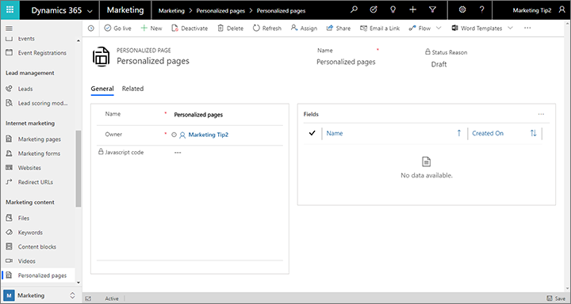

# Provide personalized page content

As with marketing emails, you can create landing pages, and other types of web pages that display content that's personalized for known contacts. The solution makes use of the following techniques:

- **Known contacts are identified by a cookie set on their browser**  
The required cookie is set in a user's browser when they open any Dynamics 365 Marketing landing page, embedded form, or subscription center. The cookie might initially be anonymous but gets linked to a contact record when the contact submits a landing page with valid contact details or opens a subscription center using a personalized link sent to them in email.
- **JavaScript is used to fetch values from the relevant contact record to the marketing page**  
Dynamics 365 Marketing generates the code you must add to your page to connect to the database and fetch the field values, but you must modify this with the specific field names you want to use, and also write your own JavaScript to make use of those values on the page. You might display contact values directly, or use them programmatically to modify page content, layout, and more.
- **Personalized pages must run either on an authenticated domain or the Power Apps portal, and use HTTPS**  
For security purposes, personalized pages are only supported on domains that are authenticated with Dynamics 365 Marketing (including native marketing pages running on a Power Apps portal, which are always authenticated). Personalized pages must furthermore be accessed using HTTPS (not HTTP).
- **Data access is restricted to explicitly allow listed fields from the contact entity**  
For security, the solution will only provide those field values that you specifically configure to make available to personalized landing pages.
- **Contacts must accept form prefilling to see personalized marketing page content**  
For privacy, the solution only allows personalized content to be shown to contacts whose contact record has the _allow-prefill_ flag set. This same flag enables landing pages to display forms that are prefilled with values from the contact record of a known contact (identified by the same cookie). Contacts can set or clear their allow-prefill flag themselves using a subscription center or landing page form, provided your form includes a "remember me" setting.
- **Use the personalized page entity to establish the allow list and generate the JavaScript**  
Go to **Marketing** > **Marketing content** > **Personalized pages** to identify which contact fields to make available and generate the code for bringing those values onto the page.

You can use fields of the following types on personalized pages:

- Single line of text
- Option set (see note)
- Two options
- Whole Number
- Floating point number
- Decimal number
- Currency
- Multiple lines of text
- Date and time
- Multi-select option set (see note)

> [!NOTE]
> Option-set values are returned as index values (integers), not display values.

## Authenticate your external domains

Domain authentication helps ensure that your organization's websites (external domains) really do belong to your organization, and that your Dynamics 365 Marketing instance is authorized to interact with those domains and send marketing emails associated with them. It requires your system administrator to prove ownership of each domain by submitting signed certificates through the DNS system. Before you start developing a personalized page for your website, be sure to ask your system administrator whether your domain is authenticated for use with Dynamics 365 Marketing. For instructions, see [Authenticate your domains](mkt-settings-authenticate-domains.md).

For native marketing pages, which are designed in Dynamics 365 Marketing and run on your Power Apps portal, authentication is automatic, so you don't need to set up an authenticated domain for these.

## Set up page personalization

To prepare the page-personalization feature, you must establish the allow list of contact fields and generate the JavaScript code you'll need to import field values onto your page. You'll do this by working with _personalized page_ records.

Personalized pages are go-live entities, which means that a record must be live for its fields allow list to take effect.

To set up one or more personalized page records:

1. Go to **Marketing** > **Marketing content** > **Personalized pages**.

1. A list of existing personalized page records opens. Do one of the following:
   - If you want to edit a record that's  already shown here, select it to open it and start editing. If the record already shows a **Status reason** of **Live** , then select **Stop** in the command bar to unlock it for editing.
   - If no records are shown, or if you want to create a new one, then select **New** in the command bar to create a new one. Then enter   **Name** for the record and select **Save** in the command bar to create the record and show all available settings

    

1. The **Fields** table shows a list of contact fields already allow listed by this record (if any). To add a new field to the allow list:
    - Select the **New personalized page field** button next to the **Fields** table heading. (If you don't see the button, then expand the **More commands** menu (ellipsis button) and select **New personalized page field** from there.)
    - The **New personalized page field** page opens. Identify the field you want to allow list by making the following settings:
      - **Personalized page** : This shows the name of the personalized page record you are editing, and to which you will add the new field. Don't change this.
      - **Name** : Select the name of the field you want to allow list from this drop-down list. All available fields from the contact entity are available here.
      - **Owner** : This defaults to your user account. Usually you should leave it.
    - Select **Save &amp; Close** on the command bar. This returns you to the personalized page record you were editing, where you should now see your new field added to the **Fields** table.

1. If you want to edit or remove a field from the allow list, select the target field to highlight it, then do one of the following:
    - To remove the selected field, expand the **More commands** menu (ellipsis button) and select **Delete personalized page field**.
    - To edit the selected field, select the **Edit** button next to the **Fields** table heading or from the **More commands** (ellipsis) menu (depending on your screen size).
    - On smaller screens, each listed field shows a **More commands** menu that you can open to **Edit** or **Delete** that field directly.

1. When you're done setting up the **Fields** list, select **Go Live** on the command bar to activate the record. The fields listed in that record are now available for use on marketing pages. Also, the **JavaScript code** field now shows the generated code that you must add to each page you want to personalize, as described in the next section.

## Add personalization to a landing page or web page

After you've set up a personalized-pages record to allow list all the fields you need and generate the required JavaScript, as described in the previous section, do the following to add personalized features to your page:

1. Go to **Marketing** > **Marketing content** > **Personalized pages** and open the record that allow lists all the contact fields you need for your page.

1. Make a note of the exact spelling of each field in the **Fields** list.

1. Select all the text in the **JavaScript code** field and copy it to your clipboard.

1. Do one of the following:
    - To personalize a marketing page published by Dynamics 365 Marketing, go to **Marketing** > **Internet marketing** > **Marketing pages** and open (or create) the page where you want to add personalization. Then go to the **Content** > **HTML** tab for your selected marketing page.
    - To personalize a page from your own website, edit the page in your CMS system or any text or code editor.

1. Paste the JavaScript code into the `<head>` section of the HTML. Your pasted code should look something like this:

    ```javascript
    <script src="https://mktdplp901cdn.azureedge.net/public/1.35.1022.0/static/js/loader.js"></script>
    <script>window.msdyncrm_personalizedpage = {
      id:"438d3652-e339-e911-a9d2-000d3a147cc6",
      success: function(data) {
       // TODO: do something with data like
       // var firstname = data.Data["firstname"];
       // alert(firstname);
      },
      error: function() {
      }
    };</script>
    ```

1. The provided JavaScript includes some sample code in comments (which start with //). For each contact field that you want to use on your page, create an uncommented code line of the following form:

    ```javascript
    var <LocalFieldName> = data.Data["<RealFieldName>"]
    ```

    Where:
    - *&lt;LocalFieldName&gt;* is the name you'll use to refer to the field using JavaScript on the marketing page. You can choose any name you like, but usually you'll pick one that matches the read field name.
    - *&lt;RealFieldName&gt;* is the name of the field as defined in Dynamics 365. This must match one of the fields you allow listed earlier, as listed in the Fields table of the page-personalization record.

    For example:

    ```javascript
    var first = data.Data["firstname"]
    ```

1. Each contact field that you enabled in the `<head>` is now available to JavaScript on the page. Use standard JavaScript techniques to reference and use the values.

> [!IMPORTANT]
> If you're running your personalized page on an external website, make sure it always communicates with visitors using HTTPS, not HTTP. Also, as already mentioned, make sure that your external domain is authenticated for use with Dynamics 365 Marketing

## Test your page personalization

As mentioned in the introduction to this topic, page personalization requires that a contact is known and allows prefilling of marketing pages. To test your page personalization, do the following:

1. Set up page personalization and create your personalized page as described earlier in this topic.
1. Open ([or create](create-deploy-marketing-pages.md)) a marketing page that's live and running on your instance and that includes a [marketing form](marketing-forms.md) with the following:
    - A [field design element](content-blocks-reference.md#form-content-elements) for each of the values you want to test on your personalized page.
    - A [remember-me design element](content-blocks-reference.md#form-content-elements) (which creates a checkbox that enables/disables prefilling and page personalization for the submitting contact)
1. Fill out all the fields on the registration form and be sure to mark the "remember me" check box. When you submit the form, Dynamics 365 Marketing will set a cookie in your browser, which enables the system to identify you the next time you open a marketing page.
1. Allow about 30 seconds for the system to process the submission and create a new contact record.
1. Open your personalized marketing page and confirm the personalization features work as expected.
