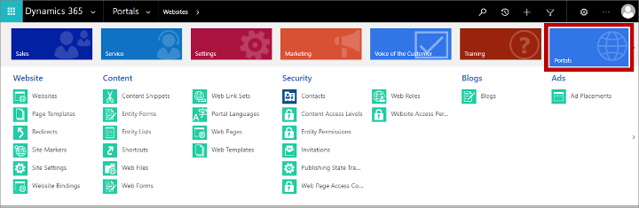

# Create interactive features with or without portals

[!INCLUDE[cc_applies_to_update_9_0_0](../includes/cc_applies_to_update_9_0_0.md)]

[!INCLUDE[pn-marketing-business-app-module-name](../includes/pn-marketing-business-app-module-name.md)] provides features for creating landing pages, subscription centers, online forms, event websites, and other ways of interacting with your customers online. Each of these features is intended to be used by marketing contacts to view and submit information to and from the [!INCLUDE[pn-marketing-app-module](../includes/pn-marketing-app-module.md)] app. There are two ways to provide these interactive features:

- **Run on a [!INCLUDE[pn-microsoftcrm](../includes/pn-dynamics-365.md)] portal**: With this option, the [!INCLUDE[pn-marketing-app-module](../includes/pn-marketing-app-module.md)] app works together with the [!INCLUDE[pn-microsoftcrm](../includes/pn-dynamics-365.md)] portals solution to provide fully automated publishing and hosting of marketing pages and the event website. You can provide all of these features without changing, or even owning, your own website. However, it requires a portals license and the features aren't fully native on your organization's website.
- **Run on your own website or CMS system**: with this option, you host the interactive marketing features on your own website. This method enables you to integrate the features into your own website structure and to match your site design perfectly. It also lets you provide these features without requiring a [!INCLUDE[pn-microsoftcrm](../includes/pn-dynamics-365.md)] portals license. However, it does require you to implement these features manually and to maintain your own website.

You can also run with a mix of both of these techniques or switch between them if needed.

## Run your interactive marketing features on an external site (portal-free)

When it was first released, [!INCLUDE[pn-marketing-business-app-module-name](../includes/pn-marketing-business-app-module-name.md)] could only be installed provided you also had a [!INCLUDE[pn-microsoftcrm](../includes/pn-dynamics-365.md)] portal available on your tenant because the portal was required for running key features. But now you can install even without a portal available. Here's how to offer interactive marketing features without running a portal:

- **Marketing pages:** You can either embed forms generated by [!INCLUDE[pn-marketing-business-app-module-name](../includes/pn-marketing-business-app-module-name.md)] onto an external page, or create your forms using native tools and then capture them for use in [!INCLUDE[pn-marketing-business-app-module-name](../includes/pn-marketing-business-app-module-name.md)]. [!INCLUDE[proc-more-information](../includes/proc-more-information.md)] [Integrate with landing pages published on an external website](embed-forms.md)
- **Subscription center:** All marketing email messages must include a link to a subscription center. A subscription center is simply a type of marketing page, but because of the vital function they play for email marketing, a default subscription center is provided with the product. It runs directly on your [!INCLUDE[pn-marketing-business-app-module-name](../includes/pn-marketing-business-app-module-name.md)] instance without requiring a portal, but can still be customized and published using the marketing page designer in [!INCLUDE[pn-marketing-business-app-module-name](../includes/pn-marketing-business-app-module-name.md)]. You can instead use an external subscription center running as an embedded form on your own website.  [!INCLUDE[proc-more-information](../includes/proc-more-information.md)] [Integrate with landing pages published on an external website](embed-forms.md) and [The default subscription center](set-up-subscription-center.md#default-center)
- **Event website:** The event website is a self-contained web application developed using the Angular framework. For instructions about how to download, customize, and install it on your own website, see [Build and host a custom event portal](developer/event-management-web-application.md). You can also run this same exact project on a [!INCLUDE[pn-microsoftcrm](../includes/pn-dynamics-365.md)] portal if you prefer.

## Use portals to host your interactive marketing features

The portals solution is highly flexible and customizable. You can create portals for a wide variety of purposes (such as self-service, registration, and data management) and audiences (including customers, partners, and employees).

If all you need are the standard marketing page and event website features provided by [!INCLUDE[pn-marketing-business-app-module-name](../includes/pn-marketing-business-app-module-name.md)], then, you never actually have to access the portal capabilities directly because [!INCLUDE[pn-marketing-business-app-module-name](../includes/pn-marketing-business-app-module-name.md)] creates, configures, and manages these portals automatically. However, you can also use the portals solution to create custom portals and websites that include features that interact directly with [!INCLUDE[pn-microsoftcrm](../includes/pn-microsoftcrm.md)] data.

> [!NOTE]
> If you want to integrate with a [!INCLUDE[pn-microsoftcrm](../includes/pn-dynamics-365.md)] portal (optional), then an unconfigured portal app must be available on your tenant when you install [!INCLUDE[pn-marketing-business-app-module-name](../includes/pn-marketing-business-app-module-name.md)]. Depending on the licensing plan you have chosen, your license may include a free portal (provided no other free portals are already in use on your tenant), or you may need to purchase a portal license before you can set up the integration. [!INCLUDE[proc-more-information](../includes/proc-more-information.md)] [When do I need a portal license, and how can I get one?](setup-troubleshooting.md#why-portal)

The portals solution is included with the [!INCLUDE[pn-marketing-app-module](../includes/pn-marketing-app-module.md)] app and is available as an add-on for many other [!INCLUDE[pn-microsoftcrm](../includes/pn-dynamics-365.md)] applications. For complete details about how to work with the portals solution, see [its online help](../portals/administer-manage-portal-dynamics-365.md).

### Work with marketing pages

Behind the scenes, each marketing page is created as a portal website that is hosted under the portal capabilities for [!INCLUDE[pn-microsoftcrm](../includes/pn-dynamics-365.md)] solution. However, you won't find them listed anywhere in the portals area of the custom app. Instead you'll set them up by using the **Marketing Pages**, **Marketing Forms**, and **Marketing Form Field** entities in the **Marketing** work area. [!INCLUDE[proc-more-information](../includes/proc-more-information.md)] [Create and deploy marketing pages](create-deploy-marketing-pages.md).

To view traffic information about each marketing page (such as who visited, where they visited from, and for how long), go to **Marketing** &gt; **Internet Marketing** &gt; **Websites**, and then choose the **Marketing Page Websites** view from the view-selector menu at the top of the page. Here you'll see a separate website listed for each marketing page you have published. Select any of these to view the traffic information. Go back to the **Active Websites** view to see the list of standard websites that you are monitoring by using this feature. These are websites where you have added a tracking script generated by [!INCLUDE[pn-microsoftcrm](../includes/pn-dynamics-365.md)], but which are not hosted as [!INCLUDE[pn-microsoftcrm](../includes/pn-dynamics-365.md)] portals. [!INCLUDE[proc-more-information](../includes/proc-more-information.md)] [Register contacts' engagement with your Internet marketing initiatives](register-engagement.md)

### Work with the event website

The event website is a self-contained web application developed using the Angular framework. You can host the event website on your own webserver or on a [!INCLUDE[pn-microsoftcrm](../includes/pn-dynamics-365.md)] portal. If you installed [!INCLUDE[pn-marketing-business-app-module-name](../includes/pn-marketing-business-app-module-name.md)] with portal integration enabled, then the event website was installed there automatically.

For general information about how to work with the event website, including when it's hosted on a portal, see [Set up the event website](set-up-event-portal.md).

For instructions about how to download, customize, and install the event website on a [!INCLUDE[pn-microsoftcrm](../includes/pn-dynamics-365.md)] portal, see [Dynamics 365 Portal hosted](developer/portal-hosted.md)

### Create custom portals solutions

To set up your own custom portals solutions, you must work with the full portal capabilities for [!INCLUDE[pn-microsoftcrm](../includes/pn-dynamics-365.md)] solution settings, which are only available in the custom app. To get to the portal settings:

1. Go to the custom app by selecting **[!INCLUDE[pn-custom-app-module](../includes/pn-custom-app-module.md)]** from the app-selector menu.  
    

2. The custom app provides a horizontal navigator at the top of the page. Use it to open the **Portals** tile and then work with the entries there.  
    

For complete details about how to work with the portals solution, see [its online help](../portals/administer-manage-portal-dynamics-365.md).

### See also

[Deliver web engagement experience with portal capabilities for Dynamics 365](../portals/administer-manage-portal-dynamics-365.md)  
[Find your way around](navigation.md)
