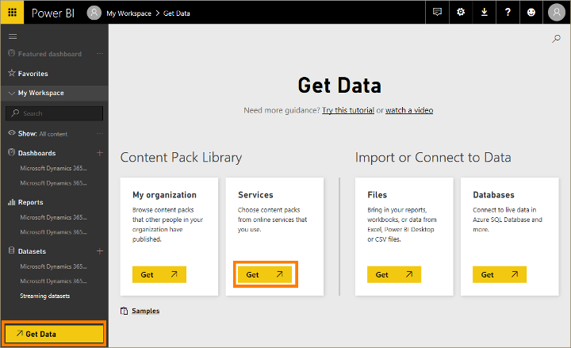
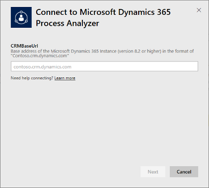
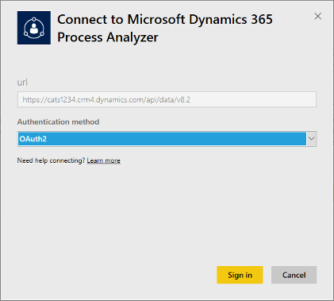

# View and explore results with [!INCLUDE[pn-microsoft-power-bi](../includes/pn-microsoft-power-bi.md)] analytics

[!INCLUDE[cc_applies_to_update_9_0_0](../includes/cc_applies_to_update_9_0_0.md)]

[!INCLUDE[pn-marketing-business-app-module-name](../includes/pn-marketing-business-app-module-name.md)], includes several prebuilt content packs for [!INCLUDE[pn-microsoft-power-bi](../includes/pn-microsoft-power-bi.md)], which provide insights and add analytics capabilities to the end-to-end sales and marketing process. Each content pack is preconfigured to consume data directly from your [!INCLUDE[pn-microsoftcrm](../includes/pn-dynamics-365.md)] database, and to create targeted and informative infographics based on that data. The content packs are built by using standard [!INCLUDE[pn-microsoft-power-bi](../includes/pn-microsoft-power-bi.md)] tools, so you can easily customize them to fit your needs.

The following content packs are provided to support [!INCLUDE[pn-marketing-business-app-module-name](../includes/pn-marketing-business-app-module-name.md)]:

- The Demand Generation Analyzer looks at responses, inquiries, leads, submissions and other records of contact interactions with your campaigns, and tracks your changing audience of prospects.
- The Marketing Audience Analyzer helps you gain a better understanding of your audience.
- The Lead Pipeline Analyzer is great for B2B scenarios, helping you understand your current lead pipeline. It helps you identify bottlenecks, optimize filters, and manage handovers.
- The Lead / Opportunity Influence Analyzer provides insights into which of your activities have contributed most to building up your current lead base, and helps you decide on the focus for future activities.

## Add a content pack to [!INCLUDE[pn-microsoft-power-bi](../includes/pn-microsoft-power-bi.md)]

To use a content pack, you must add it to your [!INCLUDE[pn-microsoft-power-bi](../includes/pn-microsoft-power-bi.md)] account and connect it to your [!INCLUDE[pn-microsoftcrm](../includes/pn-dynamics-365.md)] instance as follows:

1. Sign in to [!INCLUDE[pn-microsoft-power-bi](../includes/pn-microsoft-power-bi.md)] by using the same account that you use in [!INCLUDE[pn-office-365](../includes/pn-office-365.md)] and [!INCLUDE[pn-microsoftcrm](../includes/pn-dynamics-365.md)].

1. Select **Get Data** at the bottom of the leftmost navigation pane (select the **Show navigation pane**  button at the left side of the page if you don't see the **Get Data** button).

1. On the **Get Data** page, select **Get** under the **Services** heading.

    

1. In the **AppSource** dialog box, use the search form to find the content pack you want to add, and then select its **Get it now** link.

    ]")

1. In the **Connect to** dialog box, enter the base domain name of your [!INCLUDE[pn-microsoftcrm](../includes/pn-dynamics-365.md)] instance in the field provided (for example, **contoso.crm.dynamics.com**; don't include **https://** or any path information).

    

1. Select **Next** to continue. On the next page, set the **Authentication method** to **OAuth2**, and then click **Sign in**.

    

1. If an [!INCLUDE[pn-office-365](../includes/pn-office-365.md)] sign-in window opens, use the credentials you normally use to sign in to [!INCLUDE[pn-microsoftcrm](../includes/pn-dynamics-365.md)]. After you are signed in, you'll return to [!INCLUDE[pn-microsoft-power-bi](../includes/pn-microsoft-power-bi.md)] and your [!INCLUDE[pn-microsoftcrm](../includes/pn-dynamics-365.md)] data will begin to be loaded, which might take a few minutes.

1. When the data is loaded, your [!INCLUDE[pn-microsoft-power-bi](../includes/pn-microsoft-power-bi.md)] navigation pane will be updated to show a new **Dataset**, **Report**, and **Dashboard** in the leftmost navigation pane, each named after the Process Analyzer Content Pack.

You have now added the new content pack, and can start exploring the report and dashboard included with it.

## Customize a content pack

All the content packs provided for use with [!INCLUDE[pn-marketing-business-app-module-name](../includes/pn-marketing-business-app-module-name.md)] can be downloaded and customized as needed by using the standard [!INCLUDE[pn-microsoft-power-bi](../includes/pn-microsoft-power-bi.md)] tools, such as the [!INCLUDE[pn-power-bi-desktop](../includes/pn-power-bi-desktop.md)] App. [!INCLUDE[proc-more-information](../includes/proc-more-information.md)] [Power BI website](https://powerbi.microsoft.com)
