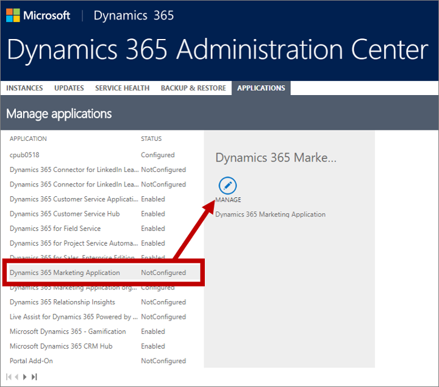

# Purchase a production version of [!INCLUDE[pn-marketing-business-app-module-name](../includes/pn-marketing-business-app-module-name.md)]

[!INCLUDE[cc_applies_to_update_9_0_0](../includes/cc_applies_to_update_9_0_0.md)]

If you already have a paid [!INCLUDE[pn-dynamics-365](../includes/pn-dynamics-365.md)] instance in use (probably with other [!INCLUDE[pn-dynamics-365](../includes/pn-dynamics-365.md)] customer engagements apps running on it), then you can integrate [!INCLUDE[pn-marketing-app-module](../includes/pn-marketing-app-module.md)] with your instance by adding a [!INCLUDE[pn-marketing-app-module](../includes/pn-marketing-app-module.md)] app to your tenant and then assigning it to the appropriate instance.

> [!IMPORTANT]
> [!INCLUDE[pn-marketing-business-app-module-name](../includes/pn-marketing-business-app-module-name.md)] can only be used on instances running [!include[pn-crm-9-0-0-online](../includes/pn-crm-9-0-0-online.md)] or higher.

## How [!INCLUDE[pn-marketing-app-module](../includes/pn-marketing-app-module.md)] is licensed

[!INCLUDE[pn-marketing-business-app-module-name](../includes/pn-marketing-business-app-module-name.md)] is licensed per instance, with each instance priced according to the number of contacts stored in your database.  Unlike most other [!INCLUDE[pn-dynamics-365](../includes/pn-dynamics-365.md)] apps, [!INCLUDE[pn-marketing-app-module](../includes/pn-marketing-app-module.md)] isn't priced per user (seat), so users already licensed to access any app on a given [!INCLUDE[pn-dynamics-365](../includes/pn-dynamics-365.md)] instance where [!INCLUDE[pn-marketing-app-module](../includes/pn-marketing-app-module.md)] is installed will also be able to access [!INCLUDE[pn-marketing-app-module](../includes/pn-marketing-app-module.md)] without requiring you to assign any additional licenses to them. You can even request any number of free (&quot;zero dollar&quot;) [!INCLUDE[pn-marketing-app-module](../includes/pn-marketing-app-module.md)] licenses to assign to users that don't have a [!INCLUDE[pn-dynamics-365](../includes/pn-dynamics-365.md)] license, but these aren't valid for apps other than [!INCLUDE[pn-marketing-app-module](../includes/pn-marketing-app-module.md)].

In some cases, you may be entitled to a free [!INCLUDE[pn-marketing-app-module](../includes/pn-marketing-app-module.md)] license for one or more of your [!INCLUDE[pn-dynamics-365](../includes/pn-dynamics-365.md)] instances. This may be triggered by purchasing a [!INCLUDE[pn-dynamics-365](../includes/pn-dynamics-365.md)] app bundle and/or by purchasing a certain minimal number of seat licenses for your other [!INCLUDE[pn-dynamics-365](../includes/pn-dynamics-365.md)] apps. Free licenses such as these usually also include a limited quota of free contacts-storage capacity, which you can increase by purchasing additional capacity.

For complete licensing details, including specific quotas and other conditions, see the  [Microsoft Dynamics 365 Licensing Guide](https://go.microsoft.com/fwlink/p/?linkid=874224).

## Add a [!INCLUDE[pn-marketing-app-module](../includes/pn-marketing-app-module.md)] app to your [!INCLUDE[pn-ms-office-365](../includes/pn-ms-office-365.md)] tenant

There are many ways to add one or more [!INCLUDE[pn-marketing-app-module](../includes/pn-marketing-app-module.md)] apps to your [!INCLUDE[pn-ms-office-365](../includes/pn-ms-office-365.md)] tenant. For example, you can purchase it from the [Dynamics 365 for Marketing overview page](https://dynamics.microsoft.com/en-us/marketing/overview/), or by going to **Billing** > **Purchase services** in your [!INCLUDE[pn-ms-office-365](../includes/pn-ms-office-365.md)] Admin Center, or by contacting your Microsoft sales representative or channel partner. As mentioned previously, you might even qualify to have a free [!INCLUDE[pn-marketing-app-module](../includes/pn-marketing-app-module.md)] app added to your tenant.

You can have any number of [!INCLUDE[pn-marketing-app-module](../includes/pn-marketing-app-module.md)] apps available on your tenant. Initially, each of these apps will be unconfigured and unassigned to any [!INCLUDE[pn-dynamics-365](../includes/pn-dynamics-365.md)] instance. Later, you'll run the [!INCLUDE[pn-marketing-app-module](../includes/pn-marketing-app-module.md)] setup wizard to assign the app to an instance and configure it.

## Set up an unconfigured [!INCLUDE[pn-marketing-app-module](../includes/pn-marketing-app-module.md)] app

When a new [!INCLUDE[pn-marketing-app-module](../includes/pn-marketing-app-module.md)] app gets added to your tenant, it begins in an unconfigured state. To set it up for use with an existing [!INCLUDE[pn-dynamics-365](../includes/pn-dynamics-365.md)] instance:

1. Go to [portal.office.com](https://portal.office.com) and sign in to your [!INCLUDE[pn-ms-office-365](../includes/pn-ms-office-365.md)] tenant using an administrator account that has a [!INCLUDE[pn-marketing-business-app-module-name](../includes/pn-marketing-business-app-module-name.md)] license assigned.

1. [Open the Dynamics 365 admin center](dynamics-365-admin-center.md).

1. Go to the **Applications** tab of the [!INCLUDE[pn-marketing-business-app-module-name](../includes/pn-marketing-business-app-module-name.md)] admin center.
    > [!IMPORTANT]
    > Don't work on the **Instances** tab when setting up [!INCLUDE[pn-marketing-app-module](../includes/pn-marketing-app-module.md)]. Though you can open details about an instance there and see that the various [!INCLUDE[pn-marketing-app-module](../includes/pn-marketing-app-module.md)] apps and solutions are available, your setup is likely to fail or be incomplete if you try to work from there.

1. Find a **Dynamics 365 Marketing Application** in the list.
    > [!NOTE]
    > If you see the [!INCLUDE[pn-marketing-app-module](../includes/pn-marketing-app-module.md)] app listed several times, then you probably have several [!INCLUDE[pn-marketing-app-module](../includes/pn-marketing-app-module.md)] apps available on your tenant. [!INCLUDE[pn-marketing-app-module](../includes/pn-marketing-app-module.md)] apps that are already configured show an instance ID appended to the app name and show a value of **Configured** in the **Status** column. [!INCLUDE[pn-marketing-app-module](../includes/pn-marketing-app-module.md)] apps that aren't assigned show a value of **Not configured** in the **Status** column and don't include an instance ID in their name.

   

1. Select an unconfigured [!INCLUDE[pn-marketing-app-module](../includes/pn-marketing-app-module.md)] app in the list and then choose **Manage** from the side panel.  
    

1. The setup wizard launches, which you will use to make initial settings for the app (including the choice of [!INCLUDE[pn-marketing-business-app-module-name](../includes/pn-marketing-business-app-module-name.md)] instance to install on (here called an _organization_)). Follow the instructions in [Run the setup wizard](purchase-setup.md) as you work through the setup wizard.
