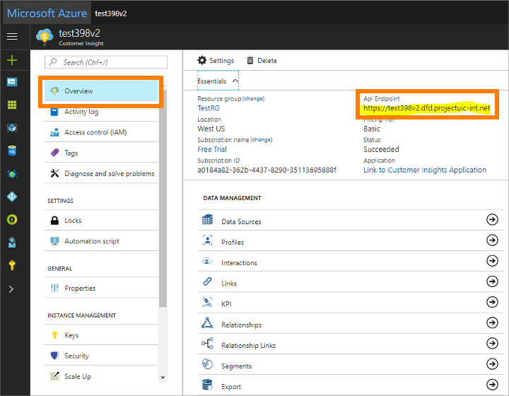
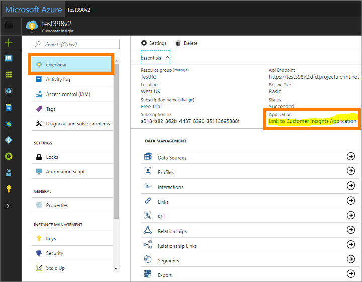
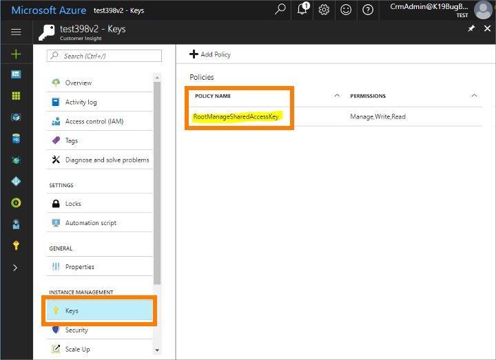
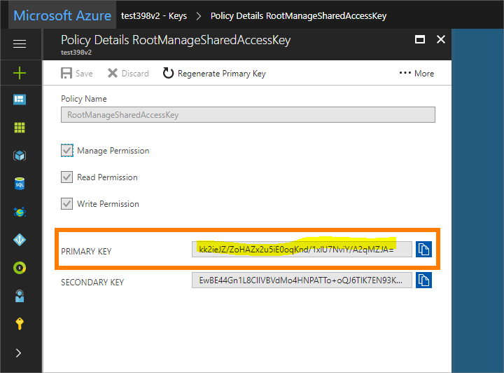

# Purchase and first-time setup

[!INCLUDE[Pre-release disclaimer](../includes/cc-beta-prerelease-disclaimer.md)]

This topic explains how licensing works, how to set up the system for the first time, and how to rerun the setup wizard if you need to change your setup later. It also provides important privacy information.

## How licensing works

[!INCLUDE[pn-marketing-business-app-module-name](../includes/pn-marketing-business-app-module-name.md)] is provided as a cloud-based solution that is linked to your [!INCLUDE[pn-office-365](../includes/pn-office-365.md)] organization. You can add it to your [!INCLUDE[pn-office-365](../includes/pn-office-365.md)] subscription by going to the [!INCLUDE[cc-microsoft](../includes/cc-microsoft.md)] Commerce Portal, but you might instead use some other sales channel. After you've set up the app, you'll be able to use the user-admin settings in [!INCLUDE[pn-marketing-business-app-module-name](../includes/pn-marketing-business-app-module-name.md)] to create user accounts and set the required access permissions for each user you've licensed.

[!INCLUDE[pn-marketing-business-app-module-name](../includes/pn-marketing-business-app-module-name.md)] is available with a variety of bundles and licensing options, the specifics of which will depend on your agreement. Typically, your agreement will include a quota of bulk email messages each month, a quota of contact records, a quota of Litmus inbox previews, a fixed number of user licenses, and other allotments. [!INCLUDE[pn-marketing-business-app-module-name](../includes/pn-marketing-business-app-module-name.md)] provides tools that help you keep an eye on your monthly quotas and purchase extra capacity as needed. Please refer to your own license agreement and to [!INCLUDE[pn-ms-dyn-365](../includes/pn-ms-dyn-365.md)] sales websites and other sales channels for specific details about bundles, pricing, and quotas.

## First-time setup

After purchasing your initial license for [!INCLUDE[pn-marketing-business-app-module-name](../includes/pn-marketing-business-app-module-name.md)], you'll receive the URL required to access the app. The first time you open the link, you'll launch a setup wizard that guides you through the initial setup. [!INCLUDE[pn-marketing-business-app-module-name](../includes/pn-marketing-business-app-module-name.md)] uses several other [!INCLUDE[pn-microsoftcrm](../includes/pn-microsoftcrm.md)] components, [!INCLUDE[cc-microsoft](../includes/cc-microsoft.md)] services, and apps; the wizard will help you review all the relevant privacy policies and set up and integrate these various elements.

> [!IMPORTANT]
> Most of the settings you make while running the setup wizard will be *permanent* for your [!INCLUDE[pn-microsoftcrm](../includes/pn-microsoftcrm.md)] [!INCLUDE[pn-marketing-app-module](../includes/pn-marketing-app-module.md)] instance, so take care while filling it out. One exception to this is the password (policy primary key) for [!INCLUDE[pn-customer-insights-full](../includes/pn-customer-insights-full.md)], which you will be able to update later by rerunning the setup wizard. [!INCLUDE[proc-more-information](../includes/proc-more-information.md)] [Rerun the setup wizard to update your Customer Insights key](#rerun-the-setup-wizard-to-update-your-customer-insights-key)).

The remaining sections of this topic provide details about each step of the setup wizard.

### Step 1: The Organization Selector page

A [!INCLUDE[pn-microsoftcrm](../includes/pn-microsoftcrm.md)] organization (org) is the foundation on which all [!INCLUDE[pn-microsoftcrm](../includes/pn-microsoftcrm.md)] Customer Engagement apps are built. All the various [!INCLUDE[pn-microsoftcrm](../includes/pn-microsoftcrm.md)] apps installed on a given org can potentially be integrated with one another and share data in various ways. If you aren't already using any other [!INCLUDE[pn-microsoftcrm](../includes/pn-microsoftcrm.md)] apps, you'll set up a new org now. If you already have one or more orgs, you'll be able to select an existing one that you want to integrate with the [!INCLUDE[pn-marketing-app-module](../includes/pn-marketing-app-module.md)] app, or create a new one.

Do the following:

1. Use the **Select an organization** drop-down list to choose an existing [!INCLUDE[pn-microsoftcrm](../includes/pn-microsoftcrm.md)] org.

1. The page includes two check boxes that describe the licensing and privacy policies that apply to [!INCLUDE[pn-marketing-business-app-module-name](../includes/pn-marketing-business-app-module-name.md)]. Read the text for each check box carefully, and follow the links provided for complete details. If you agree with all the terms, select the check boxes. If you don't agree with the privacy policy, quit the setup wizard, but you can continue without installing the email templates if you prefer.

1. Select **Continue** to continue.

### Step 2: The Customer Insights page

[!INCLUDE[pn-customer-insights-full](../includes/pn-customer-insights-full.md)] is a [!INCLUDE[cc-microsoft](../includes/cc-microsoft.md)] [!INCLUDE[pn-azure-shortest](../includes/pn-azure-shortest.md)]-based service that provides analytical tools for working with customer records. You use these tools to better understand your customers, and set up subscription lists and target segments for use in email-marketing campaigns.

This service has broad applications and is licensed separately. If you are already using [!INCLUDE[pn-customer-insights-short](../includes/pn-customer-insights-short.md)], you can integrate your new [!INCLUDE[pn-marketing-business-app-module-name](../includes/pn-marketing-business-app-module-name.md)] org with your existing [!INCLUDE[pn-customer-insights-short](../includes/pn-customer-insights-short.md)] app. If you don't have a [!INCLUDE[pn-customer-insights-short](../includes/pn-customer-insights-short.md)] or [!INCLUDE[cc-microsoft](../includes/cc-microsoft.md)] [!INCLUDE[pn-azure-shortest](../includes/pn-azure-shortest.md)] subscription, the setup wizard will help you set these up.

[!INCLUDE[proc-more-information](../includes/proc-more-information.md)] [Customer Insights overview](https://docs.microsoft.com/dynamics365/customer-insights/deploy/overview)

Do the following:

1. If you don't already have a [!INCLUDE[cc-microsoft](../includes/cc-microsoft.md)] [!INCLUDE[pn-azure-shortest](../includes/pn-azure-shortest.md)] subscription, click the first link provided near the top of the page. This opens a new browser window that will help you set up a new subscription. [!INCLUDE[cc-microsoft](../includes/cc-microsoft.md)] [!INCLUDE[pn-azure-shortest](../includes/pn-azure-shortest.md)] is a subscription-based cloud-computing platform on which [!INCLUDE[pn-customer-insights-short](../includes/pn-customer-insights-short.md)], and many other [!INCLUDE[pn-microsoftcrm](../includes/pn-microsoftcrm.md)] services, run.

1. If you don't already have a [!INCLUDE[pn-customer-insights-short](../includes/pn-customer-insights-short.md)] subscription, select the second link provided near the top of the page. This opens a new browser window that will help you set up a new [!INCLUDE[pn-customer-insights-short](../includes/pn-customer-insights-short.md)] Hub, which is the service that provides the [!INCLUDE[pn-customer-insights-short](../includes/pn-customer-insights-short.md)] feature. [!INCLUDE[pn-customer-insights-short](../includes/pn-customer-insights-short.md)] runs on [!INCLUDE[pn-azure-shortest](../includes/pn-azure-shortest.md)], so you must already have an [!INCLUDE[pn-azure-shortest](../includes/pn-azure-shortest.md)] account before you can set up [!INCLUDE[pn-customer-insights-short](../includes/pn-customer-insights-short.md)].

1. After you have your [!INCLUDE[pn-azure-shortest](../includes/pn-azure-shortest.md)] and [!INCLUDE[pn-customer-insights-short](../includes/pn-customer-insights-short.md)] Hub subscriptions in place, you're ready to fill out the rest of the settings on this page, which will enable [!INCLUDE[pn-marketing-business-app-module-name](../includes/pn-marketing-business-app-module-name.md)] to access those services. Start with the **[!INCLUDE[pn-customer-insights-short](../includes/pn-customer-insights-short.md)] Hub URL**. To find this value, sign in to your [!INCLUDE[pn-azure-shortest](../includes/pn-azure-shortest.md)] account and copy the **API Endpoint** value shown on the **Overview** page (shown in the following image) to the **[!INCLUDE[pn-customer-insights-short](../includes/pn-customer-insights-short.md)] Hub URL** field in [!INCLUDE[pn-microsoftcrm](../includes/pn-microsoftcrm.md)] setup.

    

1. Now find your **[!INCLUDE[pn-customer-insights-short](../includes/pn-customer-insights-short.md)] web application URL**, which is also on the **Overview** page in [!INCLUDE[pn-azure-shortest](../includes/pn-azure-shortest.md)]. Select the link shown under the **Application** heading to open the application in your browser, then copy the URL itself from your browser's **Address** bar into the **[!INCLUDE[pn-customer-insights-short](../includes/pn-customer-insights-short.md)] web application URL** field in [!INCLUDE[pn-microsoftcrm](../includes/pn-microsoftcrm.md)] setup.

    

1. Finally, you need your **Access policy primary key**, which functions as a password that authenticates [!INCLUDE[pn-microsoftcrm](../includes/pn-microsoftcrm.md)] to communicate with [!INCLUDE[pn-azure-shortest](../includes/pn-azure-shortest.md)] and [!INCLUDE[pn-customer-insights-short](../includes/pn-customer-insights-short.md)]. You'll also find this value in your [!INCLUDE[pn-azure-shortest](../includes/pn-azure-shortest.md)] portal, but on a different page. Do the following:
    1. Select **Keys** in the leftmost column, and then select the **Policy Name** shown.

        

    1. Details about your selected policy now appear. Copy the value shown for the **Primary Key** from here into the **Access policy primary key** field in [!INCLUDE[pn-microsoftcrm](../includes/pn-microsoftcrm.md)] setup.

        

1. Paste the same key value that you just found into the **Re-enter access policy primary key** field too.

1. Carefully read the check box text at the bottom of the form, and follow and read all the links provided. This text and its links provide important privacy information and describe the privacy policy for [!INCLUDE[pn-customer-insights-short](../includes/pn-customer-insights-short.md)]. If you agree with the policies described, select the check box. If you don't accept these terms, quit the setup wizard.

1. Select **Continue** to start the setup and integration process for [!INCLUDE[pn-customer-insights-short](../includes/pn-customer-insights-short.md)] and continue with the wizard.

### Step 3: The Portal page

The portals feature enables [!INCLUDE[pn-microsoftcrm](../includes/pn-microsoftcrm.md)] to host webpages, accept values submitted by page visitors, and to update its database directly based on those values. [!INCLUDE[pn-marketing-business-app-module-name](../includes/pn-marketing-business-app-module-name.md)] uses the portals feature to publish marketing pages, subscription centers, event portals (with online event registration), surveys, and more. As with many other [!INCLUDE[pn-microsoftcrm](../includes/pn-microsoftcrm.md)] elements, you can integrate [!INCLUDE[pn-marketing-business-app-module-name](../includes/pn-marketing-business-app-module-name.md)] with an existing [!INCLUDE[pn-microsoftcrm](../includes/pn-microsoftcrm.md)] Portals instance if you have one, or set up a new portal instance.

Do the following:

1. The **Portal** page shows a list of portals that are already available to your [!INCLUDE[pn-microsoftcrm](../includes/pn-microsoftcrm.md)] org. Choose the option for the portal you want to use with [!INCLUDE[pn-marketing-business-app-module-name](../includes/pn-marketing-business-app-module-name.md)]. The portal you choose must support the events portal feature.

1. The button in the **Actions** column is labeled **Configure** (for new portals), **Change** (for existing portals), or **Retry** (for portals that could not be set up for some reason). Select this button for the portal you selected to open its configuration settings.

1. The **Configure Portal** flyout opens. Make the following settings:
    - **Portal Name**: enter a name for the portal. The name is used to identify this portal in various [!INCLUDE[pn-microsoftcrm](../includes/pn-microsoftcrm.md)] settings pages (such as this one). Choose a name that will be easy to recognize later.
    - **Portal Subdomain**: all portals are hosted on your [!INCLUDE[pn-microsoftcrm](../includes/pn-microsoftcrm.md)] server, which uses a [!INCLUDE[cc-microsoft](../includes/cc-microsoft.md)]-owned domain name, plus a subdomain name that you choose (separated by a period). The resulting address will look something like this: https://&lt;YourSubdomain&gt;.&lt;DynamicsDomain&gt;.com. Your contacts and customers will be able to see the URL when they open a portal, so you should choose a subdomain name that they will recognize (such as your organization's name). The subdomain that you choose must also be unique among all other subdomains in the same [!INCLUDE[pn-microsoftcrm](../includes/pn-microsoftcrm.md)] server; you'll be notified to try again if you pick one that's already in use.

1. Select **Begin Setup** to close the flyout and start setting up the portal.

1. Select **Continue** to continue with the wizard.

### Step 4: The Survey page

The [!INCLUDE[pn-microsoftcrm](../includes/pn-microsoftcrm.md)] Surveys app enables you to run online surveys by using a feature called Voice of the Customer. The app is included with [!INCLUDE[pn-marketing-business-app-module-name](../includes/pn-marketing-business-app-module-name.md)], but has a separate privacy policy that you must read and accept before you can enable it.

Do the following:

1. As soon as the **Survey** page opens, a dialog box opens asking whether you want to allow the app to access your information. This is required for the feature to function. Read the information carefully, and select **Yes** if you agree. If you don't agree, select **No** and then quit the setup wizard.

1. The **Survey** page includes a check box, which you must select to indicate that you have read and agreed to its terms of service. Read the check box text carefully and follow its links for complete details. If you agree to the license terms and privacy policies that apply for the feature, select the check box. If you don't agree, quit the setup wizard.

1. Select **Begin Setup** to start the setup and integration process for Surveys.

### Step 5: The Summary page

You are now done entering settings. The wizard will continue to set up your system. You can track its progress on this page if you like, or you can close the page and wait for an email to arrive announcing that the process is complete. The email will be sent to the address associated with your [!INCLUDE[pn-office-365](../includes/pn-office-365.md)] account.

## Rerun the setup wizard to update your [!INCLUDE [pn-customer-insights-short](../includes/pn-customer-insights-short.md)] key

As mentioned earlier in this topic, most of the settings you made while running the setup wizard are permanent for your [!INCLUDE[pn-microsoftcrm](../includes/pn-microsoftcrm.md)] [!INCLUDE[pn-marketing-app-module](../includes/pn-marketing-app-module.md)] instance. One exception to this is the password (policy primary key) for [!INCLUDE[pn-customer-insights-full](../includes/pn-customer-insights-full.md)], which you can only update by rerunning the setup wizard.

To rerun the wizard, go to the **Settings** work area of [!INCLUDE[pn-marketing-business-app-module-name](../includes/pn-marketing-business-app-module-name.md)] and select the **Go to installation setup** link at the top of any page here. The setup wizard launches, behaving just like it did the first time you ran it, but this time only the key field on the **[!INCLUDE[pn-customer-insights-short](../includes/pn-customer-insights-short.md)]** page will be active; all other settings are read-only.

## Privacy notice

By enabling [!INCLUDE[pn-marketing-business-app-module-name](../includes/pn-marketing-business-app-module-name.md)] you agree to allow flow of the data from [!INCLUDE[pn-microsoftcrm](../includes/pn-microsoftcrm.md)] to certain [!INCLUDE[pn-azure-shortest](../includes/pn-azure-shortest.md)] services in order to perform some of the marketing processes. These services are collectively referred to as "[!INCLUDE[pn-marketing-app-module](../includes/pn-marketing-app-module.md)] services."

To do customer journeys, [!INCLUDE[pn-marketing-business-app-module-name](../includes/pn-marketing-business-app-module-name.md)] needs to send customer journey, email, submission form, and marketing page definitions to these [!INCLUDE[pn-marketing-app-module](../includes/pn-marketing-app-module.md)] services, running on [!INCLUDE[pn_azure_service_fabric](../includes/pn_azure_service_fabric.md)]. Marketing Pages are further sent to a customer's own instance of Portal capabilities for [!INCLUDE[pn-microsoftcrm](../includes/pn-microsoftcrm.md)].

To personalize sent emails [!INCLUDE[pn-marketing-business-app-module-name](../includes/pn-marketing-business-app-module-name.md)] needs to enable data flow to and from [!INCLUDE[pn-customer-insights-full](../includes/pn-customer-insights-full.md)]. Please see below for more information about the [!INCLUDE[pn-customer-insights-full](../includes/pn-customer-insights-full.md)] service. Data flow to [!INCLUDE[pn-customer-insights-full](../includes/pn-customer-insights-full.md)] includes synchronization of contacts and accounts to [!INCLUDE[pn-customer-insights-full](../includes/pn-customer-insights-full.md)]. [!INCLUDE[pn-marketing-app-module](../includes/pn-marketing-app-module.md)] services uses this data to personalize email content. The data that is included depends exclusively on the email definition.

To recalculate lead score models and marketing segments, [!INCLUDE[pn-marketing-business-app-module-name](../includes/pn-marketing-business-app-module-name.md)] needs to send lead score model definitions and segment definitions to [!INCLUDE[pn-customer-insights-full](../includes/pn-customer-insights-full.md)] and to leverage profiles and interactions in [!INCLUDE[pn-customer-insights-full](../includes/pn-customer-insights-full.md)] within these calculations.

To provide insights into the email and Internet interactions captured by [!INCLUDE[pn-marketing-app-module](../includes/pn-marketing-app-module.md)] services, the collected data flows from [!INCLUDE[pn-marketing-app-module](../includes/pn-marketing-app-module.md)] services to both [!INCLUDE[pn-marketing-business-app-module-name](../includes/pn-marketing-business-app-module-name.md)] and [!INCLUDE[pn-customer-insights-full](../includes/pn-customer-insights-full.md)].

If additionally, [!INCLUDE[pn-marketing-business-app-module-name](../includes/pn-marketing-business-app-module-name.md)] Event Management integration is enabled, [!INCLUDE[pn-marketing-business-app-module-name](../includes/pn-marketing-business-app-module-name.md)] is synchronizing events to [!INCLUDE[pn-customer-insights-full](../includes/pn-customer-insights-full.md)] (directly via the connector for [!INCLUDE[pn-crm-online-shortest](../includes/pn-crm-online-shortest.md)]) and event registrations and check-ins (via [!INCLUDE[pn-marketing-app-module](../includes/pn-marketing-app-module.md)] services, as interactions).

Data flow involving [!INCLUDE[pn-customer-insights-full](../includes/pn-customer-insights-full.md)] is the following:
- Entity data from [!INCLUDE[pn-marketing-business-app-module-name](../includes/pn-marketing-business-app-module-name.md)] to [!INCLUDE[pn-customer-insights-full](../includes/pn-customer-insights-full.md)], using the regular inbound connector of [!INCLUDE[pn-customer-insights-full](../includes/pn-customer-insights-full.md)], in order to provide content for email personalization, lead scoring, and segmentation (mainly contacts and accounts, eventually also leads and events)
- Entity data from [!INCLUDE[pn-marketing-business-app-module-name](../includes/pn-marketing-business-app-module-name.md)] via [!INCLUDE[pn-marketing-app-module](../includes/pn-marketing-app-module.md)] services to [!INCLUDE[pn-customer-insights-full](../includes/pn-customer-insights-full.md)], in order to provide identifiers for interactions and insights (customer journey, marketing emails, marketing pages)
- Interactions from [!INCLUDE[pn-marketing-app-module](../includes/pn-marketing-app-module.md)] services to [!INCLUDE[pn-customer-insights-full](../includes/pn-customer-insights-full.md)] (email tracking, website tracking, customer journey progress)
- Interactions from [!INCLUDE[pn-marketing-business-app-module-name](../includes/pn-marketing-business-app-module-name.md)] via [!INCLUDE[pn-marketing-app-module](../includes/pn-marketing-app-module.md)] services to [!INCLUDE[pn-customer-insights-full](../includes/pn-customer-insights-full.md)] (event registrations and check-ins)
- [!INCLUDE[pn-insights](../includes/pn-insights.md)] (interactions and KPIs) from [!INCLUDE[pn-customer-insights-full](../includes/pn-customer-insights-full.md)] via [!INCLUDE[pn-marketing-app-module](../includes/pn-marketing-app-module.md)] services to [!INCLUDE[pn-marketing-business-app-module-name](../includes/pn-marketing-business-app-module-name.md)] (mainly customer journey and email send progress, and lead scoring results)
- [!INCLUDE[pn-customer-insights-full](../includes/pn-customer-insights-full.md)] apps (segmentation and widgets) from [!INCLUDE[pn-customer-insights-full](../includes/pn-customer-insights-full.md)] directly into dedicated and sandboxed UI elements in forms of [!INCLUDE[pn-marketing-business-app-module-name](../includes/pn-marketing-business-app-module-name.md)]

### Marketing services

[!INCLUDE[pn-marketing-business-app-module-name](../includes/pn-marketing-business-app-module-name.md)] uses these [!INCLUDE[pn-azure-shortest](../includes/pn-azure-shortest.md)] services:

- [!INCLUDE[pn-azure-shortest](../includes/pn-azure-shortest.md)] Data Lake Store
- [!INCLUDE[pn-azure-shortest](../includes/pn-azure-shortest.md)] Data Lake Analytics
- [!INCLUDE[pn-azure-key-vault](../includes/pn-azure-key-vault.md)]
- [!INCLUDE[pn_azure_service_fabric](../includes/pn_azure_service_fabric.md)]
- [!INCLUDE[pn-azure-shortest](../includes/pn-azure-shortest.md)] DocumentDb
- [!INCLUDE[pn-microsoft-azure-active-directory](../includes/pn-microsoft-azure-active-directory.md)]
- [!INCLUDE[pn-azure-shortest](../includes/pn-azure-shortest.md)] Storage

> [!NOTE]
> For more information about additional [!INCLUDE[pn-azure-shortest](../includes/pn-azure-shortest.md)] service offerings, see the [!INCLUDE[cc_privacy_note_azure_trust_center](../includes/cc_privacy_note_azure_trust_center.md)] (<https://azure.microsoft.com/support/trust-center/>).

### [!INCLUDE[pn-customer-insights-full](../includes/pn-customer-insights-full.md)]

By using [!INCLUDE[pn-marketing-business-app-module-name](../includes/pn-marketing-business-app-module-name.md)], you are activating the transfer of customer data into [!INCLUDE[pn-customer-insights-full](../includes/pn-customer-insights-full.md)] for further processing. Your use of [!INCLUDE[pn-customer-insights-short](../includes/pn-customer-insights-short.md)] for [!INCLUDE[pn-microsoftcrm](../includes/pn-microsoftcrm.md)] may require compliance with specific privacy laws. Please direct any questions to the appropriate representative in your organization.

At present, [!INCLUDE[pn-customer-insights-short](../includes/pn-customer-insights-short.md)] is in public preview and does not offer the same level of privacy and security commitments as [!INCLUDE[pn-marketing-business-app-module-name](../includes/pn-marketing-business-app-module-name.md)] or [!INCLUDE[pn-microsoftcrm](../includes/pn-microsoftcrm.md)] Customer Engagement. [!INCLUDE[pn-customer-insights-short](../includes/pn-customer-insights-short.md)] is natively built on [!INCLUDE[pn-azure-shortest](../includes/pn-azure-shortest.md)] services, and respective compliance and security standards for each applicable [!INCLUDE[pn-azure-shortest](../includes/pn-azure-shortest.md)] service apply. For more information, go to the [!INCLUDE[cc-microsoft](../includes/cc-microsoft.md)] Trust Center: [https://azure.microsoft.com/support/trust-center/](https://azure.microsoft.com/support/trust-center/)

[!INCLUDE[pn-customer-insights-short](../includes/pn-customer-insights-short.md)] uses these [!INCLUDE[pn-azure-shortest](../includes/pn-azure-shortest.md)] services:

- [!INCLUDE[pn-azure-shortest](../includes/pn-azure-shortest.md)] Data Lake Store
- [!INCLUDE[pn-azure-shortest](../includes/pn-azure-shortest.md)] Data Lake Analytics
- [!INCLUDE[pn-azure-shortest](../includes/pn-azure-shortest.md)] HD Insight (Spark, Phoenix, HBase)
- [!INCLUDE[pn-ms-azure-sql-database](../includes/pn-ms-azure-sql-database.md)]
- [!INCLUDE[pn-azure-key-vault](../includes/pn-azure-key-vault.md)]
- [!INCLUDE[pn-azure-shortest](../includes/pn-azure-shortest.md)] Secret Store
- [!INCLUDE[pn-azure-shortest](../includes/pn-azure-shortest.md)] Event Hub
- [!INCLUDE[pn-azure-stream-analytics](../includes/pn-azure-stream-analytics.md)]
- [!INCLUDE[pn-azure-shortest](../includes/pn-azure-shortest.md)] Redis Cache
- [!INCLUDE[pn_azure_service_fabric](../includes/pn_azure_service_fabric.md)]
- [!INCLUDE[pn-microsoft-azure-active-directory](../includes/pn-microsoft-azure-active-directory.md)]
- [!INCLUDE[pn-azure-shortest](../includes/pn-azure-shortest.md)] Monitoring
- [!INCLUDE[pn-azure-shortest](../includes/pn-azure-shortest.md)] Metrics
- [!INCLUDE[pn-azure-shortest](../includes/pn-azure-shortest.md)] Websites
- [!INCLUDE[pn_azure_service_bus](../includes/pn_azure_service_bus.md)]
- [!INCLUDE[pn-azure-shortest](../includes/pn-azure-shortest.md)] Storage
