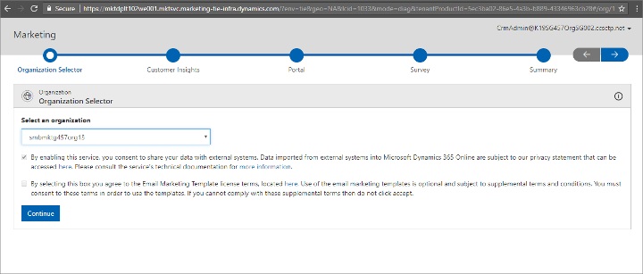
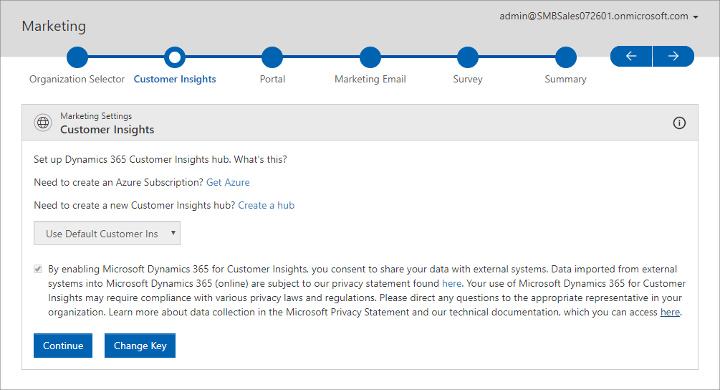
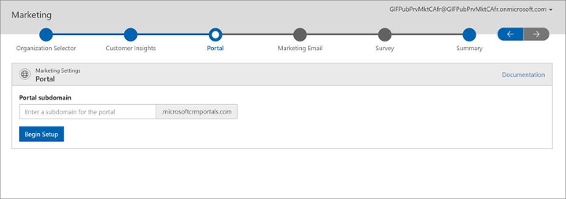
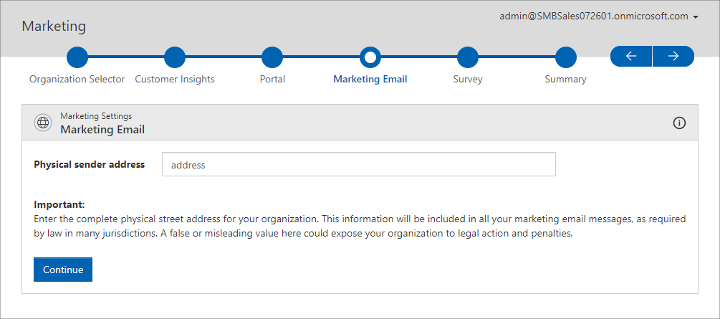
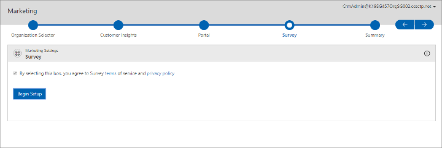
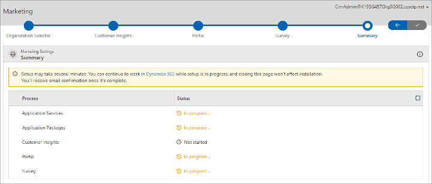

# First time setup

[!INCLUDE[cc_applies_to_update_9_0_0](../includes/cc_applies_to_update_9_0_0.md)]

[!INCLUDE[cc-beta-prerelease-disclaimer](../includes/cc-beta-prerelease-disclaimer.md)]

Read this topic to learn how to set up the system for the first time.

## Prerequisites and requirements

> [!IMPORTANT]
> A setup wizard is provided to help you set up [!INCLUDE[pn-marketing-business-app-module-name](../includes/pn-marketing-business-app-module-name.md)] for the first time. Before running the wizard, you must meet all of the following requirements:
> - You must already have an [!INCLUDE[pn-ms-office-365](../includes/pn-ms-office-365.md)] tenant.
> - You must already have a [!INCLUDE[pn-microsoftcrm](../includes/pn-microsoftcrm.md)] license assigned to you on your [!INCLUDE[pn-ms-office-365](../includes/pn-ms-office-365.md)] tenant.
> - You must run the setup wizard as a [!INCLUDE[pn-microsoftcrm](../includes/pn-microsoftcrm.md)] user with admin privileges on the [!INCLUDE[pn-microsoftcrm](../includes/pn-microsoftcrm.md)] org where you are installing [!INCLUDE[pn-marketing-app-module](../includes/pn-marketing-app-module.md)].> - Close all other browser windows and tabs before starting
> - Clear your browser cache before starting
> If you are setting up a trial or preview of [!INCLUDE[pn-marketing-business-app-module-name](../includes/pn-marketing-business-app-module-name.md)], then you can install it on a trial [!INCLUDE[pn-ms-office-365](../includes/pn-ms-office-365.md)] tenant running a trial [!INCLUDE[pn-ms-office-365](../includes/pn-ms-office-365.md)] org. For details about how to set these up, see [First time setup FAQ and troubleshooting](setup-troubleshooting.md).

> [!IMPORTANT]
> Your system is constrained by certain limits and quotas that apply to the number contacts you can store, monthly email messages you can send, monthly Litmus previews you can view, and more. Please download the [Dynamics 365 for Marketing Limits](https://go.microsoft.com/fwlink/p/?linkid=864735) document to familiarize yourself with these before you begin working with the system. You can keep an eye on your usage levels by going to **Settings** >**Advanced Settings** > **Others** > **Quota Limits** in [!INCLUDE[pn-marketing-business-app-module-name](../includes/pn-marketing-business-app-module-name.md)]. [!INCLUDE[proc-more-information](../includes/proc-more-information.md)] [Quota limits](quota-management.md)
> 
> See also the [Readme](https://go.microsoft.com/fwlink/p/?linkid=864736) document for the latest news and updates.

## First-time setup

After purchasing your initial license for [!INCLUDE[pn-marketing-business-app-module-name](../includes/pn-marketing-business-app-module-name.md)], you'll receive the URL required to access the app. The first time you open the link, you'll launch a setup wizard that guides you through the initial setup. [!INCLUDE[pn-marketing-business-app-module-name](../includes/pn-marketing-business-app-module-name.md)] uses several other [!INCLUDE[pn-microsoftcrm](../includes/pn-microsoftcrm.md)] components, [!INCLUDE[cc-microsoft](../includes/cc-microsoft.md)] services, and apps; the wizard will help you review all the relevant privacy policies and set up and integrate these various elements.

> [!IMPORTANT]
> Most of the settings you make while running the setup wizard will be *permanent* for your [!INCLUDE[pn-microsoftcrm](../includes/pn-microsoftcrm.md)] [!INCLUDE[pn-marketing-app-module](../includes/pn-marketing-app-module.md)] instance, so take care while filling it out.

The remaining sections of this topic provide details about each step of the setup wizard.

### Step 1: The Organization Selector page

A [!INCLUDE[pn-microsoftcrm](../includes/pn-microsoftcrm.md)] organization (org) is the foundation on which all [!INCLUDE[pn-microsoftcrm](../includes/pn-microsoftcrm.md)] Customer Engagement apps are built. All the various [!INCLUDE[pn-microsoftcrm](../includes/pn-microsoftcrm.md)] apps installed on a given org can potentially be integrated with one another and share data in various ways. If you aren't already using any other [!INCLUDE[pn-microsoftcrm](../includes/pn-microsoftcrm.md)] apps, you'll set up a new org now. If you already have one or more orgs, you'll be able to select an existing one that you want to integrate with the [!INCLUDE[pn-marketing-app-module](../includes/pn-marketing-app-module.md)] app, or create a new one.

Do the following:

1. Use the **Select an organization** drop-down list to choose an existing [!INCLUDE[pn-microsoftcrm](../includes/pn-microsoftcrm.md)] org.

1. The page includes two check boxes that describe the licensing and privacy policies that apply to [!INCLUDE[pn-marketing-business-app-module-name](../includes/pn-marketing-business-app-module-name.md)]. Read the text for each check box carefully, and follow the links provided for complete details. If you agree with all the terms, select the check boxes. If you don't agree with the privacy policy, quit the setup wizard, but you can continue without installing the email templates if you prefer.

1. Select **Continue** to continue.

### Step 2: The Customer Insights page

[!INCLUDE[pn-marketing-business-app-module-name](../includes/pn-marketing-business-app-module-name.md)] uses [!INCLUDE[pn-customer-insights-full](../includes/pn-customer-insights-full.md)] to process contact information, define market segments, and more. On this page of the setup wizard, you must read and agree to a privacy statement that applies to this service.

Carefully read the check box text provided here, and follow and read all the links provided. This text and its links provide important privacy information and describe the privacy policy for [!INCLUDE[pn-customer-insights-short](../includes/pn-customer-insights-short.md)]. If you agree with the policies described, select the check box. If you don't accept these terms, quit the setup wizard.

> [!NOTE]
> Your [!INCLUDE[pn-customer-insights-short](../includes/pn-customer-insights-short.md)] hub will be located either in North America or in the EMEA region, whichever is closest to your [!INCLUDE[pn-microsoftcrm](../includes/pn-microsoftcrm.md)] tenant.

### Step 3: The Portal page

The portals feature enables [!INCLUDE[pn-microsoftcrm](../includes/pn-microsoftcrm.md)] to host webpages, accept values submitted by page visitors, and to update its database directly based on those values. [!INCLUDE[pn-marketing-business-app-module-name](../includes/pn-marketing-business-app-module-name.md)] uses the portals feature to publish marketing pages, subscription centers, event portals, surveys, and more. [!INCLUDE[proc-more-information](../includes/proc-more-information.md)] [Engage with customers online with portals](portals.md)

All your portals are hosted on your [!INCLUDE[pn-microsoftcrm](../includes/pn-microsoftcrm.md)] server, which uses a [!INCLUDE[cc-microsoft](../includes/cc-microsoft.md)]-owned domain name, plus a subdomain name that you choose (separated by a period). The resulting address will look something like this: https://&lt;YourSubdomain&gt;.&lt;DynamicsDomain&gt;.com. Your contacts and customers will be able to see the URL when they open a portal, so you should choose a subdomain name that they will recognize (such as your organization's name). The subdomain that you choose must also be unique among all other subdomains in the same [!INCLUDE[pn-microsoftcrm](../includes/pn-microsoftcrm.md)] server; you'll be notified to try again if you pick one that's already in use.

Choose a suitable name and enter it in the **Portal subdomain** field. Then select **Begin Setup** to continue.

### Step 4: The Marketing Email page

All marketing email messages sent by [!INCLUDE[pn-marketing-business-app-module-name](../includes/pn-marketing-business-app-module-name.md)] must include the physical street address of your organization, and several other required elements. These requirements help maximize email deliverability while also helping make sure you conform to common legal requirements for marketing email. [!INCLUDE[proc-more-information](../includes/proc-more-information.md)] [Best practices for email marketing](get-ready-email-marketing.md)

Do the following:

1. Type the full physical street address for your organization in the field provided.

1. Select **Continue** to continue with the wizard.

### Step 5: The Survey page

The [!INCLUDE[pn-microsoftcrm](../includes/pn-microsoftcrm.md)] Surveys app enables you to run online surveys by using a feature called Voice of the Customer. The app is included with [!INCLUDE[pn-marketing-business-app-module-name](../includes/pn-marketing-business-app-module-name.md)], but has a separate privacy policy that you must read and accept before you can enable it. [!INCLUDE[proc-more-information](../includes/proc-more-information.md)] [Create and run online surveys](surveys.md)

Do the following:

1. As soon as the **Survey** page opens, a dialog box opens asking whether you want to allow the app to access your information. This is required for the feature to function. Read the information carefully, and select **Yes** if you agree. If you don't agree, select **No** and then quit the setup wizard.

    > [!IMPORTANT]
    > If you don't see the pop-up dialog, then your browser may be blocking them. Disable your pop-up blocker and then reload the **Survey** page before continuing. Your setup will fail if you continue without agreeing to the message shown in the pop-up.

1. The **Survey** page includes a check box, which you must select to indicate that you have read and agreed to its terms of service. Read the check box text carefully and follow its links for complete details. If you agree to the license terms and privacy policies that apply for the feature, select the check box. If you don't agree, quit the setup wizard.

1. Select **Begin Setup** to start the setup and integration process for Surveys.

### Step 6: The Summary page

You are now done entering settings. The wizard will continue to set up your system. You can track its progress on this page if you like, or you can close the page and wait for an email to arrive announcing that the process is complete. The email will be sent to the address associated with your [!INCLUDE[pn-office-365](../includes/pn-office-365.md)] subscription.

## Privacy notice

[!INCLUDE[cc-privacy-marketing-fre](../includes/cc-privacy-marketing-fre.md)]

### See also

[How Dynamics 365 for Marketing uses cookies](cookies.md)