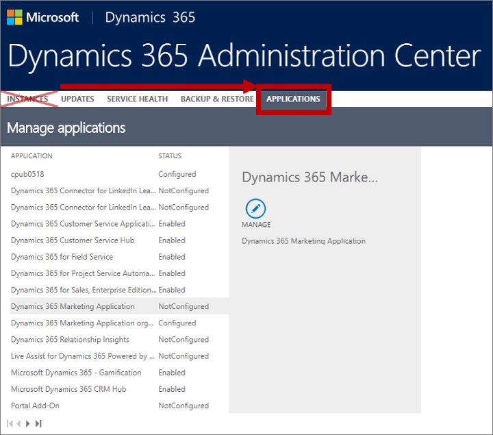

# Purchase and set up Dynamics 365 Marketing

Read this topic to learn how to set up a new Dynamics 365 Marketing instance after you have purchased a license.

> [!TIP]
> A trial version of Dynamics 365 Marketing is also available. If you'd like to set up a trial, see [Sign up for a free trial of Dynamics 365 Marketing](trial-signup.md) for instructions. This topic describes how to set up a production version.

## How Marketing is licensed

Dynamics 365 Marketing has several licensing options:

- **Production (full) license**: Production versions of Dynamics 365 Marketing are licensed per instance, with each instance priced according to the number of *marketing contacts* stored in your database. Marketing contacts only include those that you engage with marketing activities such as emails, landing pages, forms, LinkedIn integration, events, and surveys. Contacts that you never engage in marketing activities won't be counted as part of your Dynamics 365 Marketing license. Each license also includes quotas that limit the total number of free Litmus inbox previews you can view and marketing email messages you can send each month. See your license agreement for complete details about the quota limits that apply to you. You can view your quota limits and consumption on the [Quota limits](quota-management.md) page. While you're planning your marketing activities, please be sure to purchase enough marketing contacts to remain within your quota.
- **Sandbox-only license**: A sandbox-only license entitles you to set up a test instance for trying out new features or customizations. Sandboxes include both solutions and services, and are fully functional, but have much stricter quotas and can't be used to run production campaigns.
- **Solution-only license**: A solution-only license includes all of the entities and solutions for Dynamics 365 Marketing, but doesn't include any of the marketing services, which means that marketing capabilities aren't available (including email  creation, email delivery, segmentation, customer journeys, and more). This license is intended for use on development and test instances when making customizations, solving compatibility issues, importing/exporting solutions, and doing other types of development and non-functional marketing testing. A solution-only license is included with all paid licenses and allows you to install the solution-only app on as many instances as needed. As with production instances, you must [update each solution-only instance manually](apply-updates.md) each time an update becomes available. To convert a solution-only instance to a production instance, make sure you have an unconfigured production license and then [run the setup wizard](#run-wizard) to apply that license to the existing solution-only instance.

> [!NOTE]
> When you sign up for Dynamics 365 Marketing, you'll choose a licensing option that defines your contract period and various quotas for that period. Each of the contacts that you engage through marketing activities during the contract period count against your total contact quota, even if you delete, or otherwise stop marketing to, an existing marketing contact during the contract period. You can only reduce your purchased contact quota on contract renewal date.

Unlike most other model-driven apps in Dynamics 365, Dynamics 365 Marketing isn't priced per user, so users already licensed to access any Dynamics 365 app on an instance where Marketing is installed will also be able to access Marketing without requiring you to purchase any additional licenses. You can even request any number of free ("zero dollar") Marketing user licenses to assign to users that don't have a Dynamics 365 license, but these aren't valid for apps other than Marketing.

You can choose to run your marketing pages, landing pages, and events website either on an external web server (such as your own CMS system) or on a Dynamics 365 Portal or Power Apps Portal running on the same tenant as your Dynamics 365 Marketing instance. Dynamics 365 Portals and Power Apps Portals are licensed separately from Dynamics 365 Marketing. For details about portal licensing, see the [Power Apps and Flow licensing FAQ](https://docs.microsoft.com/power-platform/admin/powerapps-flow-licensing-faq#can-you-share-more-details-regarding-the-new-powerapps-portals-licensing). If you use an external website for your events website and marketing pages, then no portals license is needed. You'll choose which solution to use when you run the Dynamics 365 Marketing setup wizard and can change your mind later by running it again. More information: [Integrate Marketing with a CMS system or Dynamics 365 Portal](portal-optional.md)

For more information about Dynamics 365 Marketing licensing, see the [Administration and setup FAQ](setup-troubleshooting.md#licensing). For complete licensing details, including specific quotas and other conditions, see the  [Microsoft Dynamics 365 Licensing Guide](https://go.microsoft.com/fwlink/p/?linkid=866544).

## Prerequisites and requirements

> [!IMPORTANT]
> To run the setup wizard, you must meet all the following requirements:
> 
> - You must already have a Microsoft 365 tenant.
> - An unconfigured Dynamics 365 Marketing app must be available on your tenant.
> - You must not already have a Dynamics 365 Marketing app installed on your Dynamics 365 instance. You can have at most one Dynamics 365 Marketing per instance, and each Dynamics 365 Marketing app can only be used with one Dynamics 365 instance.
> - You must sign into your tenant with a user account that has all the following:
>   - Admin privileges sufficient to allow you to modify the Dynamics 365 instance where you are installing Marketing.
>   - Permissions to register applications in Azure. The global administrator always has this right, but other accounts can also have it. See [Do I have permissions to register applications on Azure?](setup-troubleshooting.md#register-apps-azure) for information about how to confirm this setting for your account.
> - A known issue currently prevents you from running the setup wizard unless you have a Dynamics 365 license with the _System Adminsitrator_ security role assigned to you on your tenant. However, although most of our customers do have this license, it's not actually required by the terms of the Dynamics 365 Marketing license agreement. A workaround is available for users who need to install Marketing without having a Dynamics 365 license assigned to them&mdash;see [Configuration, installation, and first-run experience](readme.md#configuration-installation-and-first-run-experience) in the readme for details.
> - You must be located in a country/region where the product is supported. To read the latest list of countries/regions where you can use Dynamics 365 Marketing, download the [Microsoft Dynamics 365 International Availability](https://go.microsoft.com/fwlink/p/?linkid=875097) document (PDF).
> - Close all other browser windows and tabs before starting.
> - Clear your browser cache before starting.
> 
> If you run into trouble while working with the setup wizard, see the [Administration and setup FAQ](setup-troubleshooting.md) for some possible solutions.

> [!IMPORTANT]
> Your system is constrained by certain limits and quotas that apply to the number of contacts you can market to, monthly email messages you can send, Litmus previews you can view, and more. Please familiarize yourself with the terms and limits of the product before you begin to use it. The limits are different based on whether you are running a trial or subscribed version of the product.
> 
> - For subscribed (paid) versions, please download the [Microsoft Dynamics 365 Licensing Guide](https://go.microsoft.com/fwlink/p/?linkid=866544).
> - For trials, see [Dynamics 365 Marketing limits for trials](trial-preview-limits.md).
> 
> You can keep an eye on your usage levels by going to  **Settings**  >  **Advanced settings**  >  **Other settings**  >  **Quota limits**  in Dynamics 365 Marketing. More information: [Quota limits](quota-management.md)
> 
> See also the  [Readme](https://go.microsoft.com/fwlink/p/?linkid=864736) document for the latest news and updates.

## Add a Marketing app to your Microsoft 365 tenant

There are many ways to add one or more Marketing apps to your Microsoft 365 tenant. For example, you can purchase it from the [Dynamics 365 Marketing overview page](https://dynamics.microsoft.com/marketing/overview/), or by going to **Billing** > **Purchase services** in your Microsoft 365 admin center, or by contacting your Microsoft sales representative or channel partner. On purchasing a license, an unconfigured Dynamics 365 Marketing app will be automatically added to your tenant.

You can have any number of Marketing apps available on your tenant. Initially, each of these apps will be unconfigured and unassigned to any Dynamics 365 instance. Later, you'll run the Marketing setup wizard to assign the app to an instance and configure it.

## Run the Marketing setup wizard

After purchasing your license for Dynamics 365 Marketing, you'll have an unconfigured Dynamics 365 Marketing app available on your tenant, but you still need to set it up for use. The Marketing setup wizard will help you review all the relevant privacy policies and set up and integrate its various elements.

To set up a new Marketing instance:

1. Go to [admin.microsoft.com](https://admin.microsoft.com) and sign in to your Microsoft 365 tenant using an administrator account that has a Dynamics 365 Marketing license assigned.

1. [Open the Dynamics 365 admin center](dynamics-365-admin-center.md).

1. Go to the **Applications** tab of the Dynamics 365 Marketing admin center.
   > [!IMPORTANT]
   > Don't work on the **Instances** tab when setting up Marketing. Though you can open details about an instance there and see that the various Marketing apps and solutions are available, your setup is likely to fail or be incomplete if you try to work from there.

   

1. Find and select an unconfigured Dynamics 365 Marketing application in the list on the **Applications** tab. Then choose **Manage** from the side panel. You may have more than one type of application available, so be sure to pick the one that meets your present needs. Both types of applications present the same setup wizard, as described in this procedure. They are identified as follows:
    - **Dynamics 365 Marketing Application**: This is a full Dynamics 35 Marketing application, including both solutions and services. It is intended for production use, but can also be used during development and testing.
    - **Dynamics 365 Marketing - Solution Only**: This application provides the Dynamics 365 Marketing solutions, including all database entities, but not the services, which means that marketing capabilities aren't available. It provides limited functionality but can be installed on as many test or development instances as needed for no additional charge. More information: [How Marketing is licensed](#how-licensed).

    

   > [!NOTE]
   > If you see the Marketing app listed several times, then you probably have several Marketing apps available on your tenant. Marketing apps that are already configured show an instance ID appended to the app name and show a value of **Configured** in the **Status** column. Marketing apps that aren't assigned show a value of **Not configured** in the **Status** column and don't include an instance ID in their name.

1. The setup wizard launches, which you will use to make initial settings for the app. The first page of the wizard lets you choose where you will install the app and to choose whether to set up a portal to run your marketing pages and event website.

    

1. From the top drop-down list, select the Dynamics 365 organization where you want to add Dynamics 365 Marketing. (A Dynamics 365 *organization* is another name for a Dynamics 365 *instance*.)

1. Select one of the following **Web hosting** options (you can easily [change this later](portal-optional.md), at any time):
    - **Use own webserver**: Select this option if you will run your landing pages and event website on an external webserver or CMS system. This option doesn't require a portals license and won't install a portals trial. If you're not sure whether you'll need a portal, then you can choose this option for now and then come back and change it later if needed.
    - **Use Dynamics 365 Portals**: Select this option if you will run your landing pages and event website on a dedicated Dynamics 365 or Power Apps Portal running on your tenant and linked to  your Dynamics 365 Marketing instance. Portals are licensed separately. If you already have an unconfigured Dynamics 365 Portals license on your tenant, then Dynamics 365 Marketing will claim that license and integrate with it. If you don't have any Dynamics 365 Portals licenses available, then the setup wizard will create a trial Power Apps Portals instance and integrate with that. The trial is free, but expires in 30 days, after which you must either begin paying for it or stop using it. (Power Apps Portals licenses are priced according to consumption (logins and page loads), while Dynamics 365 Portals licenses are priced per instance.) For details about portal licensing, see the [Power Apps and Flow licensing FAQ](https://docs.microsoft.com/power-platform/admin/powerapps-flow-licensing-faq#can-you-share-more-details-regarding-the-new-powerapps-portals-licensing).

    More information: [Integrate Marketing with a CMS system or Dynamics 365 Portal](portal-optional.md)

    > [!NOTE]
    > Dynamics 365 Portals aren't available in all countries/regions. If this applies to you, then the **Use Dynamics 365 Portals** option won't be available and you'll see a notice here instead. For more information about how to run Marketing without a portal, and how to switch to a portal if they later become available in your country/region, see [Integrate Marketing with a CMS system or Dynamics 365 Portal](portal-optional.md).

1. If you selected to **Use Dynamics 365 Portals**, then enter a prefix for your portal URL in the field provided (under **Where do you want to host your webpage?**). You can also see what the full URL will be here. All your portals are hosted on your tenant, which uses a Microsoft-owned domain name, plus the subdomain name that you choose here. Your contacts and customers can see the URL when they open a portal, so you should choose a subdomain name that they will recognize, such as your organization's name. The subdomain that you choose must also be unique among all other subdomains in the same tenant; you'll be notified to try again if you pick one that's already in use. If you want to reuse a name that's reported as already in use, then you can reclaim it by resetting the relevant portal and then removing the binding to the existing name as described in [Reset any Dynamics 365 Portals connected to the uninstalled Marketing app](uninstall-marketing.md#reset-portal).

1. Select  **Continue**  to continue. Dynamics 365 Marketing includes several services, solutions, and apps, some of which require you to consider and accept various license agreements and privacy statements. The second page of the setup wizard lists each of these and provides links for more information. It also asks you to enter your organization's postal address.

    

1. Carefully read the consent text shown for each check box, and follow the links to make sure you understand all the relevant issues. If you agree with the terms, then mark each check box as you go to indicate your consent. Some of these are optional, so you can still use the product without them, though the related features will be disabled. Other features are required, so you won't be able to use Dynamics 365 Marketing without agreeing to them.

1. Type the full physical street address for your organization in the field provided. All marketing email messages sent by Dynamics 365 Marketing must include the physical street address of your organization, and several other required elements. These requirements help maximize email deliverability while also helping make sure you conform to common legal requirements for marketing email.  More information: [Best practices for email marketing](get-ready-email-marketing.md)

1. Select  **Setup**  to start setting up the app. A page will open that tracks the setup progress, which typically takes about three hours to set up a paid instance.

## Privacy notice

[!INCLUDE[cc-privacy-marketing-fre](../includes/cc-privacy-marketing-fre.md)]

### See also

[How Dynamics 365 Marketing uses cookies](cookies.md)  
[Engage with customers online with portals](portals.md)
