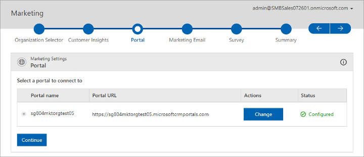

# First-time setup

[!INCLUDE[cc_applies_to_update_9_0_0](../includes/cc_applies_to_update_9_0_0.md)]

Read this topic to learn how to set up Dynamics 365 for Marketing for the first time.

## Prerequisites and requirements

> [!IMPORTANT]
> To install [!INCLUDE[pn-marketing-app-module](../includes/pn-marketing-app-module.md)], you must meet all the following requirements:
> - **You must be running [!include[pn-crm-9-0-0-online](../includes/pn-crm-9-0-0-online.md)] or higher**.
> - You must already have an [!INCLUDE[pn-ms-office-365](../includes/pn-ms-office-365.md)] tenant.
> - You must already have a [!INCLUDE[pn-microsoftcrm](../includes/pn-dynamics-365.md)] license assigned to you on your [!INCLUDE[pn-ms-office-365](../includes/pn-ms-office-365.md)] tenant.
> - You must run the setup wizard as a [!INCLUDE[pn-microsoftcrm](../includes/pn-dynamics-365.md)] user with admin privileges on the [!INCLUDE[pn-microsoftcrm](../includes/pn-dynamics-365.md)] org where you are installing [!INCLUDE[pn-marketing-app-module](../includes/pn-marketing-app-module.md)].
> - Close all other browser windows and tabs before starting.
> - Clear your browser cache before starting.
>
> If you are setting up a trial or preview of [!INCLUDE[pn-marketing-business-app-module-name](../includes/pn-marketing-business-app-module-name.md)], then you can install it on a trial [!INCLUDE[pn-ms-office-365](../includes/pn-ms-office-365.md)] tenant running a trial [!INCLUDE[pn-ms-office-365](../includes/pn-ms-office-365.md)] org. For details about how to set these up, see [First time setup FAQ and troubleshooting](setup-troubleshooting.md).

> [!IMPORTANT]
<<<<<<< HEAD
> Your system is constrained by certain limits and quotas that apply to the number contacts you can store, monthly email messages you can send, monthly Litmus previews you can view, and more. Please read [About the Preview](https://go.microsoft.com/fwlink/p/?linkid=864735) to familiarize yourself with these limits before you begin working with the system. You can keep an eye on your usage levels by going to **Settings** >**Advanced Settings** > **Others** > **Quota Limits** in [!INCLUDE[pn-marketing-business-app-module-name](../includes/pn-marketing-business-app-module-name.md)]. [!INCLUDE[proc-more-information](../includes/proc-more-information.md)] [Quota limits](quota-management.md)
=======
> Your system is constrained by certain limits and quotas that apply to the number of contacts you can store, monthly email messages you can send, monthly Litmus previews you can view, and more. Please familiarize yourself with the terms and limits of the product before you begin to use it. The limits are different based on whether you are running a trial, preview, or subscribed version of the product. 
>
> - For subscribed (paid) versions, please download the [Microsoft Dynamics 365 Licensing Guide](http://download.microsoft.com/documents/dynamics/pricing/Dynamics_365_Enterprise_edition_Licensing_Guide.pdf).
> - For trial and previews, see [Dynamics 365 for Marketing limits for trials and previews](trial-preview-limits.md).
> 
> You can keep an eye on your usage levels by going to **Settings** > **Advanced Settings** > **Others** > **Quota Limits** in [!INCLUDE[pn-marketing-business-app-module-name](../includes/pn-marketing-business-app-module-name.md)]. [!INCLUDE[proc-more-information](../includes/proc-more-information.md)] [Quota limits](quota-management.md)
>>>>>>> 0eea78dad1aefd278081e5af13d8dbd51fafde37
> 
> See also the [Readme](https://go.microsoft.com/fwlink/p/?linkid=864736) document for the latest news and updates.

## Fill out the setup wizard

After purchasing your license for [!INCLUDE[pn-marketing-business-app-module-name](../includes/pn-marketing-business-app-module-name.md)], you'll get the URL you need to access the app. The first time you open the link, you'll launch a setup wizard that guides you through the setup. [!INCLUDE[pn-marketing-business-app-module-name](../includes/pn-marketing-business-app-module-name.md)] uses several other [!INCLUDE[pn-microsoftcrm](../includes/pn-dynamics-365.md)] components, [!INCLUDE[cc-microsoft](../includes/cc-microsoft.md)] services, and apps; the form will help you review all the relevant privacy policies and set up and integrate these various elements.

> [!IMPORTANT]
> Most of the settings you make while running the setup wizard will be *permanent* for your [!INCLUDE[pn-microsoftcrm](../includes/pn-dynamics-365.md)] [!INCLUDE[pn-marketing-app-module](../includes/pn-marketing-app-module.md)] instance, so take care while filling it out.

The remaining sections of this topic describe each step of the setup wizard.

### Step 1: Choose an organization and name your portal

A [!INCLUDE[pn-microsoftcrm](../includes/pn-dynamics-365.md)] organization (org) is the foundation upon which all [!INCLUDE[pn-microsoftcrm](../includes/pn-dynamics-365.md)] customer engagement apps are built. All the [!INCLUDE[pn-microsoftcrm](../includes/pn-dynamics-365.md)] apps installed on a given org can potentially be integrated with one another and share data. If you aren't already using any other [!INCLUDE[pn-microsoftcrm](../includes/pn-dynamics-365.md)] apps, you'll set up a new org now. If you already have one or more orgs, you'll be able to select an existing one that you want to integrate with the [!INCLUDE[pn-marketing-app-module](../includes/pn-marketing-app-module.md)] app, or create a new one.

The portals feature enables [!INCLUDE[pn-microsoftcrm](../includes/pn-dynamics-365.md)] to host webpages, accept values submitted by page visitors, and to update its database directly based on those values. [!INCLUDE[pn-marketing-business-app-module-name](../includes/pn-marketing-business-app-module-name.md)] uses the portals feature to publish marketing pages, subscription centers, event portals, surveys, and more. All your portals are hosted on your [!INCLUDE[pn-microsoftcrm](../includes/pn-dynamics-365.md)] server, which uses a [!INCLUDE[cc-microsoft](../includes/cc-microsoft.md)]-owned domain name, plus a subdomain name that you choose and that is separated by a period. The resulting address will look something like this: https://&lt;YourSubdomain&gt;.&lt;DynamicsDomain&gt;.com. Your contacts and customers can see the URL when they open a portal, so you should choose a subdomain name that they will recognize, such as your organization's name. The subdomain that you choose must also be unique among all other subdomains in the same [!INCLUDE[pn-microsoftcrm](../includes/pn-dynamics-365.md)] server; you'll be notified to try again if you pick one that's already in use.

To choose an organization and name your portal:

<<<<<<< HEAD
<<<<<<< HEAD
The portals feature enables [!INCLUDE[pn-microsoftcrm](../includes/pn-microsoftcrm.md)] to host webpages, accept values submitted by page visitors, and to update its database directly based on those values. [!INCLUDE[pn-marketing-business-app-module-name](../includes/pn-marketing-business-app-module-name.md)] uses the portals feature to publish marketing pages, subscription centers, event portals (with online event registration), surveys, and more. As with many other [!INCLUDE[pn-microsoftcrm](../includes/pn-microsoftcrm.md)] elements, you can integrate [!INCLUDE[pn-marketing-business-app-module-name](../includes/pn-marketing-business-app-module-name.md)] with an existing [!INCLUDE[pn-microsoftcrm](../includes/pn-microsoftcrm.md)] Portals instance if you have one, or set up a new portal instance. [!INCLUDE[proc-more-information](../includes/proc-more-information.md)] [Engage with customers online with portals](portals.md)

Do the following:

1. The **Portal** page shows a list of portals that are already available to your [!INCLUDE[pn-microsoftcrm](../includes/pn-microsoftcrm.md)] org. Choose the option for the portal you want to use with [!INCLUDE[pn-marketing-business-app-module-name](../includes/pn-marketing-business-app-module-name.md)]. The portal you choose must support the events portal feature.

1. The button in the **Actions** column is labeled **Configure** (for new portals), **Change** (for existing portals), or **Retry** (for portals that could not be set up for some reason). Select this button for the portal you selected to open its configuration settings.
=======
The portals feature enables [!INCLUDE[pn-microsoftcrm](../includes/pn-dynamics-365.md)] to host webpages, accept values submitted by page visitors, and to update its database directly based on those values. [!INCLUDE[pn-marketing-business-app-module-name](../includes/pn-marketing-business-app-module-name.md)] uses the portals feature to publish marketing pages, subscription centers, event portals, surveys, and more. [!INCLUDE[proc-more-information](../includes/proc-more-information.md)] [Engage with customers online with portals](portals.md)
=======
1. Choose a [!INCLUDE[pn-microsoftcrm](../includes/pn-dynamics-365.md)] org from the drop-down list provided.
>>>>>>> 0eea78dad1aefd278081e5af13d8dbd51fafde37

1. Choose a prefix for your portal URL and enter it in the field provided. You can also see what the full URL will be here. 

<<<<<<< HEAD
All your portals are hosted on your [!INCLUDE[pn-microsoftcrm](../includes/pn-dynamics-365.md)] server, which uses a [!INCLUDE[cc-microsoft](../includes/cc-microsoft.md)]-owned domain name, plus a subdomain name that you choose (separated by a period). The resulting address will look something like this: https://&lt;YourSubdomain&gt;.&lt;DynamicsDomain&gt;.com. Your contacts and customers will be able to see the URL when they open a portal, so you should choose a subdomain name that they will recognize (such as your organization's name). The subdomain that you choose must also be unique among all other subdomains in the same [!INCLUDE[pn-microsoftcrm](../includes/pn-dynamics-365.md)] server; you'll be notified to try again if you pick one that's already in use.
>>>>>>> 0d2f72e14c8efe01041c9f02a3b5085d0e846b22

1. The **Configure Portal** flyout opens. Make the following settings:
    - **Portal Name**: enter a name for the portal. The name is used to identify this portal in various [!INCLUDE[pn-microsoftcrm](../includes/pn-microsoftcrm.md)] settings pages (such as this one). Choose a name that will be easy to recognize later.
    - **Portal Subdomain**: all portals are hosted on your [!INCLUDE[pn-microsoftcrm](../includes/pn-microsoftcrm.md)] server, which uses a [!INCLUDE[cc-microsoft](../includes/cc-microsoft.md)]-owned domain name, plus a subdomain name that you choose (separated by a period). The resulting address will look something like this: https://&lt;YourSubdomain&gt;.&lt;DynamicsDomain&gt;.com. Your contacts and customers will be able to see the URL when they open a portal, so you should choose a subdomain name that they will recognize (such as your organization's name). The subdomain that you choose must also be unique among all other subdomains in the same [!INCLUDE[pn-microsoftcrm](../includes/pn-microsoftcrm.md)] server; you'll be notified to try again if you pick one that's already in use.

1. Select **Begin Setup** to close the flyout and start setting up the portal.

1. Select **Continue** to continue with the wizard.
=======
1. Select **Continue** to continue.

### Step 2: Give consent and enter your postal address
>>>>>>> 0eea78dad1aefd278081e5af13d8dbd51fafde37

[!INCLUDE[pn-marketing-business-app-module-name](../includes/pn-marketing-business-app-module-name.md)] includes several services, solutions, and apps, some of which require you to consider and accept various license agreements and privacy statements. The second page of the setup wizard lists each of these and provides links for more information. 

All marketing email messages sent by [!INCLUDE[pn-marketing-business-app-module-name](../includes/pn-marketing-business-app-module-name.md)] must include the physical street address of your organization, and several other required elements. These requirements help maximize email deliverability while also helping make sure you conform to common legal requirements for marketing email. [!INCLUDE[proc-more-information](../includes/proc-more-information.md)] [Best practices for email marketing](get-ready-email-marketing.md)

To give consent and enter your postal address:

1. Carefully read the consent text shown for each check box, and follow the links to make sure you understand all the relevant issues. If you agree with the terms, then mark each checkbox as you go to indicate your consent. Some of these are optional, so you can still use the product without them, though the related features will be disabled. Other features are required, so you won't be able to use  [!INCLUDE[pn-marketing-business-app-module-name](../includes/pn-marketing-business-app-module-name.md)] without agreeing to them.

1. Type the full physical street address for your organization in the field provided.

1. Select **Setup** to start setting up the app. 

A page will open that tracks the setup progress, which typically takes about half an hour.

## Privacy notice

[!INCLUDE[cc-privacy-marketing-fre](../includes/cc-privacy-marketing-fre.md)]

### See also

[How Dynamics 365 for Marketing uses cookies](cookies.md)  
[Engage with customers online with portals](portals.md)
