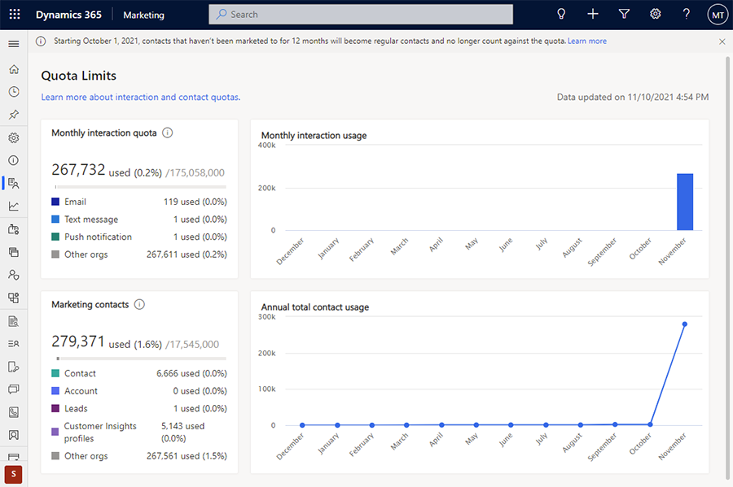

# Quota limits

Dynamics 365 Marketing is a subscription service that is billed monthly and sets organization-level quotas for the maximum number of Marketing Contact records and monthly outbound interactions that you can send. Other quotas may also apply. You can always upgrade your subscription if you need higher quotas.

The **Quota limits** page shows the total quota levels you have purchased and how much of each quota your organization has already used. To see how much of each quota you've used, go to **Settings** > **Overview** > **Quota limits**.

> [!div class="mx-imgBorder"]
> 

The following usages and limits are tracked on this screen:

- **Monthly interaction quota**: Shows the total number of outbound interactions (email messages, text messages, and push notifications) that you have sent in the current month.
    - The interaction quota is reset on the first day of each month. 
    - Your interaction quota is equal to ten times your Marketing Contact quota.
- **Marketing Contacts**: Shows the total number of *Marketing Contacts* that you can have in your database according to your current Dynamics 365 Marketing subscription.
    - Entities that count toward the Marketing Contact quota include Leads, Contacts, and CI profiles.
    - Marketing Contacts only include those that you engage with through interactions such as emails, text messages, or push notifications.
    - Contacts that you never engage in marketing activities won't be counted as part of this quota.
    - If you have multiple environments, the Contact quota for each environment is shown so that you can tell how much is being used by each environment.
    - For more information about Marketing Contacts and how they are counted, see [How Marketing is licensed](purchase-setup.md#how-licensed) and the [Administration and setup FAQ](setup-troubleshooting.yml#licensing).
    > [!NOTE]
    > Active Marketing Contacts are counted as Contact entities in the Dataverse database if they have received a Marketing interaction within the last 12 months prior to the current date. Once a Contact hasn't received an interaction in the last 12 months, it is no longer counted as an active Contact.
- **Litmus email previews**: Shows the total number of Litmus email previews (inbox previews) users at your organization can still use during the current month.
    - The pre-seeded capacity is shown together with your monthly consumption.
    - The pre-seeded capacity automatically resets on a monthly basis.
- **Free text messages**: For US-based instances, 1,000 free text messages per month can be sent using a toll-free number [created through Azure Communication Services](real-time-marketing-outbound-text-messaging.md#add-a-sender-number-using-the-azure-communication-services-preview-us-only).
- **Paid text messages**: Dynamics 365 Marketing offers [native integration with Twilio and TeleSign](real-time-marketing-outbound-text-messaging.md#sign-up-for-and-configure-a-twilio-account), enabling you to easily connect with mobile users.
    - You can purchase or reuse an existing SMS provider account with Twilio or TeleSign.
    - Consumption is recorded and displayed on the Quota limits page, but the allocated quota needs to be verified with the third-party provider.

The quota limits page also includes charts that show the monthly interaction usage and the annual total Marketing Contact usage.

> [!Note]
> Quotas and other limits are different based on whether you are running a trial, preview, or subscribed version of the product.
>
> - For subscribed (paid) versions, please download the [Microsoft Dynamics 365 Licensing Guide](https://go.microsoft.com/fwlink/p/?linkid=866544).
> - For trials, see [Dynamics 365 Marketing limits for trials](trial-preview-limits.md).
> 
> See also the [Readme](./known-issues.md) document for the latest news and updates.

[!INCLUDE[footer-include](../includes/footer-banner.md)]
