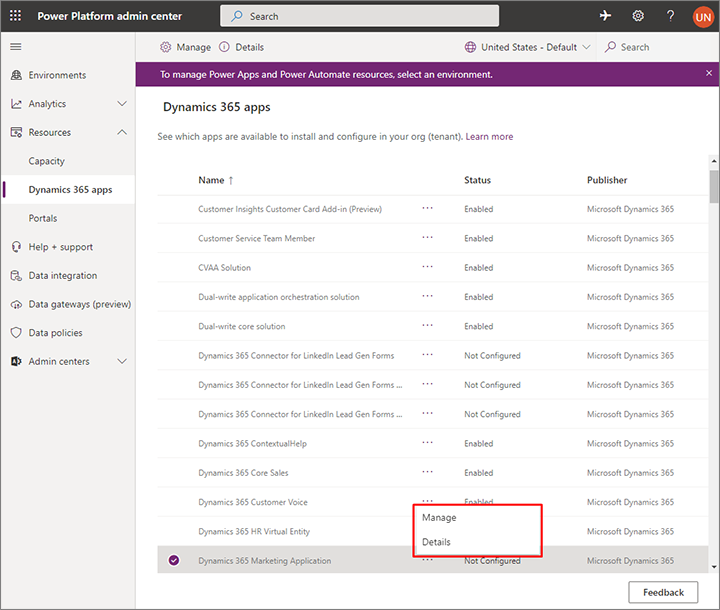

# Re-run the Marketing setup wizard

In addition to helping you install Dynamics 365 Marketing for the first time, the setup wizard can also help you modify, maintain, or update your installation. You can do all of the following by re-running the setup wizard:

- Check for and apply [updates](apply-updates.md)
- Add or remove [portals integration](portal-optional.md)
- Configure an integrated portal
- Fix installation issues
- Connect a disconnected instance to marketing services
- Clean up after a [copy or restore operation](manage-marketing-environments.md)
- [Uninstall](uninstall-marketing.md) Marketing

To re-run the Marketing setup wizard:

1. Go to [admin.powerplatform.microsoft.com](https://admin.powerplatform.microsoft.com) and sign in to your Microsoft 365 tenant using an administrator account that has a Dynamics 365 Marketing license assigned.

1. Go to **Resources** > **Dynamics 365 apps** on the left navigation pane.

   

1. The list shows a row marked **Dynamics 365 Marketing Application** for each entitlement (license) you have for Dynamics 365 Marketing. Installed entitlements show a **Status** of **Configured**.

1. Select the configured entitlement that you want to manage and select the three dots between the **Name** and the **Status** columns for the Marketing application.

    

1. To launch the Dynamics 365 Marketing setup wizard, choose **Manage** from the pop-up menu. A message will pop up informing you that you are going to the Dynamics 365 Marketing admin page. To go to the page, select **OK**.

    

1. The Marketing setup wizard opens.  It shows the name of the Dynamics 365 Marketing instance you selected.

    

    If an update is available, then you'll see a notice and an **Install** button at the top of the page. More information: [Keep Marketing up to date](apply-updates.md)

    The following links can be available in the **Other actions** panel:

    - **Configure your portal**: This link is only shown if you have a Power Apps portal integrated with your selected Marketing instance. Select this link to go to the portal configuration where you can, among other things, restart the portal or remove it from your Marketing instance. More information: [Administer your portal](/powerapps/maker/portals/admin/power-platform-admin-center)
    - **Take me to the app**: Brings you to Dynamics 365 Marketing.
    - **Uninstall Marketing from this org**: Removes Marketing from the selected instance. More information: [Uninstall Marketing](uninstall-marketing.md)

    If your selected Marketing instance isn't currently integrated with a Power Apps portal, then you can set this up by selecting **Use Dynamics 365 Portals or a Power Apps portal** in the main area of the window. More information: [Integrate Marketing with a CMS system or Power Apps portal](portal-optional.md)

[!INCLUDE[footer-include](../includes/footer-banner.md)]