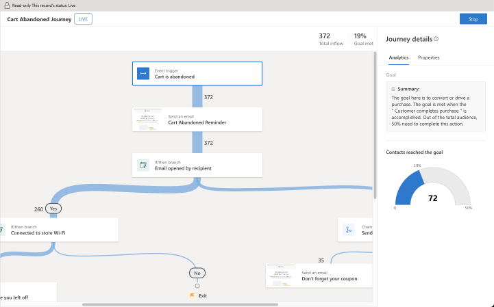
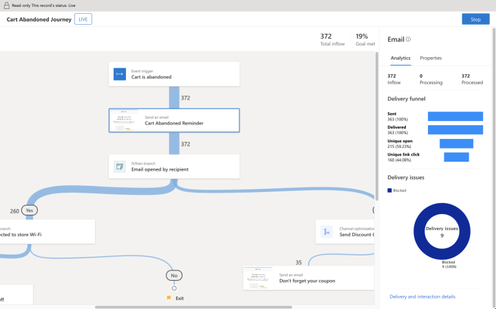
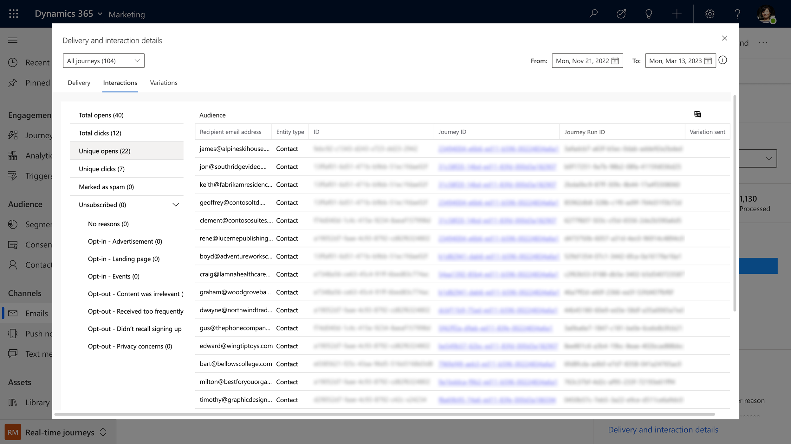
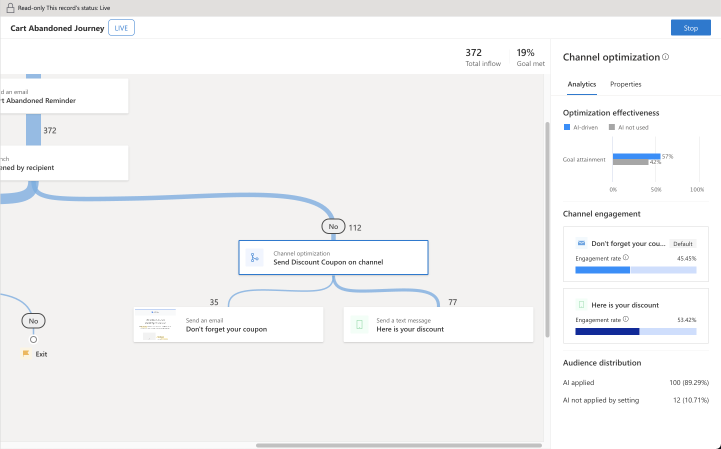
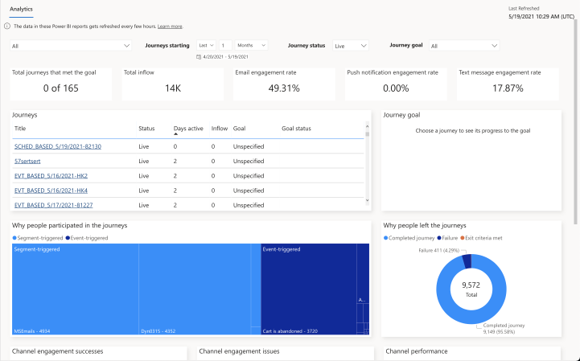
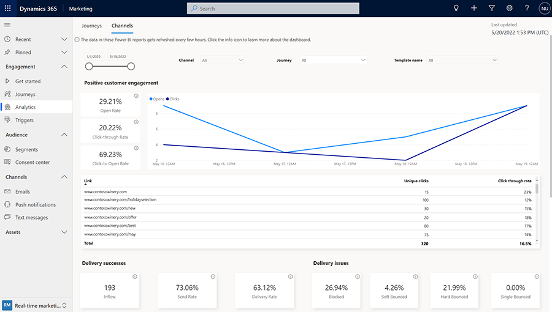

# Access and interpret analytics

Real-time marketing's dashboards and cross-journey insights show metrics, views, and insights summarized across single or multiple journeys, providing you with a deep understanding of journey, channel, and content performance. The built-in dashboards focus on measuring delivery, engagement and journey goal attainment, so you can fine-tune the effectiveness of your journeys, channels, and content.

## Real-time marketing analytics overview

With real-time marketing analytics, you can:

- Evaluate the effectiveness of journeys against your objectives.
- Troubleshoot journeys by identifying areas of friction.
- Discover what is working so that you can amplify or recreate the same approach elsewhere.
- Understand the effectiveness of various messages and channels of communication through key delivery and engagement insights.
- Gain insights into your audience's behavior and interests and tailor your marketing efforts to their specific needs. 

### Contact insights

Get a comprehensive view of how a contact has engaged with your journeys in real-time marketing, including all past email sends, opens, clicks, form submissions, and more. Better understand your audience's behavior and interests, make informed decisions based on past engagement, and tailor your marketing efforts to their needs and preferences. To view contact insights, go to **Real-time marketing** > **Audience** > **Contacts**, select a contact record, and then open its **Insights** tab.

The following insights categories are provided:

- **Overview**: View a chart of the engagement interactions and a summary of the most important KPIs for each channel for the selected contact.
- **Email insights**: View complete details of email interactions for the selected contact, including a list of all messages sent to them, plus lists of all opens, clicks, bounces, and more. 
- **Form insights**: See which marketing forms the contact has visited and submitted. View the content of each submission. 

### Journey operational analytics

Evaluate journey performance in near real time using built-in operational analytics. The Sankey view in the designer helps you understand the user flow through the journey, highlighting which branches are working well.

Select any journey component to view near real-time operational analytics in the right pane, including:

- **Goal analytics**: If a goal has been defined a target set, you can view how the journey is progressing toward its goal and if it has met the goal.

    > [!div class="mx-imgBorder"]
    > 

- **Channel analytics**: For any message in the journey (email, text, or push notification), view the delivery funnel and additional metrics to diagnose the content performance.

    > [!div class="mx-imgBorder"]
    > 

    To view delivery and interaction statistics, select the **Delivery and interaction details** link at the bottom of the channel analytics pane. Delivery and interaction details allow you to analyze delivery, engagement, and performance data for your email, text, or push notification messages. The **Delivery** tab provides details on messages sent, delivered, blocked, or bounced along with the respective reasons. The **Interactions** tab provides detailed data on customers that opened or clicked a message, as well as unsubscription interaction data. It's important to note that a message’s unique opens and clicks are calculated based on the journey run of a customer. This means that if the same customer enters the same journey multiple times and opens or clicks the same message each time, the system will record multiple unique opens or clicks. For example, if a customer clicks the same message in two different journey executions, two unique clicks will be recorded. 

    > [!div class="mx-imgBorder"]
    > 

- **AI optimization**: Near real-time data to help you evaluate how applying AI optimization has helped your engagement rate.

    > [!div class="mx-imgBorder"]
    > 

> [!NOTE]
> Data retention is 12 months for Goal analytics, Channel analytics (including delivery and interaction details), and AI optimization analytics.

### Aggregate cross-journey analytics

The built-in aggregate cross-journey analytics dashboard shows relevant metrics and insights for all your journey orchestrations in one place.

> [!div class="mx-imgBorder"]
> 

Use the aggregate cross-journey analytics dashboard to review recent journey effectiveness and quickly share reports with stakeholders.

Learn more: [How to use aggregate cross-journey analytics](real-time-marketing-cross-journey-analytics.md).

### Aggregate channel analytics

The aggregate channel analytics dashboard shows metrics and insights related to delivery and engagement.

> [!div class="mx-imgBorder"]
> 

Use the aggregate channel analytics dashboard to measure campaign effectiveness and track the performance of your marketing assets.

Learn more: [How to use aggregate channel analytics](real-time-marketing-channel-analytics.md).

> [!NOTE]
> There is no retention policy for real-time marketing interactions in Aggregate cross-journey analytics and Aggregate channel analytics. Dataverse entities are limited to a two-year retention policy after their initial creation date. Keep in mind that the two-year Dataverse entity retention policy might impact analytics views associated with interaction data from Dataverse entities.

## Learn more

Here are some advanced resources for this topic:

- [Extracting Marketing Interactions in Dynamics 365 Marketing](https://community.dynamics.com/365/dynamics-365-fasttrack/b/dynamics-365-fasttrack-blog/posts/extracting-marketing-interactions-in-dynamics-365-marketing)
