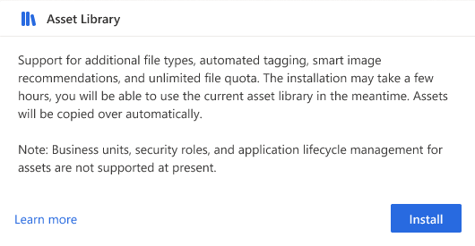

# Install the real-time marketing asset library add-on

Assets are critical for meaningful and successful customer experiences. In outbound marketing and trials, you can use the outbound file library as an out-of-the-box solution for managing image file types such as png, jpeg, and gif. Learn more: [Upload and use images in online content](upload-images-files.md).

In real-time marketing, instead of using the outbound file library, you can install the asset library add-on. This gives you access to a different set of capabilities for managing digital assets such as images, files, and videos. Learn more: [Real-time marketing asset library add-on](real-time-marketing-asset-library.md).

> [!TIP] 
> The real-time marketing asset library add-on may already be installed for your organization. You can confirm whether the add-on is installed by going to **Settings > Add-ons** and checking if the asset library add-on is installed.

> [!NOTE]
> The asset library add-on is not available for trials or for customers in Brazil, India, France, Switzerland, or United Arab Emirates.

## Outbound file library capabilities vs the real-time marketing asset library add-on

There are some functional differences between the two libraries. It's up to you to decide which one better suits your needs. The table below compares the features of the two libraries:

| **Feature​** | **Outbound file library​** | **Asset library add-on​** |
| --- | --- | --- |
| Access​ | Installed automatically​ | Needs installation​ |
| Availability​ | Outbound marketing, real-time marketing, trials​ | Real-time marketing​ |
| Geo availability​ | All regions where Dynamics 365 Marketing is supported​ | Not available in United Arab Emirates, India, Brazil. France, and Switzerland ​ |
| File type support​ | Images​ | Images, videos, documents​ |
| Tags​ | ✔ (Keywords)​ | ✔​ |
| Alternative text​ | ❌​ | ✔​ |
| Automated tagging​ | ❌​ | ✔​ |
| Smart recommendations for images​ | ❌​ | ✔​​ |
| Bulk actions​ | ✔​ | ✔​ |
| Security roles for asset ownership​ | ✔​ | ❌​ |
| Business units​ | ✔​ | ❌​ |
| Application Lifecycle Management​ | ✔​ | ❌​ |
| Resizing of assets​ | ❌​ | ✔ (No UI support yet) |

## Installing the add-on

You can install the asset library add-on from the add-on page in the settings. By default, all users have the necessary permissions to trigger the asset library add-on installation. System administrators can remove these permissions. To install the asset library add-on from the settings:

1. Go to **Settings** in the area switcher then go to **Overview** > **Add-ons**.
1. Select **Install** on the asset library card.
1. Confirm the action.

    > [!div class="mx-imgBorder"]
    > 

### Copying assets

As mentioned in the table above, the asset library add-on doesn't support security roles for asset ownership. Therefore, copying existing assets from the outbound file library will start automatically *only* if you have sufficient permissions to access all assets.

If a user without permissions to access all assets triggers the installation, the assets won't be copied over for security purposes.

> [!TIP]
> If your assets haven't been copied, you can go to **Library** in outbound marketing and select **Copy to real-time marketing** from there. Only assets that you have access to will be copied over, so it is best to ask your system administrator for assistance.

## Uninstalling the add-on

> [!IMPORTANT]
> When uninstalling the add-on, assets that have been uploaded will be deleted. At present, the outbound file library does not support the same file types as the asset library add-on, thus preventing assets from automatically transferring to the outbound file library. Assets that have been previously uploaded to the outbound file library will still be available. If you want to use the assets that you have uploaded while the add-on was installed, download them in bulk before you uninstall the add-on.

The add-on can be uninstalled by users with delete permissions granted. To uninstall the asset library add-on:

1. Go to **Settings** in the area switcher then go to **Overview** > **Add-ons**.
1. Select **Uninstall** on the asset library card.
1. Confirm the action.