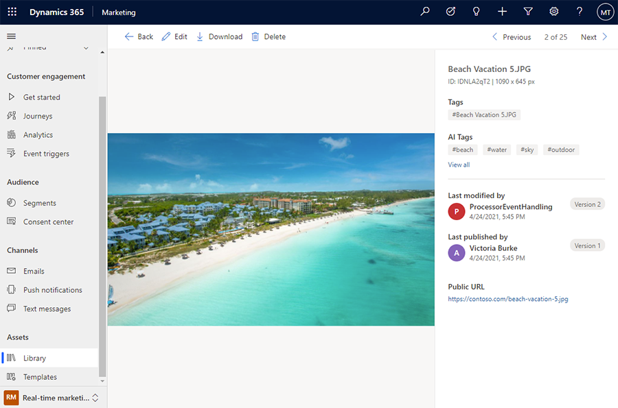
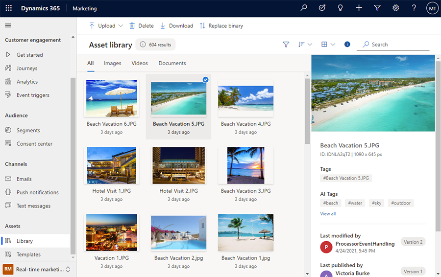

# Real-time marketing asset library add-on

> [!IMPORTANT]
> The [real-time marketing library add-on](real-time-marketing-asset-library.md) has been retired and will be removed by **June 30, 2023**. All customers will automatically be migrated to the [unified asset library](upload-images-files.md), which adds support for shared Dynamics 365 features such as support for business units, security roles for asset management and application lifecycle management. Other features, such as automated tagging and smart recommendation for images, will be temporarily removed and added back in upcoming releases. Learn more: [Asset library add-on file migration](real-time-marketing-add-on-migration.md)

> [!NOTE]
> The asset library add-on is not available in Brazil, India, France, Switzerland, or United Arab Emirates.

> [!NOTE]
> The asset library add-on doesn’t support Business Units, Application Lifecycle Management, and security roles for asset ownership.

> [!NOTE]
> The asset library add-on supports images (such as JPEG, GIF, and PNG files), videos (such as MP4, AVI, and MPEG files), and documents (such as Word documents, PowerPoint files, and Adobe PDFs). Learn more about supported file types: [Upload files other than images and videos](/dynamics365/commerce/dam-upload-files).

> [!TIP]
> The real-time marketing asset library add-on lets you upload images, videos, and documents. Images are automatically tagged using AI. When authoring email content, you can use the asset library add-on's AI-driven suggestions to find images that best complement your email content.

## Asset library features

> [!div class="mx-imgBorder"]
> 

### Upload assets

You can upload a single file, bulk upload a few files, or upload an entire folder.

### Organize and find assets 

Use tags to organize your assets as needed. All images uploaded into the library are automatically analyzed and described by AI (using AI tags). As a result, you can easily find an image containing a searched object. For example, by typing “house,” you'll find all images showcasing houses, regardless of their file names. You can also sort your assets by *Title* or *Last modified* date.

> [!div class="mx-imgBorder"]
> 

For videos and documents, you'll have to add tags manually.

### Uninstalling the add-on

> [!IMPORTANT]
> This action cannot be undone, and you won’t be able to reinstall the add-on. When uninstalling the add-on, assets that have been uploaded will be deleted. Assets that have been previously uploaded to the default library will still be available. If you want to use the assets that you have uploaded while the add-on was installed, download them in bulk before you uninstall the add-on.

The add-on can be uninstalled by users with delete permissions granted. To uninstall the asset library:
- Go to **Settings** in the area switcher then go to **Overview > Add-ons**.
- Select **Uninstall** on the asset library card.
- Confirm the action.

[!INCLUDE[footer-include](../includes/footer-banner.md)]