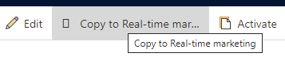

# Real-time marketing asset library

The centralized real-time marketing asset library lets you upload files that are automatically tagged by the app using AI. When authoring your email content, you can use the asset library's AI-driven suggestions to find the images that best complement your email content.

> [!NOTE]
> The asset library supports JPEG, GIF, and PNG images.

## Asset library features

> [!div class="mx-imgBorder"]
> 

### Quickly upload assets

You can upload a single media file, bulk upload a few media files, or even upload an entire folder.

### Export assets from outbound marketing to the asset library

You can transfer assets from outbound marketing to the real-time marketing asset library in just a few steps. To transfer assets:

1. Go to **Outbound marketing** in the area switcher, then go to **Marketing content** > **Files**.
1. Choose which assets you'd like to copy by selecting the blue check mark on the upper right of the asset.
    > [!div class="mx-imgBorder"]
    > 
1. To copy the assets to the real-time marketing asset library, select the **Copy to Real-time marketing** button in the top ribbon.
    > [!div class="mx-imgBorder"]
    > 
1. A modal window will appear and ask if you'd like to copy the selected assets to real-time marketing. Select **Copy files**. A status bar at the top of the window will show the copying progress.
1. Alternatively, if you'd like to copy *all* assets from outbound marketing to the asset library, do not select any individual assets. The button in the top ribbon will say **Copy all files to Real-time marketing**. To copy all assets, select the button and choose **Copy files** on the modal window.

### Organize and find assets with ease

Use tags to organize your assets as needed. All images uploaded into the library are automatically analyzed and described by AI (using AI tags). As a result, you can easily find an image containing a searched object. For example, by typing “house,” you will find all images showcasing houses, regardless of their file names. You can also sort your assets by *Title* or *Last modified* date.

> [!div class="mx-imgBorder"]
> 

### View assets in different ways

Depending on your preferences, you can view your assets as a single photo, a thumbnail view, or a list view.

### Update your assets when needed

You can replace your assets with newer versions whenever needed.
