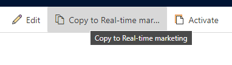

# Real-time marketing asset library add-on

> [!NOTE]
> By default, real-time marketing uses the [outbound file library](upload-images-files.md). To use the real-time marketing asset library, you must install the [asset library add-on](real-time-marketing-asset-add-on.md)

The real-time marketing asset library add-on lets you upload images, videos, and documents. Images are automatically tagged using AI. When authoring email content, you can use the asset library add-on's AI-driven suggestions to find images that best complement your email content. The asset library add-on may already be installed for your organization. If not, you can choose to install it. Learn more: [Install the real-time marketing asset library add-on](real-time-marketing-asset-add-on.md).

> [!NOTE]
> The asset library add-on supports images (such as JPEG, GIF, and PNG files), videos (such as MP4, AVI, and MPEG files), and documents (such as Word documents, PowerPoint files, and Adobe PDFs). Learn more about supported file types: [Upload files other than images and videos](/dynamics365/commerce/dam-upload-files).

> [!TIP]
> Use of the asset library add-on is provided with your Dynamics 365 Marketing license at no extra charge. Images uploaded to the outbound file library will be stored in the user’s Microsoft Dataverse storage and will count against their file storage capacity. For more information on Dataverse storage capacity, see [New Microsoft Dataverse storage capacity](/power-platform/admin/capacity-storage).
>
> If you decide to use the outbound file library or you are in Brazil, India, France, Switzerland, or United Arab Emirates, refer to [Upload and use images in online content](upload-images-files.md) for further guidance.

## Asset library features

> [!div class="mx-imgBorder"]
> 

### Quickly upload assets

You can upload a single file, bulk upload a few files, or even upload an entire folder.

### Export assets from the outbound file library to the asset library add-on

You can transfer images from the default outbound file library to the real-time marketing asset library add-on in just a few steps. To transfer images:

1. Go to **Outbound marketing** in the area switcher, then go to **Marketing content** > **Library**.
1. To copy individual images, choose which images you'd like to copy by selecting the blue check mark on the upper right of the image.
    > [!div class="mx-imgBorder"]
    > 
1. To copy the images to the real-time marketing asset library add-on, select the **Copy to Real-time marketing** button in the top ribbon.
    > [!div class="mx-imgBorder"]
    > 
    
1. A modal window will appear and ask if you'd like to copy the selected images to real-time marketing. Select **Copy files**. A status bar at the top of the window will show the copying progress.
1. Alternatively, if you'd like to copy *all* images from the default outbound file library to the real-time marketing asset library add-on, don't select any individual images. The button in the top ribbon will say **Copy all files to Real-time marketing**. To copy all images, select the button and choose **Copy files** on the modal window.

### Organize and find assets with ease

Use tags to organize your assets as needed. All images uploaded into the library are automatically analyzed and described by AI (using AI tags). As a result, you can easily find an image containing a searched object. For example, by typing “house,” you'll find all images showcasing houses, regardless of their file names. You can also sort your assets by *Title* or *Last modified* date.

> [!div class="mx-imgBorder"]
> 

For videos and documents, you'll have to add tags manually.

### View assets in different ways

Depending on your preferences, you can view your assets as a single file, a thumbnail view, or a list view.

### Update your assets when needed

You can replace your assets with newer versions whenever needed.
