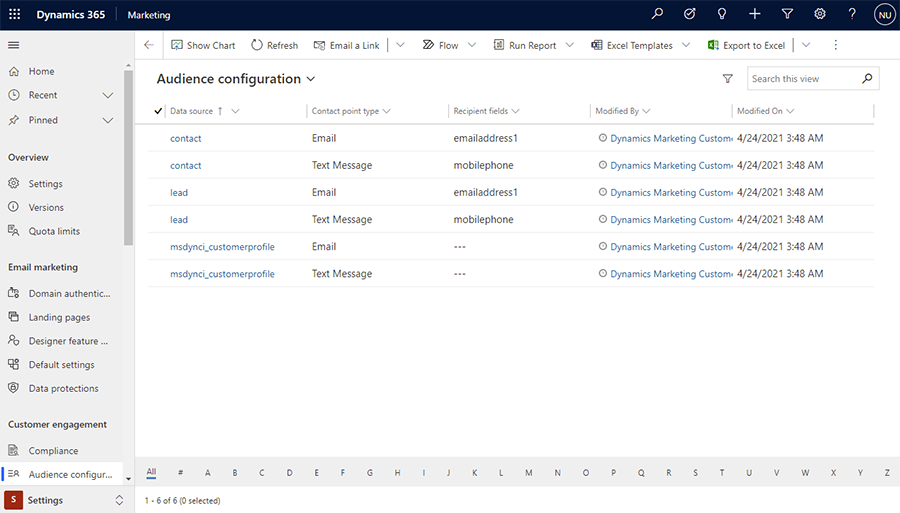
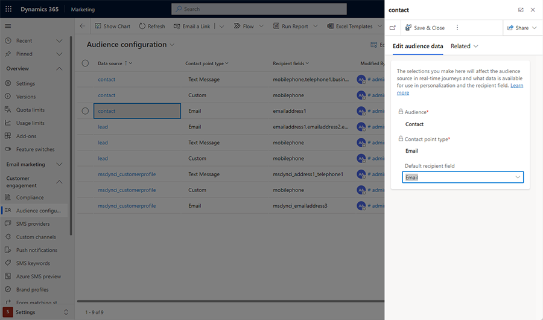

# Select the audience source for real-time journeys

Audience configuration allows you to manage your audience data sources. Real-time marketing supports **Contact**, **Lead**, and **Customer profile** entities.

To access the **Audience configuration settings**, go to **Settings** > **Customer engagement** > **Audience configuration**.

> [!div class="mx-imgBorder"]
> 

Contacts and Leads have default recipient fields set up for emails and phone numbers. The values from these fields are automatically populated in the *Send-to* field. You can modify the default settings by adding more recipient fields or changing the default field content.

Customer Profiles have no default fields set. You can choose which fields from a Customer Profile should be used when sending an email or text message.

## Change your audience configuration

To make changes to the audience configuration, select a data source (**Contact**, **Lead**, or **Customer profile**) and review the information in the right pane.

> [!div class="mx-imgBorder"]
> 

You can change the default recipient or add more recipient fields. You can select any of the fields you added when adding an email or text message tile to a customer journey.

A default value is displayed in the *Send-to* field, but you can select any other recipient field from the dropdown menu.

> [!Important]
> For Contacts, only one recipient email address can be used. This is done to remove consent ambiguity. In outbound marketing, a Contact record may store several email addresses with one consent for the entire contact. But in real-time marketing, consent is given per each email address. Learn more in [Compliance settings](real-time-marketing-compliance-settings.md#outbound-consent).

[!INCLUDE[footer-include](../includes/footer-banner.md)]