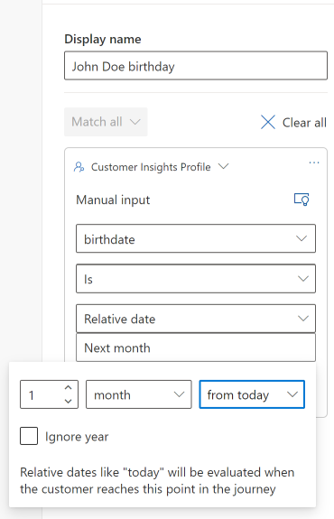
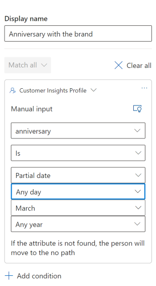
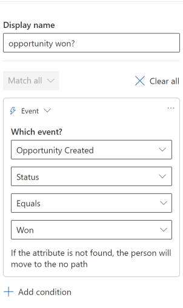
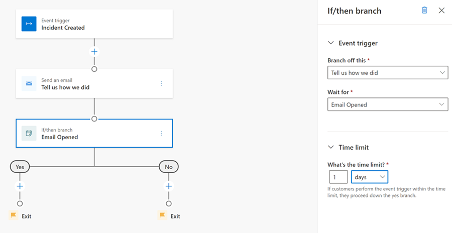

# When to use attribute versus if/then branches

When creating a real-time marketing journey, you'll need to make choices about what types of branching to use. But how do you decide when to use an attribute branch and when to use an if/then branch? Attribute and if/then branches both use simple yes/no logic that evaluates your users and then funnels them to one step or another based on the customers' behavior or profile attributes.

A general rule of thumb is that attribute branches are best used for things that have already happened (attributes that live in your customer’s profile). If/then branches, on the other hand, evaluate based on a desired customer behavior occurring or not.

Let’s see some use cases:

## Case 1: Attribute branching for dates and special events

Let’s assume you want to branch your audience based on a specific contact profile attribute like a birthday. You can use the relative date format to add contacts to a journey on a yearly cycle.

The relative date format will evaluate birthdays when the customer reaches this point of the journey, irrespective of when the journey goes live. Assume the journey goes live on February 1 and John Doe was born on March 1 (one month from February 1). If John goes through the attribute branch on March 1, they will go through the **yes** branch. But if John reaches the attribute branch before or after March 1, or the journey goes live after March 1, John will always be directed to the no branch.

> [!div class="mx-imgBorder"]
> 

You can use the partial date format for special events that occur annually, such as an anniversary.

> [!div class="mx-imgBorder"]
> 

Actual dates add contacts to a journey on a specific day, month, and year, so they can’t be used with recurring events.

## Case 2: Attribute branch for triggers

Now, let’s assume you are creating an onboarding journey. You might start the journey with an event when an opportunity is created and send two different messages when the opportunity is won versus when it’s still open.

You can use an attribute branch to check the attribute values for a trigger that starts a trigger-based journey.

> [!div class="mx-imgBorder"]
> 

## Case 3: If/then branch to follow up with your customers

Finally, let’s assume you are creating a journey for customers that raise a support ticket. You want to send a survey email when the ticket is closed asking about their experience.

You can use an if/then branch to wait for a survey email open event. If you set the limit for one day, the if/then branch will wait for the customer to open the email within that one day. If the customer opens the email, they are funneled down the **yes** branch, otherwise they go in the **no** branch.

> [!div class="mx-imgBorder"]
> 
