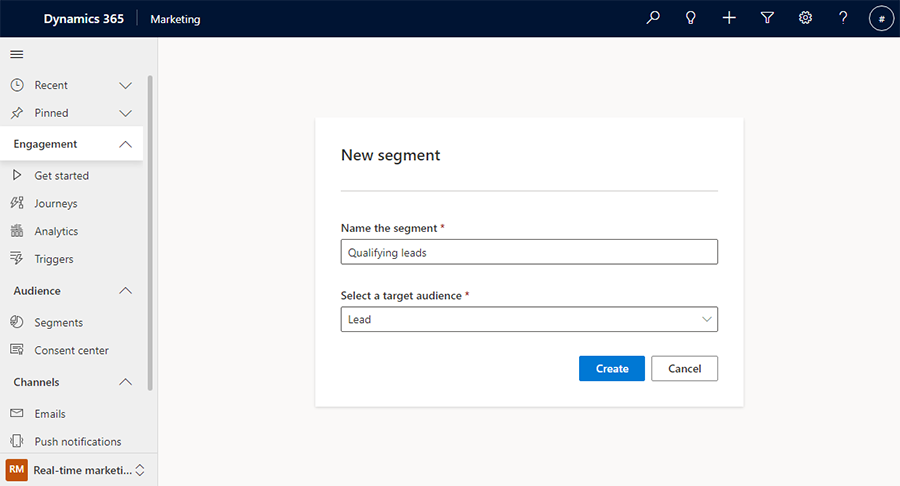
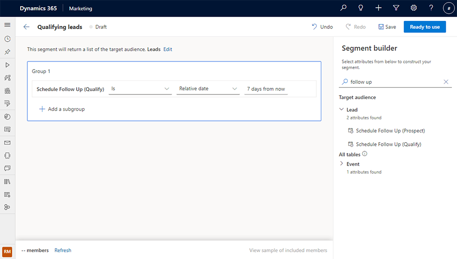
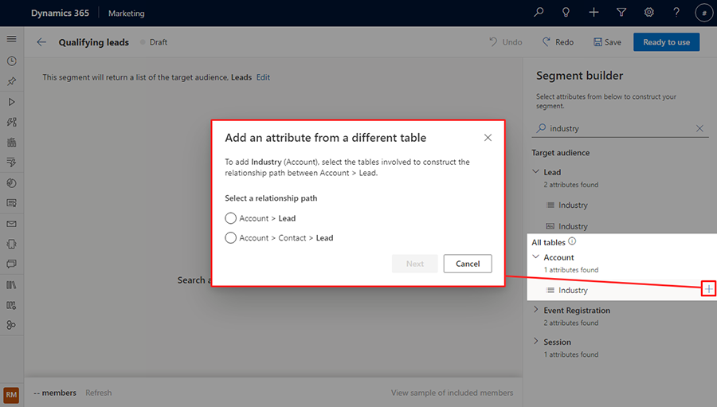
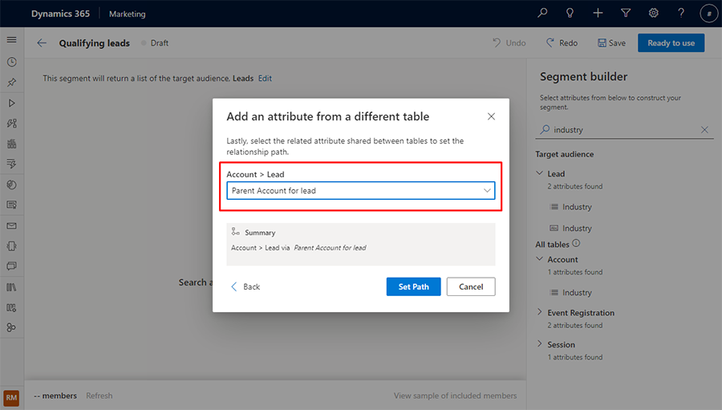
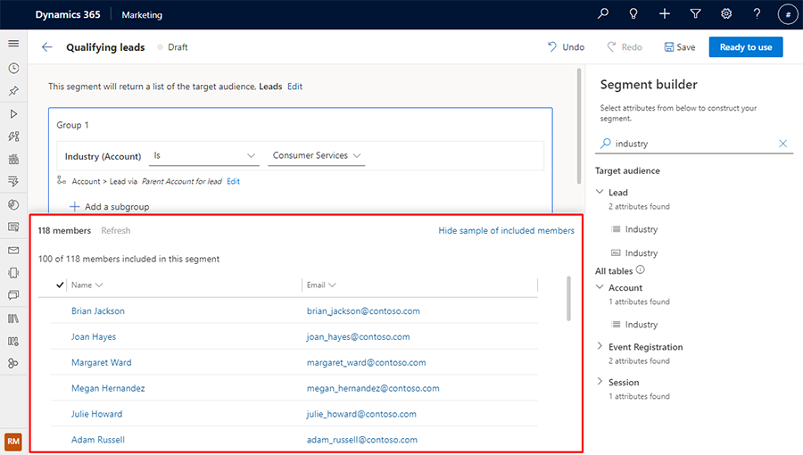
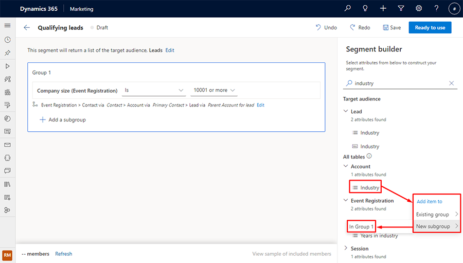
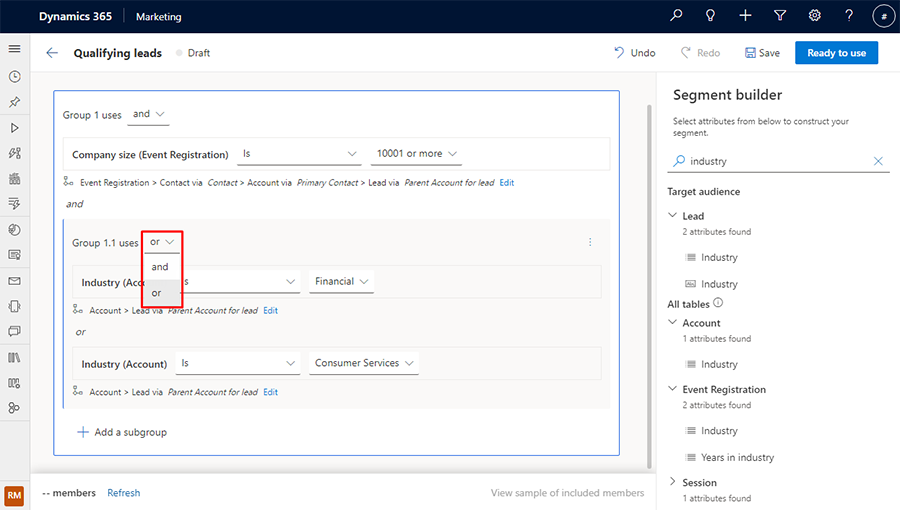
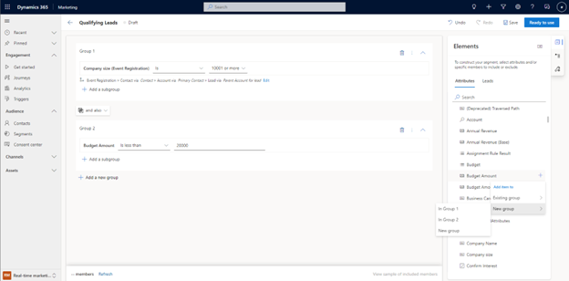
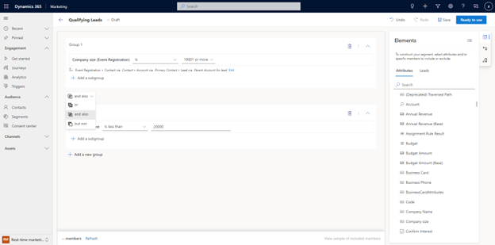

# Build segments in real-time marketing

[!INCLUDE[consolidated-sku-rtm-only](../includes/consolidated-sku-rtm-only.md)]

> [!VIDEO https://www.microsoft.com/videoplayer/embed/RE50Oqt]

To improve marketing return on investment, it's important to target the right audience. You can now build segments directly within the real-time marketing area of Dynamics 365 Marketing using the powerful, easy-to-use logic builder that doesn’t require specialized knowledge of complex data structures and logical operators. You can even preview the estimated segment size and membership before you mark your segment as "Ready to use" in customer journeys.

## Create a demographic segment targeting leads

You can now create dynamic segments targeting leads directly without having to connect it to a parent contact.

To target leads directly, go to **Real-time marketing** > **Audience** > **Segments** and select **+ New Segment** in the top toolbar. You can then name the new segment and select **Lead** under the **Select a target audience** dropdown. After you select the **Create** button, you'll be taken directly to the segment builder where you can create and save your segment.

> [!div class="mx-imgBorder"]
> 

In the right pane of the segment builder, you can search for attributes to add to the builder canvas.

**Example:** Qualifying leads that are scheduled for a follow-up in the next seven days:

> [!div class="mx-imgBorder"]
> 

## Create demographic segment using related tables

In addition to having a segment return its targeting entity (such as Contacts or Leads), you can also build more complex queries that reference other tables (such as Event Registration or Account) to further enrich your segment definition.

When adding an attribute that relates to a different table, you can search for the attribute, then define how the two tables are related based on your segment definition.

**Example:** Leads whose parent accounts are in the Consumer Services industry.

Search for "industry" on the right-side pane and select the **+** button to the right of the item in the table you want. You'll see all possible combinations of how the Lead and Account tables are related.

> [!div class="mx-imgBorder"]
> 

Select "Account > **Lead**" for the relationship path, then select the **Next** button. Next, set the path between the Lead and Account tables to be "Parent Account for lead" according to the segment definition, then select the **Set Path** button.

> [!div class="mx-imgBorder"]
> 

## Previewing segment members and size estimate

When you're satisfied with your segment definition, select **Refresh** on the bottom toolbar to quickly check if you are on the right track to creating your segment. This will give you an estimated size of how many members are in the segment.

To see a list of the first set of segment members the app fetched based on your definition, select **View sample of included members** on the bottom toolbar. This will give you an estimate of who is in this segment.

> [!div class="mx-imgBorder"]
> 

## Add a subgroup to your segment

**Example:** Leads with company size of more than 10,000 employees, whose parent accounts are in either the Consumer Services or Financial Services industry.

You can choose your attribute to be added to a new subgroup. To do this, search for the attribute, then select the name of the attribute item from the results. A contextual menu will pop up that allows you to add the item to a new or existing subgroup.

> [!div class="mx-imgBorder"]
> 

To include members from either subgroup, select the **or** subgroup operator.

> [!div class="mx-imgBorder"]
> 

## Preview: Add a new group to a segment

> [!IMPORTANT]
> A preview feature is a feature that is not complete, but is made available before it’s officially in a release so customers can get early access and provide feedback. Preview features aren’t meant for production use and may have limited or restricted functionality.
> 
> Microsoft doesn't provide support for this preview feature. Microsoft Dynamics 365 Technical Support won’t be able to help you with issues or questions. Preview features aren’t meant for production use, especially to process personal data or other data that are subject to legal or regulatory compliance requirements.

**Example**: Let’s say you want to create a query for Leads with a company size of more than 10,000 employees whose parent accounts are in the Consumer Services or Financial Services industries, **but not** leads with a budget of less than $20,000.

To create the segment from the above example, create a new segment in real-time marketing for Leads whose company size is 10,001 or more. Open the **Elements** pane by selecting the top icon on the menu on the right side of the window. Then, go to the **Attributes** tab and search for the **Budget Amount** attribute. Select the icon to the left of the attribute name from the results list. A contextual menu will appear, allowing you to add the attribute to an existing or new group.

> [!div class="mx-imgBorder"]
> 

In the above example, the attribute was added to a new group (Group 2).  To create the segment you want, select the operator button between the groups.

> [!div class="mx-imgBorder"]
> 

[!INCLUDE[footer-include](../includes/footer-banner.md)]
