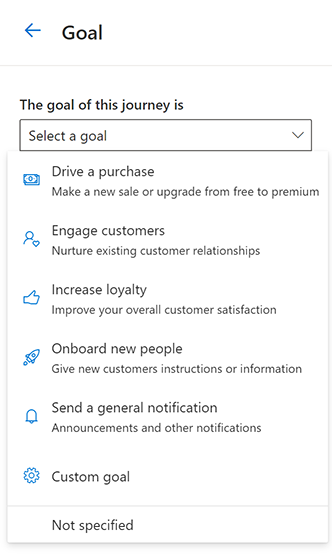
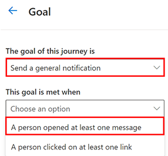
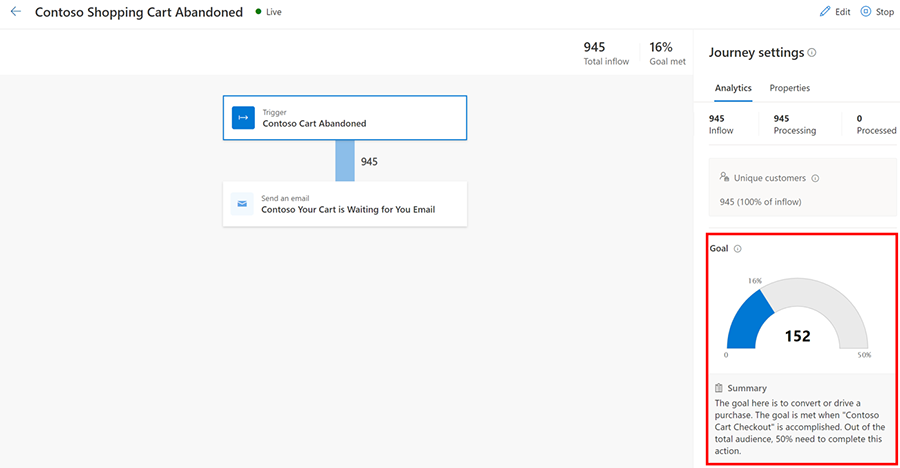

# Set a business goal and measure progress through a journey

Most journeys are created to drive a specific customer action such as making a purchase, signing up for an event, or renewing a subscription. With the goal-setting feature, you can choose the intended action as the goal of your journey and set a target you want to hit. Using the goal, you can measure a journey’s success on an ongoing basis. Goal settings enable you to make incremental improvements to reach your targets more quickly and effectively.

Using the goal-setting feature, you can:

- Measure a journey’s success on an ongoing basis using the goal metric.
- Optimize your [A/B tests](real-time-marketing-experimentation.md) and channel selections based on the journey goal.
- Express goal targets in count or percentage to determine how well a journey is performing.

## Types of triggers available to create a real-time marketing business goal

There are six types of business goals you can use to measure the desired outcome of a journey:

1. **Drive a purchase**: You’re measuring how many customers complete a purchase after sending a reminder email about their abandoned cart.
1. **Engage customers**: You’re measuring how many customers registered for an upcoming event.
1. **Increase loyalty**: You're measuring how many customers redeem their loyalty points after having made a purchase above a certain amount.
1. **Onboard new people**: You’re measuring how many new customers are getting connected to a sales agent after they download an interest form.
1. **Send a general notification**: You're measuring how many people are opening your emails or your overall clickthrough rate.
1. **Custom goal**: You want more control over what you want to measure by creating your own metric.

> [!div class="mx-imgBorder"]
> 

All goal metrics are measured using custom triggers. The only exception is the "Send a general notification" goal, which uses pre-calculated metrics the app provides for opens and clicks.

## Create a real-time marketing business goal

The examples below illustrate how to use goals for various business scenarios. The first example creates a goal to measure emails opened. The second example creates a goal to measure purchases. You can follow these examples, modify them, or use any of the other available goal triggers to set goals suitable for your needs.

### Example 1: Create a real-time marketing business goal to measure the number of emails opened

In this example, a journey is created to measure the number of subscribers that are opening their newsletters. The journey targets subscribers and sends them a monthly newsletter.

1. Go to **Real-time marketing** > **Engagement** > **Journeys** and create a new journey.
1. Select **Goal** on the right-side pane.
    > [!NOTE]
    > You can select only one goal per journey.
1. Under **The goal of this journey is**, select the general purpose of the journey—in this case, the purpose is to **Send a general notification**.
1. Under **This goal is met when**, select the “A person opened at least one message” trigger.
    > [!NOTE]
    > You cannot specify which message is to be opened. The app will track if any of the messages in the journey are opened.
1. Under **The amount of people needed for this goal is**, specify a target amount that you think would mean success. In this example, you don't have a specific target in mind, so you leave it blank.

> [!div class="mx-imgBorder"]
> 

Once the journey is published, you can see the analytics in the right-side pane by selecting the first tile of the journey. From there, you can see how many subscribers have opened at least one email since the journey was published.

### Example 2: Create a real-time marketing business goal to measure the number of purchases

In this example, a journey is created to measure the number of shoppers that will complete a purchase after they abandoned their cart. Shoppers will enter the journey when they abandon their cart from an online store. You want to monitor how many of those abandoned cart shoppers successfully complete a purchase by going through your journey. It's assumed that you’ve already created custom triggers to capture when a shopper abandons a cart and when they complete a purchase. To learn more about creating custom triggers, see [Create custom triggers in real-time marketing](real-time-marketing-custom-triggers.md).

1. Go to **Real-time marketing** > **Engagement** > **Journeys** and create a new journey.
1. Select **Goal** on the right-side pane.
1. Under **The goal of this journey is**, select the general purpose of the journey—in this case, the purpose is to **Drive a purchase**.
1. Under **This goal is met when**, select your “Checkout complete” trigger.
1. Under **The amount of people needed for this goal is**, specify a target amount that you think would mean success. In this example, you might determine that the journey was successful if 50 percent of the customers that go through the journey complete the check-out action.

Once the journey is published, you can see the analytics on the right-side pane by selecting the first tile of the journey. From there, you can see how many people have checked out since the journey was published.

> [!div class="mx-imgBorder"]
> 

## Attribution window for the journey

A customer can only count toward the journey goal so long as they’re actively a part of the journey. There's a default listening time of three days after the journey is completed, in case the desired action takes place after the customer has left the journey. The app won't count the journey success of a customer if:

- They never entered the journey because they were part of an exclusion segment.
- They exited the journey because they were added to a suppression segment and hit the goal after they exited the journey.
- The journey is completed and the customer reached the goal after the default three-day window expired.

If a customer is part of two journeys with the same goal and the customer hits the goal trigger after the first journey has ended (or they've exited) but before the second journey has ended (or they've exited), the customer will only count toward the *second* journey goal.

## Other limitations

1. The journey goal only counts unique profiles. Unique profiles are the number of unduplicated (counted only once) people that enter the journey. This means that in cases where the journey is repeating, the total inflow won’t match the number of unique profiles with which the goal attainment is calculated. For example, assume you want to create a repeating journey that measures how many people send you an interest form after your weekly webinars. The app will record the *first* time an attendee fills out the form, but it will not record any other forms the attendee might fill out as long as they return to the same journey.
1. The journey can't use any of the Dataverse triggers as a goal. For example, this means that you can't use goals to measure how many incidents created are now resolved.

[!INCLUDE[footer-include](../includes/footer-banner.md)]