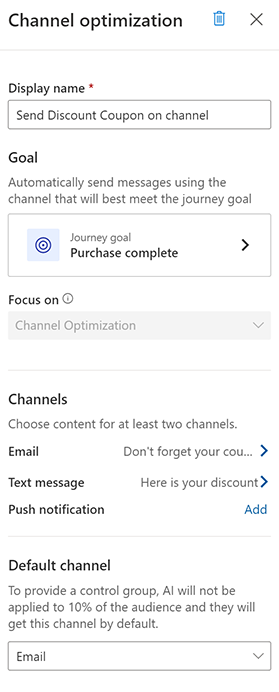

# Use AI-driven run-time channel optimization

[!INCLUDE[consolidated-sku-rtm-only](../includes/consolidated-sku-rtm-only.md)]

Channel optimization takes the guesswork out of determining the right channel to reach each customer for the intended journey goal. Channel optimization continuously monitors how each customer responds to communication channels without requiring you to define a complex set of conditions.

## How channel optimization works

The real-time marketing AI model picks the optimal channel for your customer based on their historical data. The AI model considers the customer’s channel preferences to determine which channel is most likely to achieve the journey outcome.

The AI model operates autonomously and in real time to understand the journey goal and explore ways in which it can optimize for the goal. Initially, every channel is given equal probability to reach the journey goal. But as time goes by, the AI model learns which option is most likely to succeed, given the customer's historical activity (which channel they engaged with the most in the past).

> [!NOTE]
> Channel optimization will not recommend a channel which a customer has not consented to. If no channel has consent, no communication will be sent out and the customer will progress to the next step in the journey. In addition, if you have enabled the "Multi-brand consent and customizable preference centers (preview)" feature switch, channel optimization will not work at this point. We expect to update this behavior soon. Learn more: [Manage user compliance settings](real-time-marketing-compliance-settings.md).

## Prerequisites

- **Journey goal**: You must have a [defined journey goal](real-time-marketing-business-goals.md) for the channel optimization to start working.
- **Content for your channels**: You must have the content for the channels (email, text, or push) that you want to optimize.

## Create and add channel optimization

1. Go to **Real-time marketing** > **Customer engagement** > **Journeys** and open a new or existing journey.
1. Select the plus sign (**+**) in the journey canvas and create a **Send messages through the right channel** tile.
1. Choose at least two channels you want to optimize for.
1. Make sure you have a defined journey goal to help the AI model understand what you want to optimize for.
1. Determine which channel will act as your default. This is your “safe” option under which approximately 10 percent of your audience will automatically be filtered through. The default channel will allow you to compare the results of the AI recommendations to your control group.
    > [!NOTE]
    > The AI model will still evaluate the channels objectively if the audience distributed to the default channel successfully reaches the journey goal.
1. Choose the content for your channels.

    > [!div class="mx-imgBorder"]
    > 

## Assess channel optimization analytics

Following the launch of the customer journey, the following measures can help you analyze each channel's effectiveness:

- **Optimization effectiveness**: Provides a comparison view of how the AI performed versus the control group based on journey goal achievement.
- **Channel engagement**: Provides insights into how customers engaged with the channel they were distributed to. The calculation is the number of unique clicks or opens divided by the total number of messages sent.
- **Audience distribution**: Provides insights into what portion of the audience was filtered using the AI model versus not.

## Special cases

If you notice a *No message sent* screen for one of the channels, that means that either the AI model has not routed customers down that channel or the message was sent but your customers have not yet interacted with it by opening the message or clicking the links.

In some cases, the app might be able to fetch engagement data from one channel but not the other.

[!INCLUDE[footer-include](../includes/footer-banner.md)]
