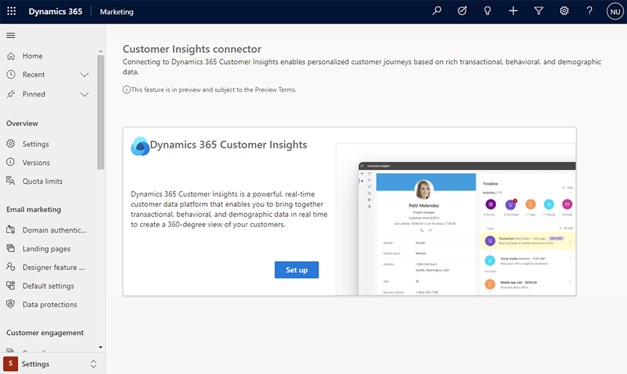
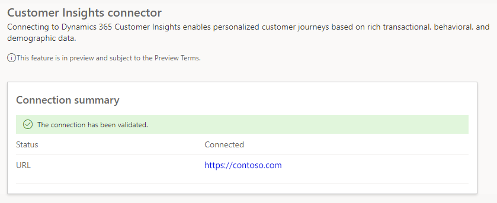

# Use Customer Insights profiles and segments in real-time marketing

Real-time marketing enables you to deeply personalize your customer engagement using transactional, behavioral, and demographic data from [Dynamics 365 Customer Insights](/customer-insights). With Customer Insights (CI) data, you can:
- Target unified CI customer profiles and segments. This enables you to engage every customer, regardless of whether the customer's data is in Marketing or CI.
- Base dynamic content (such as personalized tokens) in emails, SMS, and push notifications on measures such as loyalty status, subscription renewal date, parent account, or any other measure you have captured in the unified customer profile.

For example, let's say you have an e-commerce website. You capture information about the visitors and shoppers on the website as customer profiles in CI. You decide you want to target visitors that have abandoned their carts while shopping.

To target visitors with abandoned carts, you first need to define a [custom event trigger](real-time-marketing-custom-events.md) for any shopper that abandons a cart. You will need to set the **Data type** field for the event trigger's **Customer Data** property to **Profile (Customer Insights)**. You will then need to set up an [event-based journey](real-time-marketing-event-based-journey.md) using the abandoned cart trigger.

> [!div class="mx-imgBorder"]
> 

Alternately, you can create a scheduled journey targeting the customers in an abandoned cart segment. When creating your journey, you will be able to see segments from both Marketing and Customer Insights in the **Audience** dropdown.

## Set up your CI environment for real-time marketing

To set up your CI data for real-time marketing customer journeys, complete the following steps:

1. Ensure that the CI environment is set up in a [region where the real-time marketing preview is available](real-time-marketing-install.md). If your current environment is not in a region where real-time marketing is available region, you can create a new CI environment using a copy of the previous environment.
1. Enable data sharing between your CI environment and the Dataverse organization where Dynamics 365 Marketing is or will be installed. This can be done in the Advanced settings of the [CI environment configuration](/customer-insights/audience-insights/manage-environments#create-an-environment-in-an-existing-organization).
1. Set up **Map**, **Match**, and **Merge** rules in CI to unify customer data and create unified customer profiles. Be careful while setting up the unification rules. Any future changes to the rule can impact or break live customer journeys.
1. Create at least one segment.

## Set up your Dynamics 365 Marketing environment to automatically discover CI data

Marketing can automatically discover CI data and make it available for real-time marketing. To ensure automatic discovery, complete the following steps:

1. If you haven't [enabled real-time marketing](real-time-marketing-install.md) or are yet to install the Dynamics 365 Marketing application in a Dataverse org, complete the steps [in the section above](real-time-marketing-ci-profile.md#set-up-your-ci-environment-for-real-time-marketing) to first set up your CI environment. If you complete these steps before real-time marketing is installed in the Dataverse org, the Marketing app will automatically discover the CI environment. You can verify whether Marketing has discovered the CI environment by going to **Settings** > **Data management** > **Customer Insights connector**.
1. If you’ve already enabled real-time marketing in the Marketing app prior to setting up CI as described above, the automatic discovery will not take place. In this case, **Settings** > **Data management** > **Customer Insights connector** shows the following screen.

> [!div class="mx-imgBorder"]
> 

  - To retry CI discovery, complete the [above-listed steps](real-time-marketing-ci-profile.md#set-up-your-ci-environment-for-real-time-marketing) in your CI environment, then return to **Settings** > **Data management** > **Customer Insights connector** and select **Connect**.
  - If the setup is correct, Marketing will be able to discover CI and you should see the success indicator.

> [!div class="mx-imgBorder"]
> 

## Set up default properties for unified customer profiles

When using CI customer profiles in real-time customer journeys, you will be required to specify which attributes in the profile correspond to the customer’s preferred email and phone number. To eliminate the need for specifying this information every time, you can create default settings that customer journeys will automatically use from that point on.

Learn more: [Audience configuration](real-time-marketing-audience-data.md)
